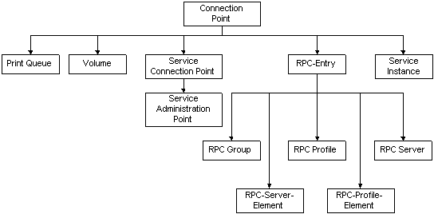

# Connection Points

A connection point object contains data about one or more instances of a service available on the network. The [**connectionPoint**](https://msdn.microsoft.com/library/ms680992) object class is the abstract base class from which objects representing connectable resources in Active Directory Domain Services are derived. The following illustration shows some of the object classes derived from the **connectionPoint** object class.

The following table lists immediate subclasses of the [**connectionPoint**](https://msdn.microsoft.com/library/ms680992) class.

| Object Class                                                    | Description                                                                                                                                                                                                                                                                                                              |
|-----------------------------------------------------------------|--------------------------------------------------------------------------------------------------------------------------------------------------------------------------------------------------------------------------------------------------------------------------------------------------------------------------|
| [**serviceConnectionPoint**](https://msdn.microsoft.com/library/ms683956) | Service connection point (SCP) objects for publishing data that client applications use to bind to a service. For more information, see [Publishing with Service Connection Points (SCPs)](publishing-with-service-connection-points.md).                                                                               |
| [**rpcEntry**](https://msdn.microsoft.com/library/ms683927)                             | An abstract class whose subclasses are used by the RPC Name Service (Ns) accessed through the **RpcNs\*** functions in the Win32 API. For more information, see [Publishing with the RPC Name Service (RpcNs)](publishing-with-the-rpc-name-service-rpcns.md).                                                          |
| [**serviceInstance**](https://msdn.microsoft.com/library/ms683958)               | Connection point object used by the Windows Sockets Registration and Resolution (RnR) name service, accessed through the Windows Sockets **WSA\*** APIs. For more information, see [Publishing with Windows Sockets Registration and Resolution (RnR)](publishing-with-windows-sockets-registration-and-resolution.md). |
| [**printQueue**](https://msdn.microsoft.com/library/ms683911)                         | Connection point object used to publish network printers. For more information, see [**IADsPrintQueue**](https://msdn.microsoft.com/library/aa706091).                                                                                                                                                                                           |
| [**volume**](https://msdn.microsoft.com/library/ms683984)                                 | Connection point object used to publish file services.                                                                                                                                                                                                                                                                   |

 

Be aware that COM-based services do not use connection-point objects to advertise themselves. These services are published in the class store. The Windows 2000 class store is a directory-based repository for all COM-based applications, interfaces, and APIs that provide for application publishing and assigning. For more information, see [Publishing COM+ Services](publishing-com-services.md).

 

 

