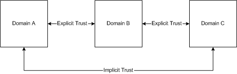
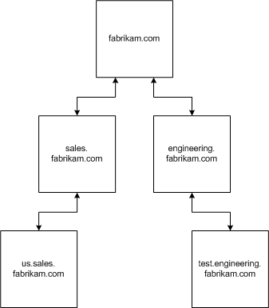

# Domain Trees

A *domain tree* is made up of several domains that share a common schema and configuration, forming a contiguous namespace. Domains in a tree are also linked together by trust relationships. Active Directory is a set of one or more trees.

Trees can be viewed two ways. One view is the trust relationships between domains. The other view is the namespace of the domain tree.

## Viewing Trust Relationships

You can draw a diagram of a domain tree based on the individual domains and the existing trust relationship.

Windows 2000 establishes trust relationships between domains based on the Kerberos security protocol. Kerberos trust is transitive and hierarchical—if domain A trusts domain B, and domain B trusts domain C, then domain A trusts domain C.

## Viewing the Namespace

You can also draw a diagram of a domain tree based on the namespace. You can determine an object's distinguished name by following the path up the hierarchy of the domain tree namespace. This view is useful for grouping objects into a logical hierarchy. The chief advantage of a contiguous namespace is that a deep search from the root of the namespace searches the entire hierarchy.

 

 

