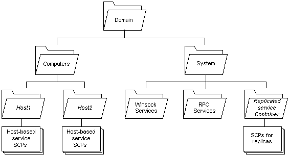

# Where to Create a Service Connection Point

When an instance of Active Directory Domain Services is installed, the service installer creates service connection point objects (SCP) in Active Directory Domain Services. The primary objective should be to minimize replication traffic and to enable efficient administration and maintenance of objects.

Be aware that client applications find SCPs by searching the directory for keywords in the SCP. The **keywords** attribute of an SCP is included in the Global Catalog; clients can search the Global Catalog to find SCPs in the forest. For this reason, the client does not influence where to publish SCPs.

## Minimize Replication Traffic

To minimize replication traffic, create SCPs in the domain partition of the domain of the service host computer. For example, you can create SCPs as child objects of the computer object on which the service is installed. A domain partition of Active Directory Domain Services, sometimes called a domain naming context, contains domain-specific objects such as the objects for the users and computers of the domain. A full replica of all objects in the domain partition is replicated to every domain controller (DC) for the domain, but it is not replicated to DCs of other domains.

Do not create SCPs in the Configuration partition, also known as the configuration naming context, because changes to the Configuration partition are replicated to every DC in the forest. As noted above, clients throughout the forest can query the Global Catalog to find SCPs anywhere in the forest, so creating SCPs in the Configuration partition does not make them more visible to clients; it only generates more replication traffic.

## Ease of Administration

Consider the following guidelines for object administration:

-   Place service-specific objects where administrators can control access to them using policy and inherited access permissions.
-   Place the objects in where an administrator can easily find them.

A good default location that satisfies both goals is to create SCP and other service-specific objects under the computer object of the host computer of each service instance. For more information, see [Publishing Under a Computer Object](publishing-under-a-computer-object.md).

A good alternative for services not tied to a single host is to create a container for the service objects under the System container in a domain partition. For more information, see [Publishing in a Domain System Container](publishing-in-a-domain-system-container.md).

The following diagram shows part of the default container hierarchy for a domain partition.

The diagram shows the default domain hierarchy included with Active Directory Domain Services. However, many enterprises create a hierarchy of organizational unit (OU) containers to group object classes, such as users and computers, together for purposes of administration. Administrators can then apply policy and inheritable access-control entries (ACEs) to an OU to delegate administrative authority for objects in the OU. This enables administrators to efficiently manage an enterprise, but it has a few consequences for service programmers:

-   The computer object for a service host might not be under the Computers container as shown in the diagram. For more information about how to find the computer object for the local computer, see [Publishing Under a Computer Object](publishing-under-a-computer-object.md).
-   Administrators may move objects as their organizational needs change. This means that you cannot depend on your objects remaining in a fixed location; that is, your service cannot depend on an object distinguished name remaining the same. Instead, use an object's **objectGUID** attribute, which does not change if the object is moved or renamed. For more information, and a code example that creates an SCP, stores its **objectGUID**, and later retrieves the **objectGUID** to bind to the SCP, see [Creating and Maintaining a Service Connection Point](creating-and-maintaining-a-service-connection-point.md).
-   All of the standard service-related object classes, as well as any subclasses of these classes, are valid children of the **computer** and **organizationalUnit** classes. If you extend the schema to define your own service-specific class, be sure that the **computer** and **organizationalUnit** classes are included in the possible superiors.
-   The service installer determines the default location for creating SCPs. You may want to allow the administrator installing the service to specify an alternate install path.

Service-specific objects should not be created in the following areas:

-   Services should not publish objects directly in the Users or Computers containers of a domain partition, nor should they create new containers in these containers. However, services can publish objects as child objects of a computer object, whether or not the computer object is stored in the Computers container.
-   Services, that use Windows Sockets registration and resolution (RnR) or the RPC name service (RpcNs) APIs to advertise themselves, create the proper objects in the WinsockServices and RpcServices containers under a domain partition's System container. Do not explicitly create objects in these containers. Doing so does not cause direct harm, but may be confusing for administrators.

 

 

