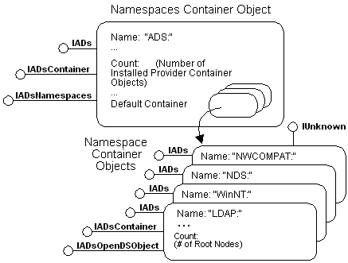

# Active Directory Service Interfaces Architecture

Many directory services are hierarchical and thus lend themselves to a hierarchical object model. This section uses COM object representations to illustrate various ADSI features.

In the following object model figure, a top-level system object contains one Namespace object for every installed ADSI provider.

Each of the Namespace objects is itself a container that contains the top-level root nodes of every server, domain, or whatever other kinds of directory-system objects are defined as roots in each directory service.

ADSI supplies a set of predefined objects and interfaces so that client applications can interact with directory services using a uniform set of methods. However, ADSI may not provide access to all features of a directory service. To better use the full feature set of each directory service, ADSI supplies a schema model that directory service providers and third-party software vendors can use to extend features beyond the interfaces provided in ADSI.

The root-node container objects, found within each provider Namespace object, include an ADSI schema container object. This object contains the definition of all features for that provider. For more information, see [ADSI Schema Model](adsi-schema-model.md).

This section includes the following topics:

-   [Active Directory Service Interfaces Objects](active-directory-service-interfaces-objects.md)
-   [Namespaces](namespaces.md)
-   [Active Directory Service Interfaces Provider](active-directory-service-interfaces-provider.md)
-   [ADSI Schema Model](adsi-schema-model.md)

 

 

