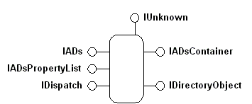

# Active Directory Service Interfaces Objects

The ADSI object model consists of COM objects. Clients manipulate objects with interfaces. ADSI providers implement the objects and their interfaces.

ADSI objects are COM objects that represent an item within a directory service: computers, users, files, servers, printers, print queues, and so on; that is, elements that network administrators work with daily. ADSI defines different kinds of objects to represent different kinds of elements. Each object, as shown in the following figure, supports one, or more, COM interfaces that enable access to object data, often called metadata.

Because COM interfaces are logically connected sets of properties and methods, you can think of each interface as a handle to the object that provides access to only one set of logical functions at a time. The following table lists fundamental ADSI elements.

| Interface            | Description                                                                                                                                                                                                                                                                                                                                                                               |
|----------------------|-------------------------------------------------------------------------------------------------------------------------------------------------------------------------------------------------------------------------------------------------------------------------------------------------------------------------------------------------------------------------------------------|
| **IADs**             | Used for object identification. As the fundamental interface required on all ADSI objects, [**IADs**](/windows/desktop/api/Iads/nn-iads-iads) supplies access to object metadata, including its definition in the ADSI schema. IADs also provides access to the properties and methods that manage object data in the property cache.                                                                                   |
| **IADsContainer**    | Used for object management and detection. All ADSI container objects require the [**IADsContainer**](/windows/desktop/api/Iads/nn-iads-iadscontainer) interface to manage object creation, deletion, copying and moving, binding, and enumeration.                                                                                                                                                                      |
| **IADsPropertyList** | Used for object property management. The [**IADsPropertyList**](/windows/desktop/api/Iads/nn-iads-iadspropertylist) interface optimizes management of object data in the property cache.                                                                                                                                                                                                                                |
| **IDirectoryObject** | Used for direct object access. The [**IDirectoryObject**](/windows/desktop/api/Iads/nn-iads-idirectoryobject) interface provides low-level object access for clients that do not use Automation. This interface bypasses the object property cache and provides direct access to object properties. For more information, see [The IADs and IDirectoryObject Interfaces](the-iads-and-idirectoryobject-interfaces.md). |
| **IUnknown**         | Used for COM object management. The [**IUnknown**](/windows/win32/api/unknwn/nn-unknwn-iunknown) interface is required for all COM objects.                                                                                                                                                                                                                                                                              |
| **IDispatch**        | Used for type library data and method invocation. The [**IDispatch**](/windows/win32/api/oaidl/nn-oaidl-idispatch) interface is required for all Automation objects.                                                                                                                                                                                                                             |

 

More complex ADSI objects may expose additional interfaces. For example, [**IADsCollection**](/windows/desktop/api/Iads/nn-iads-iadscollection) supports methods that manage collections of directory elements of the same data type. [**IADsGroup**](/windows/desktop/api/Iads/nn-iads-iadsgroup) methods manage the special case collections of objects that support the [**IADsMembers**](/windows/desktop/api/Iads/nn-iads-iadsmembers) interface. For providers that support it, the [**IDirectorySearch**](/windows/desktop/api/Iads/nn-iads-idirectorysearch) interface supports methods to query directory services. In addition, ADSI supplies interfaces that represent well-known logical and physical items. For example, ADSI objects that represent users support [**IADsUser**](/windows/desktop/api/Iads/nn-iads-iadsuser), those that represent computers support [**IADsComputer**](/windows/desktop/api/Iads/nn-iads-iadscomputer), and so on. For more information about ADSI objects, see [The IADs and IDirectoryObject Interfaces](the-iads-and-idirectoryobject-interfaces.md). Not all providers implement all interfaces or all methods and properties on all interfaces. For more information, see [ADSI reference](adsi-reference.md).

 

 