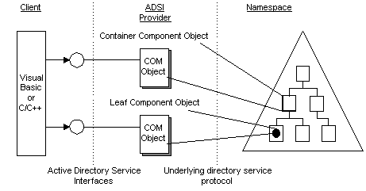

# Active Directory Service Interfaces Provider

An ADSI provider contains the implementation of ADSI objects and dependent objects for a particular namespace. The following illustration shows that clients are concerned only with getting and using interfaces on an object, and not with the details of where and how the software of an object is implemented.

 

 

