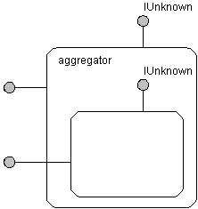
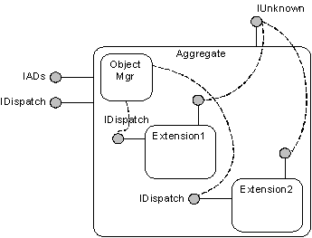

# ADSI Extension Architecture

ADSI extensions are based on the COM aggregation model with several enhancements. Extensions must adhere to all COM rules. For more information, see the COM specification.

Here is a review of the COM aggregation model.

An aggregate, also known as an inner object, is an object that an aggregator creates. Your extension object is an aggregate.

An aggregator, also known as an outer object, is an object that creates an aggregate. ADSI is an aggregator.

The inner object delegates its [**IUnknown**](/windows/win32/api/unknwn/nn-unknwn-iunknown) to the aggregator's **IUnknown**.

ADSI extensions add the following enhancements to COM aggregation to satisfy its requirements:

-   Enables each extension writer to extend ADSI objects. An extension writer can register its extension with ADSI and not be affected by the existence of other extensions. In the COM aggregation model, the aggregator must have the aggregate's CLSID. ADSI relaxes this requirement by making itself act as the aggregator for all extensions. Therefore, instead of forming a layer of nested components, extensions are at the same level.
-   Allows one object, one IDispatch. Automation support is one of the most important features of ADSI. Automation support is achieved because ADSI supports the [**IDispatch**](/windows/win32/api/oaidl/nn-oaidl-idispatch) interface. Extension writers are encouraged to support the **IDispatch** interface. However, there should be only one **IDispatch** interface on a given object. ADSI integrates and collects the many **IDispatch** interfaces from different extensions and presents them as one consistent **IDispatch** to the Automation controller. Each extension, when aggregated, must re-route its **IDispatch** calls to the **IDispatch** provided by ADSI.

All these solutions are possible because of services that the ADSI Object Manager provides, which reside on each ADSI provider.

The following figure shows the ADSI Extension Model architecture.

ADSI supports two levels of extension:

-   Early Binding Support. This is the first level of extension. An extension must support registration and implement new interfaces. The extension consumers must use tools or scripting hosts that support early binding, for example, Visual C++ , Visual Basic.
-   Late Binding Support. This happens when an extension satisfies all early binding requirements, and implements an additional interface, [**IADsExtension**](/windows/desktop/api/Iads/nn-iads-iadsextension). Extension implementers can use any tool that operates as an Automation controller, such as the Windows Script Host, Active Server Pages, or HTML with VBScript.

 

 