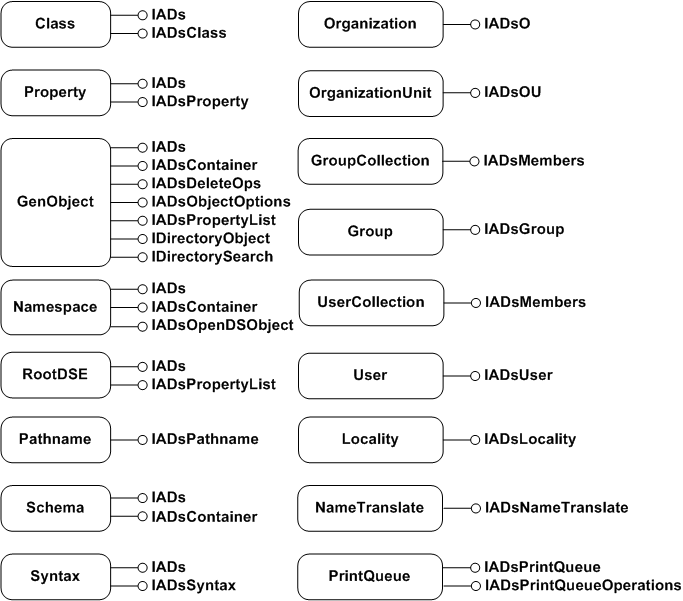

# ADSI Object Model for LDAP Providers

The following illustration shows ADSI objects used for the LDAP provider and interfaces used to access these objects.

| Object                        | Interface                                                                                                                                                                                                                                                                                      |
|-------------------------------|------------------------------------------------------------------------------------------------------------------------------------------------------------------------------------------------------------------------------------------------------------------------------------------------|
| Class               | [**IADs**](/windows/desktop/api/Iads/nn-iads-iads), [**IADsClass**](/windows/desktop/api/Iads/nn-iads-iadsclass)                                                                                                                                                                                                                                           |
| Property            | [**IADs**](/windows/desktop/api/Iads/nn-iads-iads), [**IADsProperty**](/windows/desktop/api/Iads/nn-iads-iadsproperty)                                                                                                                                                                                                                                     |
| GenObject           | [**IADs**](/windows/desktop/api/Iads/nn-iads-iads), [**IADsContainer**](/windows/desktop/api/Iads/nn-iads-iadscontainer), [**IADsDeleteOps**](/windows/desktop/api/Iads/nn-iads-iadsdeleteops), [**IADsObjectOptions**](/windows/desktop/api/Iads/nn-iads-iadsobjectoptions), [**IADsPropertyList**](/windows/desktop/api/Iads/nn-iads-iadspropertylist), [**IDirectoryObject**](/windows/desktop/api/Iads/nn-iads-iadsopendsobject), [**IDirectorySearch**](/windows/desktop/api/Iads/nn-iads-idirectorysearch) |
| Namespace           | [**IADs**](/windows/desktop/api/Iads/nn-iads-iads), [**IADsContainer**](/windows/desktop/api/Iads/nn-iads-iadscontainer), [**IADsOpenDSObject**](/windows/desktop/api/Iads/nn-iads-iadsopendsobject)                                                                                                                                                                                     |
| RootDSE             | [**IADs**](/windows/desktop/api/Iads/nn-iads-iads), [**IADsPropertyList**](/windows/desktop/api/Iads/nn-iads-iadspropertylist)                                                                                                                                                                                                                             |
| Pathname            | [**IADs**](/windows/desktop/api/Iads/nn-iads-iads), [**IADsPathname**](/windows/desktop/api/Iads/nn-iads-iadspathname)                                                                                                                                                                                                                                     |
| Schema              | [**IADs**](/windows/desktop/api/Iads/nn-iads-iads), [**IADsContainer**](/windows/desktop/api/Iads/nn-iads-iadscontainer)                                                                                                                                                                                                                                   |
| Syntax              | [**IADs**](/windows/desktop/api/Iads/nn-iads-iads), [**IADsSyntax**](/windows/desktop/api/Iads/nn-iads-iadssyntax)                                                                                                                                                                                                                                         |
| Organization        | [**IADsO**](/windows/desktop/api/Iads/nn-iads-iadso)                                                                                                                                                                                                                                                                         |
| OrganizationalUnit  | [**IADsOU**](/windows/desktop/api/Iads/nn-iads-iadsou)                                                                                                                                                                                                                                                                       |
| GroupCollection     | [**IADsMembers**](/windows/desktop/api/Iads/nn-iads-iadsmembers)                                                                                                                                                                                                                                                             |
| Group               | [**IADsGroup**](/windows/desktop/api/Iads/nn-iads-iadsgroup)                                                                                                                                                                                                                                                                 |
| UserCollection      | [**IADsMembers**](/windows/desktop/api/Iads/nn-iads-iadsmembers)                                                                                                                                                                                                                                                             |
| User                | [**IADsUser**](/windows/desktop/api/Iads/nn-iads-iadsuser)                                                                                                                                                                                                                                                                   |
| Locality            | [**IADsLocality**](/windows/desktop/api/Iads/nn-iads-iadslocality)                                                                                                                                                                                                                                                           |
| NameTranslate       | [**IADsNameTranslate**](/windows/desktop/api/Iads/nn-iads-iadsnametranslate)                                                                                                                                                                                                                                                 |
| PrintQueue          | [**IADsPrintQueue**](/windows/desktop/api/Iads/nn-iads-iadsprintqueue), [**IADsPrintQueueOperations**](/windows/desktop/api/Iads/nn-iads-iadsprintqueueoperations)                                                                                                                                                                                         |

 

 

 

