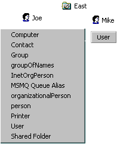

# Delegating Organizational Units

The Fabrikam company hires two administrators, Mike and Paul, to manage the East and West organizational units, respectively. Joe delegates his administrative responsibilities to them so that they can create and delete users in their respective organizational units.

Before seeing how to set up these organizational units under Mike and Paul, you must understand how to set up access to objects in Active Directory. Each object in Active Directory has a security descriptor. With the security descriptor, you can modify permissions on the object, propagate permissions, enable auditing, and so on. The security descriptor itself has two access control lists (ACLs): a discretionary ACL (DACL) and a system ACL (SACL). Each ACL can contain access control entries (ACEs). With an ACE, you can set allowed or denied access on an object. In addition, you can specify specific actions to allow or deny. Examples of actions include Create Child, Delete Child, Read Property, and Write Property. These rights are specified with the [**AccessMask**](iadsaccesscontrolentry-property-methods.md).

Next, you may specify the classes or attributes to which this ACE is associated. In the Fabrikam example that follows, Joe picks the user class so that each administrator can add users to the system. Next, you must answer the question: "Who will be the beneficiary of this ACE?" Joe will specify Mike.

Finally, you can set the ACE inheritance behavior—for example, ACEs can be specified to propagate down the hierarchy. In summary, the previous example will result in Mike being able to create and delete user objects under the East Sales organizational unit.

Joe uses the following code example to set up the ACEs and ACLs on the East organizational unit.


```VB
Set ou = GetObject("LDAP://OU=East, OU=Sales, DC=Fabrikam,DC=COM")
Set sec = ou.Get("ntSecurityDescriptor")
Set acl = sec.DiscretionaryAcl

Set ace = CreateObject("AccessControlEntry") 
' You can also use Set ace = new ADsAccessControlEntry.

' Grant access to the object.
ace.AceType = ADS_ACETYPE_ACCESS_ALLOWED_OBJECT 

' Create and delete child objects.
ace.AccessMask = ADS_RIGHT_DS_CREATE_CHILD Or ADS_RIGHT_DS_DELETE_CHILD 
' Create the user object with the user schema IDGUID.
ace.ObjectType = "{BF967ABA-0DE6-11D0-A285-00AA003049E2}" 
' Propagate the ACE down.  
ace.AceFlags = ADS_ACEFLAG_INHERIT_ACE
' Provide an option that notifies that the objectType is filled.
ace.Flags = ADS_FLAG_OBJECT_TYPE_PRESENT 
' Show the beneficiary of this ACE.
ace.Trustee = "FABRIKAM\Mike" 
acl.AddAce ace

sec.DiscretionaryAcl = acl
ou.Put "ntSecurityDescriptor", Array(sec)
' Use SetInfo to commit the data to Active Directory.
ou.SetInfo 

' Release the objects.
Set ace = Nothing
Set acl  = Nothing
Set sec = Nothing
```


The following figure shows the Active Directory **Create New View** menu after the code runs. When Joe, the administrator, logs on, he sees several classes that he can create. However, when Mike logs on, he is able only to create user objects.



For more information, see [ADSI Security Model](adsi-security-model.md).

 

 


