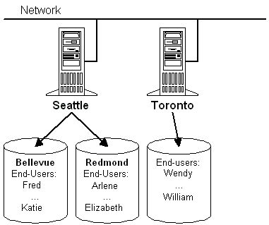

# Directory Definition

The example provider component uses a relatively simple directory design to clarify the relationship between components and to show the minimum requirements necessary to be an ADSI provider.

The "directory" for the example provider component consists of two root nodes: "Seattle" and "Toronto". Seattle contains two more sublevels, "Bellevue" and "Redmond". Each of these entries contains several user accounts. The "Toronto" entry has no further sublevels, but directly contains several user accounts. The following figure shows these two root nodes connected to a network.

In hierarchical terms, the Namespace node contains "Seattle" and "Toronto". "Seattle" contains "Bellevue" and "Redmond". "Bellevue" and "Redmond" each contain a set of user accounts. "Toronto" directly contains the user accounts with no intermediate organizational nodes.

The example provider component represents this structure with only two Active Directory object types: a container object and a leaf object. "Seattle", "Toronto", "Bellevue", and "Redmond" are container objects and each user account is a leaf object.

The example provider component creates a schema class called "Organizational Unit" for a container object type and a schema class called "User" for a user account.

The properties for each schema class, their methods, and the rules that govern the containment relationships for these objects are all defined in [Schema Management](schema-management.md).

 

 

