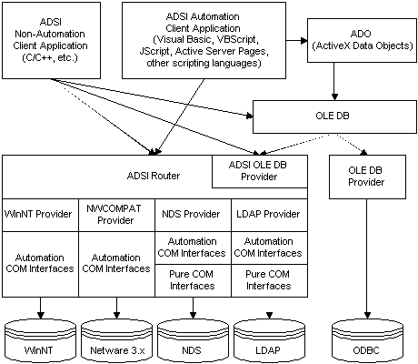

# Programming Language Support

You can write ADSI client applications in many languages. For the majority of administrative tasks, ADSI defines interfaces and objects accessible from languages compliant with Automation. For example, the Microsoft Visual Basic development system, Microsoft Visual Basic Scripting Edition (VBScript), and Java, as well as more performance and efficiency-conscious languages such as C and C++.

Smooth integration with Active Server Pages and VBScript make it easy to write Internet applications that access directory services. For integration with OLE DB applications, ADSI supplies an OLE DB provider by supporting a subset of the OLE DB query interfaces. The OLE DB provider supports read-only access to Active Directory.

For Internet applications, using scripting in Active Server Page (ASP) files can create and manipulate ADSI objects on the server and display the results in a webpage. In Microsoft Management Console, directory-service administration snap-ins can use ADSI to find directory services of interest. In short, Active Directory Service Interfaces can provide access to a broad and diverse set of directory services — including those not yet built.

For access to structures that use traditional APIs, the ADSI architecture defines low-level interfaces that do not support Automation that are accessible from languages like C and C++. These interfaces are little more than COM wrappers for network protocols to a directory service.

Writing code to the published interfaces allows your application to reach directory services for all installed ADSI providers and integrate the resulting data. With little or no changes to your code, your application can continue to access additional directory services on your network as new ADSI providers are installed.

The following figure shows how ADSI fits into an application environment. Whether the application is written in Visual Basic, C/C++, VBScript, Microsoft JScript development system, or as a web application using Active Server Pages, Active Directory Service Interfaces provide a clean and easy-to-use access to the underlying directory services without having to use the native network APIs.

As shown in the preceding figure, clients that do not support Automation have access to all ADSI interfaces, including both pure COM interfaces with the naming convention **IDirectoryXXX** and Automation COM interfaces with the naming convention **IADsXXX**. Because clients predominantly request information from directory services, the ADSI flexible query model through OLE DB and [**IDirectorySearch**](/windows/desktop/api/Iads/nn-iads-idirectorysearch) is effective.

 

 

