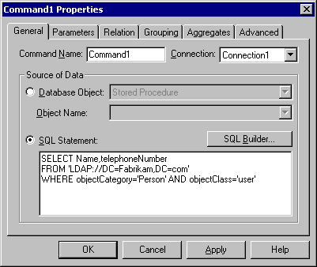
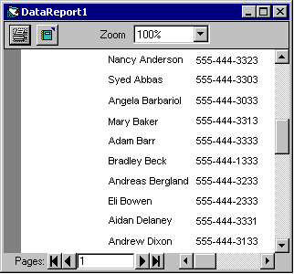

# Reorganization

The sales organization has moved to a new organization — "Sales and Support." Julie Bankert has been promoted to vice president and will lead the new organization. Joe Worden, the enterprise administrator, must move Sales OU to a new OU, Sales and Support.


```VB
Set dom = GetObject("LDAP://DC=Fabrikam,DC=COM")
Set salesSupport = dom.Create("organizationalUnit", "CN=Sales and Support")
Set sales = salesSupport.MoveHere("LDAP://OU=Sales,DC=Fabrikam,DC=COM", vbNullString)
```


With this code example, all objects in the sales organizational unit, including the sub-organizational units, are moved to the new organizational unit.

Now, Joe can move Julie into the Sales and Support organizational unit.


```VB
Set usr = salesSupport.MoveHere("LDAP://CN=Julie Bankert,OU=Sales,OU=Sales and Support,DC=Fabrikam,DC=COM")
usr.Put "title", "Vice President"
usr.SetInfo
```


Be aware that the manager-direct report link between Julie Bankert and Chris Gray is automatically updated by Active Directory.

**To create an Active Directory report**

1.  Open Visual Basic version 6.0, and when prompted for the project type, select **Data Project**.
2.  On **Data Project**, double-click **Data Environment1**.
3.  On the **Data Environment** window, right-click the connection object **(Connection1)** and select **Properties**.
4.  Select **OLE DB Provider for Microsoft Directory Services**, and click **Next**.
5.  Select **Use Windows NT Integrated security**, and click **OK**. This creates a connection object.
6.  Right-click the **Data Environment** window again to select **Add Command**. Right-click the **Command1** object and select **Properties**. The following **Command1 Properties** dialog box will appear.

    

7.  Click the **SQL Statement** option button and type the following:

    SELECT Name,telephoneNumber FROM 'LDAP://DC=Fabrikam,DC=com' WHERE objectCategory='Person' AND objectClass='user'

    The **Command** object is created. Add the **Command** object to the report.

8.  Double-click **Data Report1** from the **Project** window.
9.  Drag the **Command1** object from the **DataEnvironment1** window to the **Detail** section in the **Data Report** window.
10. On **DataReport1 Properties**, for **DataSource**, select **DataEnvironment1** from the pull-down menu, and select **Command1** in the **DataMember** field.
11. On the project window, right-click **Data Project**, and select **DataProject Properties**.
12. On the **DataProject - Project Properties** dialog window, under **Startup Object**, select **DataReport1** from the pull-down menu. Click **OK** to save.
13. Compile. The following **DataReport1** dialog box will appear.

    

## Related topics

<dl> <dt>

[Joining Heterogeneous Data](joining-heterogeneous-data.md)
</dt> </dl>

 

 


