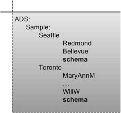

# Schema Interfaces

The schema container contains a set of schema definitions that are attached to part of the namespace tree of the provider. Typically, each instance of a namespace has its own schema. For example, in the following figure, the ADSI example provider defines a schema container in each of the root nodes "Seattle" and "Toronto".

To create an ADSI implementation for a provider, you need to supply schema management objects that reflect the underlying namespace of the provider and which support ADSI schema interfaces. The following is a list of the ADSI schema interfaces, which are contained in the schema container.

-   [**IADsClass**](/windows/desktop/api/Iads/nn-iads-iadsclass) represents directory service classes.
-   [**IADsProperty**](/windows/desktop/api/Iads/nn-iads-iadsproperty) represents directory service properties that have single or multiple values.
-   [**IADsSyntax**](/windows/desktop/api/Iads/nn-iads-iadssyntax) represents the single VARIANT type.

Interfaces defined by ADSI can support specific properties and syntaxes for your provider. Providers can choose to extend an ADSI definition by using the methods that create and access properties, for example, you can use the methods of the [**IADs**](/windows/desktop/api/Iads/nn-iads-iads) interface such as [**Get**](/windows/desktop/api/Iads/nf-iads-iads-get), [**GetEx**](/windows/desktop/api/Iads/nf-iads-iads-getex), [**Put**](/windows/desktop/api/Iads/nf-iads-iads-put) and [**PutEx**](/windows/desktop/api/Iads/nf-iads-iads-putex). Providers can also support additional properties through additional interfaces. For a complete list of ADSI interfaces, see [ADSI Interfaces](adsi-interfaces.md).

An ADSI provider component with a complex namespace might allow multiple schemas to exist in a namespace instance, each at a different part of the tree. The [**IADs::Schema**](iads-property-methods.md) property of an object, however, always names its own schema definition.

 

 

