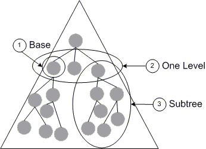

# Scope of Query

The scope of a query is determined by the object to which you bind. If you are unsure where the object is located within the enterprise then you will need to do as wide a search as possible. However, if you know that the object will be contained within a specific domain, such as the domain that the user is connected to, or within a specific group, such as the Managers group, then you should set the scope of the search to reflect the circumstance. For the best performance, you should try to target the scope to search the smallest number of objects possible.

When you are not sure where an object will be located in the enterprise, you can bind to the global catalog service. The global catalog service contains a list of every object in the directory and a small subset of each object's attributes. After you find the object in the global catalog, you can retrieve its distinguished name from the global catalog and use it to bind to the object to perform other operations.

After you decide which object to bind to, you can further restrict the query to one of the following scopes: a base query, a one-level query, or a subtree search, as shown in the following illustration.

## Base

A base query limits the search to only the base object. The maximum number of objects returned is always one. This search can be used to verify the existence of an object. For example, if you have an object's distinguished name and you must verify the object's existence based on the path, you can use a one-level search. If the search fails, you can assume that the object may have been renamed or moved to a different location, or that you were given incorrect data about the object. Be aware that you should store the GUID instead of the distinguished name if you want to revisit an object. This allows the object to be renamed or moved in the directory hierarchy without breaking the persisted link.

## One Level

A one-level search is restricted to the immediate children of a base object, but excludes the base object itself. This setting can perform a targeted search for immediate child objects of a parent object. For example, if you have a parent object called P1, and its immediate children are: C1, C2, C3, then in a one-level search, C1, C2, and C3 should be included when evaluating the criteria, but P1 would not be part of the search. A one-level search can be used to enumerate all children of an object. In fact, in some ADSI providers, [**IADsContainer**](/windows/desktop/api/Iads/nn-iads-iadscontainer) enumeration translates to a one-level search.

## Subtree

A subtree search, also known as a deep search, includes all the objects beneath the base object, excluding the base object itself. This search may generate referrals to other servers. This search has the greatest scope and may return a large result set. If possible, search on at least one indexed attribute and set the referrals settings (for more information, see [Performance and Handling Large Result Sets](performance-and-handling-large-result-sets.md)) to match your search requirements. It is also suggested that the results of a subtree search be performed asynchronously and paged to reduce the server overhead and network effectiveness. A subtree search is normally used to search objects for a given scope. For example, search for all users with accounts that will expire in 30 days or less.

 

 

