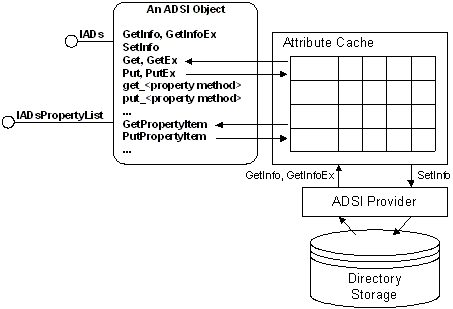

# The ADSI Attribute Cache

The ADSI object model provides a client-side attribute cache for each ADSI object. The attribute cache is comparable to a table in memory that contains the names and values of most object attributes that have been downloaded. Some attributes, such as operational attributes, are not cached. ADSI uses property caching to enhance the performance of attribute manipulation and add transactioning capability for attribute read and write operations. This capability is critical for clients written in languages that have no native batching mechanism for setting attributes, such as Microsoft Visual Basic development system. Without the ADSI property cache, such clients would have to access the server every time an attribute is read or written.

When an object is created or first bound to, the property cache for the object is empty. When the [**IADs::GetInfo**](/windows/desktop/api/Iads/nf-iads-iads-getinfo) method is called, ADSI loads the requested attributes for the object from the underlying directory service into the local cache. When a specific attribute value is read and the cache is empty, ADSI makes an implicit call to the **IADs::GetInfo** method. When the cache is filled, all attribute read operations work on the contents of the cache only.

When an attribute value is written, the new value is stored in the local cache until the [**IADs::SetInfo**](/windows/desktop/api/Iads/nf-iads-iads-setinfo) method is called. When the **IADs::SetInfo** method is called, the attributes in the cache are committed to the underlying directory service. After the **IADs::SetInfo** method is called, the values remain in the cache until explicitly refreshed with another call to the [**IADs::GetInfo**](/windows/desktop/api/Iads/nf-iads-iads-getinfo) method.

> [!IMPORTANT]
> The [**IADs::GetInfo**](/windows/desktop/api/Iads/nf-iads-iads-getinfo) method must be used carefully because this method will always overwrite the attribute values in the cache from the underlying directory service, even if the cached value has been changed. That is, it will overwrite attribute values that have been changed in the cache, but not committed to the underlying directory service with a call to the [**IADs::SetInfo**](/windows/desktop/api/Iads/nf-iads-iads-setinfo) method.

 

The following figure shows the different methods used to operate on the cache.

 

 

