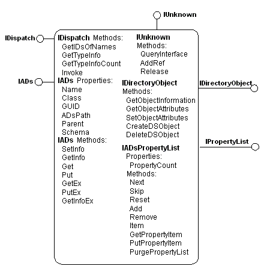
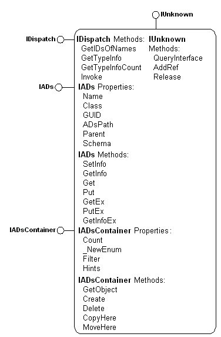

# Using the IADs Interfaces

ADSI, each element of a directory service is represented by an ADSI object, which is a Component Object Model (COM) object that supports the standard COM [**IUnknown**](_com_iunknown) interface as well as the [**IDispatch**](ebbff4bc-36b2-4861-9efa-ffa45e013eb5) and [**IADs**](iads.md) interfaces. **IADs** supplies the basic maintenance functions for ADSI objects.

Each ADSI object must support this interface, which serves to:

-   Provide object identification by name, class, or ADsPath.
-   Identify the object container that manages creating and deleting objects.
-   Obtain the object schema definition.
-   Load the object attributes to the property cache and commit changes to the persistent directory store.
-   Access and modify the object attribute values in the property cache.

The [**IADs**](iads.md) interface is designed to ensure that ADSI objects provide network administrators and directory service providers with an efficient and consistent representation of various underlying directory services.

The preceding figure shows a generic ADSI object that support the fundamental interfaces [**IADs**](iads.md), [**IADsPropertyList**](iadspropertylist.md), [**IUnknown**](_com_iunknown), [**IDirectoryObject**](idirectoryobject.md), and [**IDispatch**](ebbff4bc-36b2-4861-9efa-ffa45e013eb5). An ADSI object such as this manages data from the data store of the underlying directory service through the interfaces it supports. This data is known as the properties of the object, and the routines that obtain and set these properties are known as property methods. Read-only properties have one property method that obtains the property value. Read/write properties have two methods; a method that sets the value and one that obtains the value. Properties are implemented on each ADSI object using a [property cache](the-adsi-attribute-cache.md). [**IADs::get\_ADsPath**](iads-property-methods.md) and **IADs::put\_ADsPath** are examples of property methods. Property methods are not apparent to Visual Basic and other Automation clients that enable direct references to the property. For example, Visual Basic refers to **IADs::ADsPath** directly using the **Object.ADsPath** syntax. For more information, see [Interface Property Methods](interface-property-methods.md).

In addition, an ADSI object interacts with other ADSI objects and directly to a namespace through methods. Methods execute immediately. Examples of methods include [**IADs::SetInfo**](iads-setinfo.md) and [**IADs::GetInfo**](iads-getinfo.md).

Properties, property methods, and methods are all accessed through standard COM interfaces.

An ADSI object is uniquely identified by its ADsPath. For example, an ADsPath for the LDAP namespace is "LDAP://MyServer/DC=Fabrikam,DC=COM". For more information about ADsPaths, see [ADSI Binding](binding-to-an-adsi-object.md). For programmers familiar with COM monikers, this is conceptually similar to the COM moniker display name.

Any ADSI object that contains other ADSI objects, called an ADSI container object, also supports the [**IADsContainer**](iadscontainer.md) interface, which provides methods and properties that manage the creation, deletion, and enumeration of ADSI objects contained by the object. The following figure shows an ADSI container object.

Most ADSI objects are contained by other objects. The only ADSI object with no parent container is the top-level ADSI **Namespaces** object ("ADS:").

The [**IADs::SetInfo**](iads-setinfo.md) method on a container object persistently stores the cached properties of the ADSI container object to storage in addition to any objects created with the [**IADsContainer::Create**](iadscontainer-create.md) method. [**IADsContainer::Delete**](iadscontainer-delete.md) does not affect the property cache but deletes the underlying namespace directory element represented by this object.

 

 

