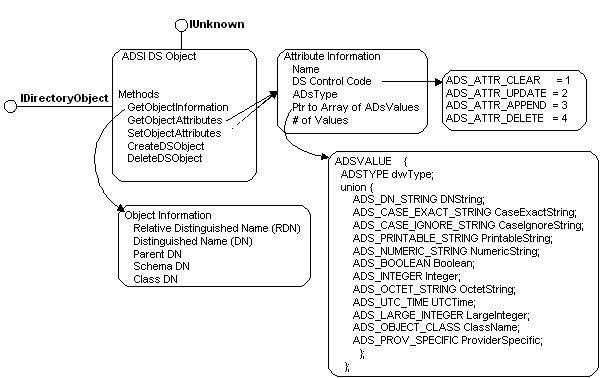

# Using the IDirectoryObject Interface

When you create an ADSI client in C or C++ that uses early binding, you will have a wider variety of ADSI data types available to use for your client if it calls the [**IDirectoryObject**](/windows/desktop/api/Iads/nn-iads-idirectoryobject) interface instead of the [**IADs**](/windows/desktop/api/Iads/nn-iads-iads) interface. The **IDirectoryObject** interface provides methods to support a subset of an object's maintenance properties and to access its attributes. The following figure shows the relationships among the data structures.

In the preceding figure, the structure [**ADS\_OBJECT\_INFO**](/windows/desktop/api/Iads/ns-iads-ads_object_info) defines properties that identify the object by distinguished name, relative distinguished name, by container (ParentDN), by object type (ClassDN), and by schema definition (SchemaDN). The attribute descriptor [**ADS\_ATTR\_INFO**](/windows/desktop/api/Iads/ns-iads-ads_attr_info) consists of a name, data type, an array of data values shown in [**ADSVALUE**](/windows/desktop/api/Iads/ns-iads-adsvalue), and a flag that directs the underlying directory service to perform certain operations on the attributes detailed in [ADS\_ATTR\_\* constants](adsi-constants.md). The data types for these attributes include the ADSI extended syntax types, detailed in [**ADSTYPEENUM**](/windows/win32/api/iads/ne-iads-adstypeenum).

 

 

