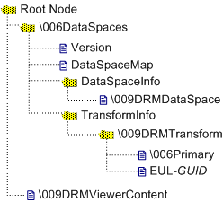

# Understanding Compound Files

\[The AD RMS SDK leveraging functionality exposed by the client in Msdrm.dll is available for use in Windows Server 2008, Windows Vista, Windows Server 2008 R2, Windows 7, Windows Server 2012, and Windows 8. It may be altered or unavailable in subsequent versions. Instead, use [Active Directory Rights Management Services SDK 2.1](https://msdn.microsoft.com/library/hh535290), which leverages functionality exposed by the client in Msipc.dll.\]

The Rights Management Add-on for Internet Explorer reads compound file binary format (CFBF) files. This is an open container format originally developed by Microsoft. For more information, see Structured Storage. The Rights Management Add-on expects to find an encrypted file, an [*issuance license*](https://www.bing.com/search?q=*issuance license*), and optionally an end-user license at specific locations within the container. The encrypted file must be saved in the MHTML (MIME Encapsulation of Aggregate HTML) format before encryption. For more information, see [MIME Encapsulation of Aggregate HTML Documents (MHTML)](http://go.microsoft.com/fwlink/p/?linkid=87265).

In addition to licenses and encrypted content, the compound file also contains the transform that enables the add-on to process AD RMS-protected files. For more information about the compound file format used by the add-on, see [Rights-Managed HTML SDK](http://go.microsoft.com/fwlink/p/?linkid=105037).

For the add-on to read your protected content, the compound file must conform to a specific data structure. You can visualize this structure as a folder and file tree where an **IStorage** object represents a folder and an **IStream** object represents a file within that folder. The following diagram shows the storage objects and streams that the add-on expects. Storage objects are shown as folders and stream objects as files. This structure must be built by using the **IStream** and **IStorage** COM interfaces. The table following the diagram describes the various **IStream** shown.

| Stream name           | Description                                                                                                                                                                                                                                                                                                                     |
|-----------------------|---------------------------------------------------------------------------------------------------------------------------------------------------------------------------------------------------------------------------------------------------------------------------------------------------------------------------------|
| Version               | Stream that contains the add-on version number.                                                                                                                                                                                                                                                                                 |
| DataSpaceMap          | Stream that maps streams to their associated data spaces.                                                                                                                                                                                                                                                                       |
| \\009DRMDataSpace     | Describes the structure of streams and storage objects within a compound file. It maps AD RMS transforms applied to streams (in the \\009DRMViewerContent stream).                                                                                                                                                              |
| \\006Primary          | Stream that holds the signed issuance license, information about the transform class, such as its CLSID (C73DFACD-061F-43B0-8B64-0C620D2A8B50), and a text identifier such as Microsoft.Metadata.DRMTransform.                                                                                                                  |
| EUL-*GUID*            | Stream that holds the use license. You can store zero or more use license streams in a container file, each holding one license. If you do not include any, the add-on will attempt to acquire one by using the provided issuance license. If you do include use licenses, name the streams "EUL-", plus a base32 encoded GUID. |
| \\009DRMViewerContent | Stream that holds the encrypted file. This file can be a maximum of four gigabytes in size.                                                                                                                                                                                                                                     |

 

Keep the following guidelines in mind when you are creating the compound file:

-   You must use the names given.
-   Stream and storage names are not case-sensitive.
-   Strings are sequences of Unicode characters that are not preceded by a byte-order mark and that are not null-terminated.
-   Because the fields that follow strings are **DWORD**-aligned, you may need to use padding bytes.
-   The \\006 and \\009 values are ASCII values for nonprinting characters, not string values.
-   The *GUID* in EUL-*GUID* represents a unique value, not an actual GUID (which is too long for a stream name). You can use any unique value here. The maximum stream name length is 32 Unicode characters. To use an actual GUID string, you should base32 encode it.
-   The compound file structures and functions are defined in Objbase.h which is included in Atlenc.h.

## Related topics

<dl> <dt>

[Creating a Compound File and Adding Protected Content](creating-a-compound-file-and-adding-protected-content.md)
</dt> <dt>

[Adding an Issuance License to the Compound File](adding-an-issuance-license-to-the-compound-file.md)
</dt> <dt>

[Adding a Use License to the Compound File](adding-a-use-license-to-the-compound-file.md)
</dt> <dt>

[Publishing Content](publishing-content.md)
</dt> </dl>

 

 

