# User Interface Principles

This topic discusses how to implement intuitive user interface and user experience design principles into a Windows applications.

-   [Introduction](#introduction)
-   [The Basic Principles of Proper UI](#the-basic-principles-of-proper-ui)
    -   [Spacing and Positioning](#spacing-and-positioning)
    -   [Size](#size)
    -   [Grouping](#grouping)
    -   [Intuitiveness](#intuitiveness)
-   [20 Tips for a Better, Functional User Experience](#20-tips-for-a-better-functional-user-experience)
    -   [Use Standards](#use-standards)
    -   [Draw Attention to Important Buttons](#draw-attention-to-important-buttons)
    -   [Simplify Recognition with Icons](#simplify-recognition-with-icons)
    -   [Simplify Recognition with Headers](#simplify-recognition-with-headers)
    -   [Use Custom Message Boxes](#use-custom-message-boxes)
    -   [Include Alternate Commands](#include-alternate-commands)
    -   [How to Handle Critical Actions](#how-to-handle-critical-actions)
    -   [RadioButtons or ComboBoxes?](#radiobuttons-or-comboboxes)
    -   [Never Disrupt the User!](#never-disrupt-the-user)
    -   [Provide Progress Status](#provide-progress-status)
    -   [Simplify Complex Steps with Wizards](#simplify-complex-steps-with-wizards)
    -   [Get the Tone of Your Text Right](#get-the-tone-of-your-text-right)
    -   [Sometimes a ListView is Better](#sometimes-a-listview-is-better)
    -   [Simplify Navigation with Breadcrumb Controls and Sidebars](#simplify-navigation-with-breadcrumb-controls-and-sidebars)
    -   [Use Pretty Graphics](#use-pretty-graphics)
    -   [Provide Resizable Forms When Possible](#provide-resizable-forms-when-possible)
    -   [Provide More Functionality with Sidebars/Task Panes](#provide-more-functionality-with-sidebarstask-panes)
    -   [Give a Notification Choice](#give-a-notification-choice)
    -   [Provide Tooltips!](#provide-tooltips)
    -   [Do Not Forget the Little Things](#do-not-forget-the-little-things)
-   [Conclusion](#conclusion)

## Introduction

Developers often fail to take the perspective of the end user into account. Developers work hard to make the application work—customers just expect it to work and their perception of the software centers around this requirement. This is especially true if you develop retail software, or something that will be used by non-technical people. Developers must be aware of the needs of the end-user throughout the entire software design process.

A software application must be as easy to navigate and use as possible. With the amount of software being created, an estimated 4 out of 10 software applications have a really great UI that the end user truly likes and is instantly comfortable using.

A massive amount of internal-use software is created for corporations. Whether it is developed in-house, or under the care of a consultant—often a bare minimum of time, effort, or money is invested into creating a better UI. The 'designer' role is rare in the development cycle—especially in the world of Windows applications.

There are some basic rules to follow to have a much nicer looking and better functioning UI for your application. It does not require too much investment of time or money on your part, and adds a good return on investment.

Before we go further, let's differentiate between user interface and user experience—at least for the scope of this article. User interface, or UI, refers to the visuals and controls of your application, while user experience, or UX, encompasses both the UI and the behavior of the application related to the UI as well as the "feeling" the user gets from your app. It's not just about designing a great-looking UI, but making sure it works great, too.

Here we will discuss 20 points of UX design that you can integrate into your application design phase easily. The result will be richer applications with better intuitive functionality—a "human UX". As we all know the Windows Vista generation of applications will need to look and behave differently. This topic will help you prepare for future applications while giving your current users a taste of the future.

The following sections discuss the basics of proper UI design.

## The Basic Principles of Proper UI

A professional looking UX depends on these four factors:

-   Spacing and Positioning
-   Size
-   Grouping
-   Intuitiveness

With versions of Microsoft Visual Studio prior to 8.0, spacing and sizing was suboptimal. A 4x4 or 8x8 grid does not always work. With the inclusion of SnapLines, the process has been greatly simplified. Aligning a label with a text box, or even worse, aligning multiple labels with their corresponding text boxes was extremely difficult in previous versions of Visual Studio. SnapLines have greatly simplified this process.

The following sections describe four of the more important aspects of professional UX design.

### Spacing and Positioning

Spacing between two controls is important. The following screen shot demonstrates a poorly designed **User Information** entry form—the top two text boxes are too close, the list under them is too far away, and there is a lot of unused room on the form.

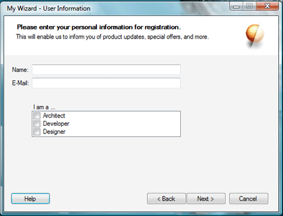

In the following screen shot, you can see a more professional-looking dialog with proper spacing and appropriately sized controls. This is the same form as in the previous screen shot, but it was modified to use the spacing recommended by the SnapLines. It is always recommended to align a label with the text baseline of the textbox or other control next to it, rather than the actual bottom border of the control. The SnapLines turn a different color when that alignment is reached, usually just a few pixels above the bottom border.

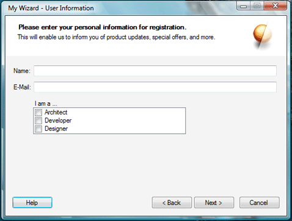

While there are no exact rules for spacing, the SnapLines provide extremely useful guidelines for proper spacing. Other tools to help you keep proper spacing are the Layout controls under the Containers toolbox group. The TableLayoutPanel is also very helpful for creating entry form style dialog boxes.

### Size

The same considerations apply to size. When you drag a button from the toolbox on to your form—it has the perfect height and width. The maximum width recommended (barring any seriously important reasons) is to double the original width.

If you look at the **Run** window on the **Start** menu, or the **Properties** dialog of any Windows Explorer object, the button sizes are 'just right'. If you have a very important function that you need your end user to notice without fail, there are other methods than using a large button or garish non-standard colors (more on that later).

In the following image, you can see three buttons. The first button is the most recommended size and is the size created by default when dragged (or double-clicked) from the toolbox. Sometimes extra text requires you to make the button larger. The second button shows a large yet acceptable size. It would not create a mess for laying out other controls. The third button, however, is a completely unacceptable size. You can see that it even slightly distorts the theme bitmaps Windows uses to draw themed controls. It will also make it hard to align other controls intuitively around it.

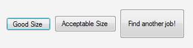

### Grouping

Typically, an application contains many controls. Only by proper, intuitive grouping can you make all these controls easier to use. Function-based or categorized grouping is done best by Tab controls. For example, 'Accounts,' 'Reports,' 'Employees,' and 'Projects' would be perfect candidates for tabs in a typical business application. Sibling grouping—controls that contribute to the same end result—are best done by Group controls. Using Panels with borders for such grouping is not recommended. Group controls save you the extra weight of a label control—especially if your sub-controls are self-explanatory.

Group controls inside Group controls are not recommended unless there are no more than 2 or 3 of them inside one large Group control.

### Intuitiveness

This is the most important aspect of a great user experience. Intuitive UX lessens the need for explanations. The user just knows what the controls do.

An important topic in intuitive design is color-coding. A good example is presented in Windows XP which presented new soft-square buttons for functions such as navigation in themed applications, the **Log Off** and **Turn Off Computer** dialogs, and others.

The coloring of these controls was determined based upon the severity of the result of that button being pushed. Navigation is green, much like a 'Go' traffic light. Shut Down, which would result in a potential loss of work, is colored red like a warning sign. Semi-critical buttons such as Log Off or Hibernate are yellow. Neutral buttons that do not have any critical effects on the work processes of the user, such as Help, are a soft blue. When creating a skinned UI, these color aspects should be kept in mind.

A very good example of recognition of content by colors is Microsoft Office OneNote. The application's tabs can be set to different colors while still looking essentially like a proper part of the overall Windows XP style design.

Another important aspect is the text in your applications. Recently, there have been various efforts to simplify the language used for the written instructions in Windows software. The usage of text inside software will be discussed later, but please note the following small but important detail.

MSN Messenger had a check box in its **Options** dialog marked "Share webcam capabilities." Developers and tech-friendly people know what that means, but a novice user could possibly think that you could let another user on the other end of your chat use your Web cam, too. In a recent version, they changed it to "My Webcam: Allow others to see that I have a webcam". This is perfect for the target audience that may not have technical knowledge and are used to simple language.

While simpler language makes it easy to understand, there's also an added advantage. Scientific studies show that our mind works easier with simpler language when trying to understand something new. Often, our brain processes words like 'it,' 'for,' 'that,' and other common words so speedily and effortlessly that more 'bandwidth' is allocated to understanding the words that stand out, like 'Webcam' or 'Others,' in the above example.

Message Box titles, GroupBox captions, and other such text blocks make it easy for you to convey the function of a group of controls to the end user with just a few words.

Intuitiveness is also born from familiarity. For example, the placement of the **OK** and **Cancel** buttons is so uniform and well placed in our minds that if a dialog holds these buttons in a reverse sequence (**Cancel**, then **OK**; instead of **OK**, then **Cancel**)—you just might hit **Cancel** instead. After using a particular standard for doing things—Windows-based applications for example—for more than a year, habits develop. Following industry standards (however unstated they may be) makes your software easier to use.

In one of the early Windows Vista preview builds, the **Minimize**, **Maximize**, and **Close** buttons of any window became different. In previous versions of Windows (especially when using a single monitor), you develop a habit of moving the cursor in the top-right corner of the screen and clicking. This always resulted in the window closing. Now in this particular build of Windows Vista, there were approximately 8 pixels worth of space between the Close button and the right-most border of the window. The extra space did make it look cool (and was probably necessary for the cool glow animation the button sported), but was irritating because it did not allow users to close open windows as easily. Reconditioning your mind can be tough. Thankfully, in the following build, this issue was addressed. Now, there still is space between the border of the window and the close button, but clicking that space also causes the window to be closed.

A very important factor of intuitive design is the amount of 'mental bandwidth'—the amount of time it might take our mind to comprehend something—it uses. The lower the 'bandwidth' usage, the better your user experience.

These are small things that contribute to the "experience" of using a software application. The following examples provide tips on improving your applications with real-world tips and tricks.

## 20 Tips for a Better, Functional User Experience

The goal of a better user experience is to have a simpler, easier, functional UI that also looks good. These tips will help you shape your UI to be more effective.

### Use Standards

The established standards of any software environment—whether on the operating system level, brand level, or application level—are very important. Besides the branding, the standards act as a proverbial schema in the user's mind. When the user spends long periods of time working with a software application, he or she will automatically increase productivity because of the growing familiarity.

Before discussing standards, let's first discuss what exactly these standards are. The standards include everything from the layout of controls in a particular manner on the dialog boxes—like the **OK** and **Cancel** buttons, the user interface's shape—rounded-corners of the top of the window as in Windows XP dialogs, styles of icons, styles of any other graphics, interactive behavior of your application, and the like.

If your application falls into a specific niche, then it may fare better to follow a different set of standards. For example, if your application supports, application or an add-on for, Office OneNote 2003, it is wise to follow the styles of UI and interactivity standards of Office—and OneNote itself, in particular. This includes using the Office-style command bars instead of the standard toolbars, and other such things— both visual and behavioral. If your application is to be part of the Microsoft Visual Studio .NET category, then you have a separate set of standards. In fact, for such add-on or support applications, companies such as Microsoft do release written guidelines. Also note that sometimes graphics and design concepts are protected intellectual properties. Always check the proper documentation to make sure you have the license to create such designs.

A third example of standards would be the Tablet PC environment. These standards cross the boundaries between operating system guidelines and application guidelines. The [Tablet PC SDK documentation](/previous-versions/ms840465(v=msdn.10)) contains some very helpful information in the "Planning Your Application" topic. In contrast to theOffice 2003 or Visual Studio guidelines, these design recommendations directly affect how the user will interact with your application and how it should behave in turn. For instance, if you have docking windows in your application, the documentation recommends that you make sure it can detect when the screen orientation is changed, and that the docking windows properly reorganize themselves in a portrait or landscape orientation as needed. Even if you are not designing your application to be Tablet-specific, you should go over these guidelines.

With the rise of Smart Clients, applications are now crossing the boundaries between different hardware—normal PCs, Tablet PCs, Mobile or Ultra Mobile Devices, Media Center PCs, and so on. Each situation calls for a different (or additional) set of standards to be followed.

When applications share the operating system-level or application-level standards, the users feel more at home with the software, which makes it easier to learn and use. This results is a direct boost to productivity. Users want to be able to become productive with new software as quickly as possible.

### Draw Attention to Important Buttons

Sometimes you need to direct the user to the most important buttons even when you have four or five other buttons lying around it. If you experiment with the size, color, or font, you would break standards—which is not recommended. Instead, you can use a couple of simple tricks to accomplish this.

The first is to convert the other non-critical buttons into LinkLabels as shown in the following image. This way, the user knows that these links will perform a task, but their attention will go first to the button that stands out—without breaking standard design guidelines.

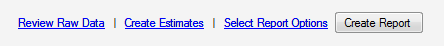

The second is to put the critical button first in line—either on the left for horizontal layouts as shown in the following image, or on top for vertical layouts. Do note that this may change depending on the target user's culture—you may fare better if you place the button in question on the far right if your application is any language that is written from right-to-left.

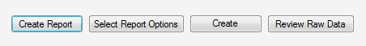

The recommended option is to set to receive focus by default. For example, on a delete confirmation dialog, the **No** option should be highlighted, as this prevents the user from accidentally deleting something.

### Simplify Recognition with Icons

Icons—especially the Windows XP and Office 2003 icons and toolbar bitmaps—help speed up cognition of the UI and the task the user has to perform.

For example, when you see the exclamation icon most often seen on the Message Box, you instantly become aware of the level of risk associated with the controls next to that icon. Similarly, when your application puts up a lot of controls—no matter how properly arranged—it can be daunting to find the set of controls you are looking for.

In Windows XP Service Pack 2, an updated tab is added to the **System Properties** control panel applet called "Automatic Updates". There are four options present—automatically download updates, download updates but let the user decide when to install them, notify the user if updates are available but do not start download, and disabling automatic updates completely.

A new PC user may not be aware of what these updates are and might not know which option would be best to choose. So, Microsoft has put a green shield icon with a big check mark on it next to the most recommended that signifies a "safe" option, and a red shield icon with a big "x" on it next to the one that would be potentially harmful to the user. This is very helpful in critical situations—especially when the user does not have time to read too much text.

In the same **System Properties** applet, each tab has multiple GroupBoxes with different controls for different tasks. A relative graphic is placed next to each group that would easily signify the task of the control group. This type of graphical code is similar to color-coding in physical files or parking lots. This also works on the same principle of having at least some visuals in a magazine article—it keeps the reader's interest.

Choosing the right icon is also important. Microsoft provides many standard graphics as part of Visual Studio 2005. These would be the best choice. If you create your own icons, it is highly recommended that you follow the operating system-level or application-level standards for these graphics as mentioned in the [Use Standards](#use-standards) section above.

The [Windows User Experience Interaction Guidelines](/windows/apps/desktop/) contains a very helpful guide for creating Windows style [icons](https://msdn.microsoft.com/library/aa511280.aspx).

### Simplify Recognition with Headers

Headers are the perfect way to explain the entire dialog in a single sentence (and optionally a graphic). Sometimes, headers can even help you accommodate navigation and commands within them as well. Headers work more effectively than normal description labels because they are the first thing that a user sees when the dialog pops up.

The Windows Installer wizards are perhaps the most popular headers: a simple icon in the far right; a title label describing the dialog (for example, Select Installation Folder); and a sub-heading that describes the purpose of the dialog (for example, Select the folder where the software files will be installed).

Let's say we have a typical business application with an accounts section. Following the design paradigm championed by Windows Vista, we can supply mission-critical information and related commands in the header (or footer, if the scenario calls for it) itself. Our user has opened the account file for "Big Company," and the header would look something like that shown in the following screen shot.

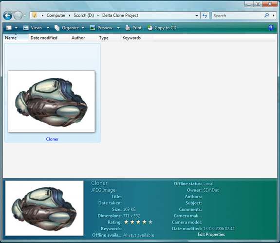

The following screen shot shows an example of a detailed header in a dialog box.

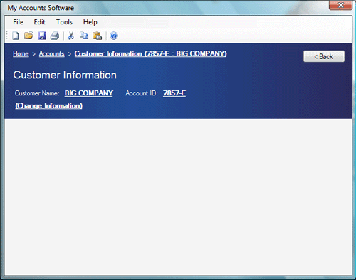

Similarly, you can avoid having to add Windows XP-style task panes—especially when you have just a few commands, which would waste a lot of vertical space— by moving these commands to the header.

There a few things you should keep in mind when designing headers:

-   Make sure the background color is different from the dialog background color. More often than not, a white header over a standard Windows intrinsic control face color will do. But if you really want to make sure no special theme or custom colors mess up your header, draw a **LinearGradient** using the **Color.FromKnownColor** with the colors **ControlLight** and **ControlDark**.
-   If possible, keep your header's height under 150 pixels. Usually a height of 100 or 120 will do. As a general rule, make sure it is less than 1/4 of the entire form's height.
-   If you want to add in-place editing for information shown in the header above, dynamically replace the LinkLabel with a Textbox and swap them again once the editing is done.
-   If you have a title label with a font over 10 pt in size, use Arial, or Franklin Gothic Medium. MS Sans Serif will look too jagged and unprofessional. Franklin Gothic Medium is the recommendation in the Windows XP Design Guidelines documentation. For applications targeting Windows Vista, use the Segoe UI font that is the system default font.

### Use Custom Message Boxes

The options available in the standard Windows message box are very limited. When you have to ask your user a question that can't be answered with a simple yes/no or OK/cancel, it becomes complicated.

Windows applications are now becoming simpler to use because of the high volume of non-technical users. Sometimes, it can be much simpler to provide buttons with friendlier texts and even some additional controls—LinkLabels, for instance—to make it easier to accomplish the task at hand.

The Microsoft .NET Framework makes it easy to implement custom dialogs. By just assigning a couple of properties on your custom dialog form, or with a single line of code, your form can work just like a standard message box. In a button-click event, set the dialog's **DialogResult** property to **DialogResult.Ok** or **DialogResult.Cancel**. Use the **ShowDialog(\[OwnerForm\])** method from the parent form. This method method returns the **DialogResult** value.

You can use all **DialogResult** members. These same options are used by the standard **MessageBox.Show** method.

Alternatively, you can just set the dialog's **AcceptButton** property to **btnOK**, and the **CancelButton** property to **btnCancel**. This will automatically map the **Enter** and **Esc** keys to the **btnOK** and **btnCancel** buttons' respective Click events.

Here are some tips to spice up your custom dialogs:

-   For complicated topics, provide links to local or online Help with a LinkLabel stating "Find out more" under the appropriate text label.
-   Instead of **Yes**/**No**/**Cancel** buttons, use texts that clearly state the result of clicking the button, such as "Save File and Exit," "Exit without saving," and "Do not exit." However, stick to the standard **Yes**/**No**, **OK**/**Cancel**, and such standard buttons whenever possible. Familiarity makes for great productivity.
-   Keep 50 pixels worth of margin space on the left side (or right side depending on the target culture settings) and add an icon representing the scenario for the dialog. If it's an information dialog, you can use the "i" icon used by standard message boxes; if it's a security dialog, you can use a lock icon or a key icon. Visual Studio 2005 ships with some great high-quality graphics.
-   Always make sure you provide proper keyboard navigation for these buttons—users use the keyboard shortcuts for message boxes (for example, O for Ok, Y for Yes, C for Cancel, and so on) heavily. They would surely find it annoying if your custom dialog did not use them.

### Include Alternate Commands

Two important factors dictate the need for alternate input methods—frustration and laziness. Frustration is a too often occurring thing for computer users. When you are frustrated you want your task to be done quickly. An extra click or an extra wait of a few seconds really infuriates a person under stress—you know how it is, we've all been there. Laziness often urges you to either finish the task with just the keyboard or mouse—whichever you are using at the moment. But other than these two factors, having alternate input methods makes it easy for the user to get tasks done.

For example, if you have a list box with two buttons—"Add" and "Remove"—on either side, you should add a context menu for that list box with menu commands analogous to those buttons. This gives the user an opportunity to choose the method he or she finds the most suitable. Novice users, as the Windows Vista User Experience Guidelines state, use context menus a lot and expect them to be anywhere they right-click.

Similarly, we use visual controls for text or numeric input. For example, sliders are used to specify integers, and Calendar controls are used for date input. Sometimes it can be more comfortable to just input by typing. It can often make a difference for the user if you add a Numeric Up-Down control linked to a Slider, or use a DateTimePicker instead of the Calendar control.

### How to Handle Critical Actions

When performing a critical, unrecoverable function, it is generally a good practice to make a message box pop-up to confirm the action. Let's take that up a notch. In the following screen shot you can see a similar custom message box, but with an added advantage—a timer shown visually with the help of a progress bar.

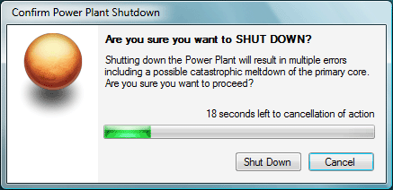

There are a few scenario-specific variations you can use. If the action to be taken is very critical (ranging from overloading a nuclear power plant to deleting files permanently), then the default action after the timer runs out should be cancel. The dialog should not go away, but rather the text label changes to show that the action has been canceled. The user can choose to confirm the command or cancellation.

Always make sure buttons that perform critical operations are clearly marked—always use clear text that accurately describes the action. If the action is the deletion of files, do not write "Remove Files from Repository"; write "Delete Files from Repository." When working with file lists, if a Delete menu command deletes the selected files from the hard disk itself (as opposed to removal from just the file list), you should properly stress the critical nature of this and explicitly stress that the action will permanently delete the files.

Someone once said, "You are as good as your worst work." The same thing applies to software applications. A single bad experience with your app can make a big negative impression on the user. To make sure this does not happen, one thing you can do is to make sure that if your application crashes, it goes down gracefully. If you can add data recovery, or allow the user to try to save a copy of that data, it can be a big plus. The user should be properly notified if the application crashes. A JIT-Debugger or a critical error dialog is not a good thing. While talking about how to handle crashes goes beyond the scope of this article, I will recommend that a simple dialog that apologizes to the user and informs him or her of the situation (and possibly with a link to more information on how to recover from this crash) would be very helpful to the user.

If you want to take it one step further, you can do what one of my favorite graphic design applications does. If it crashes, it will show a recovery dialog which would allow you to save a separate copy of the file being worked on, and then would give you a feedback dialog where you can enter information about the crash (personal information optional, of course) and send it to the creators.

### RadioButtons or ComboBoxes?

At first glance, the method for making a one-of-many selection does not seem so difficult or important. Sometimes it can be—especially if the scenario is an application used for time-sensitive work.

Let's take a look at a real life example. Microsoft recently released a preview version of a graphics application, Expression Graphics Designer (formerly codenamed "Acrylic"). I had about 20 graphics objects to which I had to assign a certain property separately in this application. It was a dreary process. To do this, I had to select the object, click the button for bringing up the settings window, and set the options. In one such option two choices had to be picked from a ComboBox, as you can see in the following screen shot.

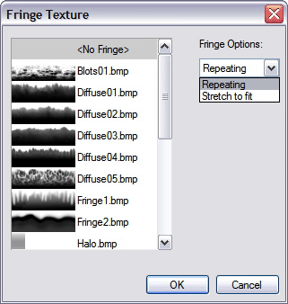

When you have to drop down the ComboBox list and select the second item (out of only 2 items) it can be really irritating. What we do not generally realize is the time it takes for the drop down list to appear. It can waste a lot of your time and can be frustrating. This could be solved easily by putting in a GroupBox with two RadioButtons—especially when there is so much space available. I've encountered similar problems in applications such as CorelDRAW, Microsoft Access, and others.

Besides wasting time because of the drop-down animation, it also wastes our "mental bandwidth." With two "always visible" RadioButtons, our mind would subliminally know the position for the cursor to click. With the ComboBox it will be processed only after the list has been drawn. While it may seem too unimportant, it actually is very important.

Sometimes it is better to use RadioButtons, especially if you have 4 choices or less.

### Never Disrupt the User!

Short of putting a gun to their heads, this is the most destructive thing a developer can do to users. When your application, unnecessarily or otherwise, interrupts the user while he or she is working on another application with a message box or a taskbar flash, you earn negative points from the user.

Taskbar flashes can be useful, of course, but should be called upon only when your application's process requires input from the user to continue, or if you have something critical to convey to the user. If the user has kept the taskbar on Auto-Hide, a flashing taskbar button can obstruct the user from accessing the status bar or other low-anchored controls as the taskbar would be on top of it and will not hide again until the user has clicked the flashing button.

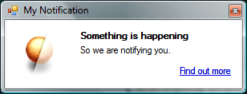

"Toast" windows (see Figure 10), made famous by instant messaging clients like MSN Messenger, are a great solution for informing the user of something without annoying or disrupting his or her work flow. There is a great article by Bill Wagner on [creating Toast windows](/archive/msdn-magazine/2005/september/sprinkle-some-pizzazz-on-your-plain-vanilla-windows-forms-apps). It's good policy (and manners) to not disturb any other application's toasts. Obstruction of such windows can be annoying and unproductive. One solution is to use the [ToastSemaphore Mutex](/library/WinMessenger/winmessenger/overview/toast.asp) provided by the operating system to avoid toast collision.

Sometimes you may need to show multiple items by the toast. Popping up 3 or more toasts would not really be advisable. Instead, cycling through each by popping/fading one toast after the other would be better. Microsoft Outlook implements a similar solution when notifying the user of incoming e-mails.

### Provide Progress Status

Often there are tasks that require the user to wait. Of course, this is one of the things that the user simply hates to do. But worse is when they are waiting without knowing what is happening. Sometimes your application may need to connect to a Web service or a remote computer, or maybe it is processing large chunks of data—whatever the reason, the user should be made aware of, or at least vaguely aware of, what is happening under the hood. There are different methods of doing this, based on the situation.

If you are connecting to some far off object like a Web service or something placed on a network or Internet server, it would be advisable to show a simple progress dialog (see the following image), or a progress bar hosted in the status bar. An accompanying label should describe the current status of the process. For example, if you are connecting to a Web service to process some data, just say "Connecting to Web service... " or "Please wait, processing... " If this process is synchronous, it is advisable to disable all controls the user can access until the process has been completed, or just show the progress as a modal dialog box.

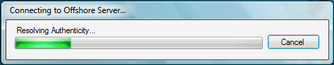

It is highly recommended that you set the progress bar Style to Marquee mode if you are using a progress bar and the processing time is unknown, or if you do not have a maximum value.

Another method that is becoming popular is a fixed 'toast' window that displays progress. Microsoft AntiSpyware downloader/updater or the Norton AntiVirus e-mail scanning toasts are good examples of this. Of course, this should be used only for asynchronous processes only. Otherwise the user may feel disconcerted. Such windows are best used for background processing such as downloading an update or performing a scheduled task, and should never be set to "Always on top."

### Simplify Complex Steps with Wizards

It is safe to assume that if faced with a plethora of controls on a single form, a typical user will be confused to no end. Sometimes, no amount of grouping, sizing, or spacing can help you when you have many important controls.

A Wizard is the best thing for such scenarios. You can divide controls by task or categories as applicable, and place them in separate steps. This can help the user stay focused and not be daunted by the task. You can provide step- or task-specific help with a Help button. You can find Wizard creation guidelines in the MSDN Library.

Wizards are also a good way to help set up the initial configuration of your application. Many applications use such a wizard to set up personalized configuration just after setup is completed, or on first use. Such an initial wizard should also be made optional, if possible—if the user cancels at any point, the unspecified settings go to default values. If you can make the wizard a bit graphical (see the [Use Pretty Graphics](#use-pretty-graphics) section), it makes the configuration task that much easier.

### Get the Tone of Your Text Right

In the [Windows User Experience Interaction Guidelines](/windows/apps/desktop/), a very important point has been made about "Text Tone". This is the impression and feeling given by the text in your application. This can be anything from a simple tooltip, to an instruction label control.

Earlier we discussed the change of text in the Webcam option in MSN Messenger. That is called proper text tone. When dealing with non-technical or novice users, getting the message across takes on a different aspect.

If you write "Destination Path" above a text box in a self-extracting application, a technical user can easily know that you enter something like "C:\\Temp\\MyPath." A novice user (think "Mom") can just as easily be baffled and would need to refer to the manual, call tech support, or worse—give up. A good alternative is to specify what you want the user to do: "Select the folder where you would like to place these files." You can even rename the "Browse... " button residing next to that text box to "Select Folder... "

Providing a clear description of what you want the user to do also lessens the need for Help files, or at least lessens the details you need to include in Help files.

A very good suggestion from the [Windows User Experience Interaction Guidelines](/windows/apps/desktop/) applies to any software. It states that the writer should keep the text conversational. The Guidelines defines this as, "Avoid words you wouldn't say to someone else in person."

A few tips for writing text:

-   Avoid talking about the user in the third person. Say "You" instead of "The user."
-   Whenever possible, judiciously use "My name:" or "My E-Mail address:" instead of "Name:" or "E-Mail:"
-   When giving multiple options, write the text from the user's perspective. For example, if you have two RadioButtons under a label such as "Select permission for \[Username\] on this network" above two RadioButtons, such as "Allow" and "Deny", replace the RadioButton text with "I want to allow \[Username\]" and "I want to disallow \[Username\]."
-   Underline text only if it is used for links. It confuses the user if the underlined text is not a link.
-   Draw attention to important information with a bold label, but use it carefully. Too much bold text is confusing and reduces the overall impact of the form.
-   When writing the text for a check box, make sure it is easy to know what will happen when it is selected and when it is unselected, or cleared. The recommended option is to write the text directly as the result of the check box being selected. For example, write "Send me helpful information from your partners" instead of "Do not send me helpful information from your partners." While I can imagine many marketing people arguing about this particular example, I'm sure you know what I mean.
-   If you have a button-like control (usually a RadioButton with a Command Button appearance) that controls Enabled/Disabled, make sure you label it properly. If the process is enabled, write "Enabled" instead of "Enable", or "Disable". If you write Enabled it shows the current status. If the button is clicked (enabled) and the button says "Enable", it can be confusing and problematic. "Enable" might prompt the user to click it thinking the process is not active.

### Sometimes a ListView is Better

We often stick to DataGrid or ListBox or even ComboBox for selection tasks, but with Windows XP and later versions of Windows, using a ListView can give you larger options.

The fine points of the ListView control:

-   Speeds up recognition of items with icons and bitmaps.
-   Displays additional information with Details or Tile views.
-   With Visual Studio 2005, you can even have Groups for additional categorization. Groups span across all views and are flexible. Groups can also be used to flatten a hierarchy view (like a TreeView) where there are more Child nodes than Parent nodes. A good example of this is the Network Connections dialog in Windows XP, when viewed with "Show in Groups" and the view set to Details.
-   To customize a ListView control, manually paint it by setting the **OwnerDraw** property and using the **DrawItem** and **DrawSubItem** events.
-   Supports quick in-place editing of ListView items.
-   Easily supports manual reordering.
-   Lets users select the view (Large Icons, small icons, list, and so on) they are most comfortable with.

### Simplify Navigation with Breadcrumb Controls and Sidebars

"Sub-navigation" is the key to complex UI. Sometimes you can't escape having a complicated UI. The best thing to do in such a situation is to make the experience as easy as possible for the user. A sidebar consisting of link labels, or a TreeView for hierarchy-based navigation, suggests a sibling level navigation for the current dialog's task. It makes it very easy for the user to jump between steps of the process while knowing where he or she is.

If you go for a hierarchy-based navigation with TreeViews or other similarly complex navigation, a good utility for the user would be a breadcrumb control. While Visual Studio does not ship with a built-in control for this yet, see [Creating A Breadcrumb Control](/archive/msdn-magazine/2005/july/advanced-basics-creating-a-breadcrumb-control) for information on creating one yourself. A breadcrumb control makes it easy to find the current location in relation to the hierarchy.

Breadcrumb navigation can be easily merged into the header if the form has one. See the previous section on [headers](#simplify-recognition-with-headers).

### Use Pretty Graphics

Everyone loves applications with cool graphics—the majority does, at least. While a UI with pretty graphics isn't a logical choice for all applications, it does help to make a nice impression and can be a pleasure to work in. Of course, the graphics should not impede productivity, but if used correctly, they can increase it!

There does not have to be many graphics, nor do they necessarily require a lot of work. A professionally designed splash screen or a header (like the one we talked about earlier) does the trick. If your budget allows, you can use nicely designed graphics for toolbars, wizards, and more. They make your app look pretty, and more professional, too. It is a subtle effect, but a professional look conveys confidence and stability. If you are a relatively small company creating retail applications, this is a key aspect to consider.

Always make a point to use professionally designed graphics. Royalty-free graphics are easily available and affordable. You can hire a designer as well. But if graphics aren't your forte, do not try it yourself. If you can't acquire or use professionally designed graphics, then it is better to not use them at all.

For small graphics, you can always go for the icons and bitmaps that ship with Visual Studio 2005. (The graphics that shipped with previous versions are not recommended!)

### Provide Resizable Forms When Possible

Resizable windows are somewhat like to resolution-independent windows. Resolution-independent windows look the same whether you use 96DPI or 300DPI screens. Whether or not your application's UI is resolution-independent, it will fare better if it is resizable. Of course, this would not apply to many scenarios, but is a good general-purpose rule.

If your window deals with lists of any sort—especially ListViews—this becomes even more important. Resizing allows the user to look at more data at the same time.

For example, we have an application where the user has to select an image from a large collection. The open dialog allows you to select a Thumbnail view, but the dialog is fixed size, and the thumbnail list shows only 4 thumbnails at a time. If the collection has a hundred images, scrolling and looking—a repetitive task—can be quite tiresome and a decrease in efficiency. If the dialog is resizable, the user can make it as large as is comfortable or at least as large as the screen would allow, and be able to finish the task quickly. If your list has horizontal scrolling—like a detailed ListView or DataGrid—it is even more tiresome! Resizable windows are very helpful in such a situation.

### Provide More Functionality with Sidebars/Task Panes

Like the headers we talked of previously, sidebars and task panes are a wonderful way to provide extra functionality and utility commands. For example, the task panes in Office Word 2003 are very convenient, accessible, and non-intrusive. They also function asynchronously when connecting to online resources, providing the user with the option to multi-task.

Creating a task pane or sidebar is as easy as creating a docking panel, with the option of putting a slick graphic on the top to act as a titlebar. You can even use a colored Label control for that. The opportunities for task panes are many!

If you have additional functionality and want to non-intrusively supply it to your user, there's no place like the task pane. You can also make task panes "Auto Hide" or collapse like the Visual Studio tool windows.

### Give a Notification Choice

Previously we saw how to make a custom message box. If a message box in your application is going to be shown often to the user, then it can be prudent to add a check box that the user can select to disable that dialog from being shown in the future. Such an option is especially good for more obvious messages.

A familiar example of this is the Visual Studio Find dialog. When you search or replace text, Visual Studio shows a message box stating the results. But you are also given the option of disabling that message box. It can be really annoying if you have to hit Enter or click OK every time you search.

Another cool thing that Visual Studio does is that even if the dialog is disabled, it still displays the results of that operation in the status bar.

### Provide Tooltips!

Sometimes tooltips can save you a lot of time. Buttons, check boxes, and other controls can be ambiguous and the user may not be sure what to do. Tooltips provide the best form of context-sensitive Help in just a single line. The user can quickly decide what to do without searching for anything in the Help file or opening another window.

People often skip this in their applications. Make a point to add tooltips to all ambiguous controls—or to ALL controls if possible. Do not repeat the text of an accompanying label or that control's own text, but provide additional information about that control. The text should explain the function of the control in just a few words.

### Do Not Forget the Little Things

The little things can annoy you, but ignoring them can impact the impression you make. I once used an application made by an important person in the software industry that had its form's BorderStyle set to Sizeable, but the controls on the right side of the form were not anchored. Because of this, the application created by an industry heavyweight had a non-professional feel.

These kinds of "little things" are the core of the overall impression. Your application's UI and UX are what users will judge your application on—at least at first. If they see obvious bugs in your UI, they may perceive your application to be less powerful and effective.

## Conclusion

We have only touched upon a small portion human user experience. As the user experience becomes simpler, effective, fun, and more user friendly, the task of creating that user experience becomes that much more complex. But with some foresight and good planning, you can create a great user experience.

The best way to create the perfect user experience is to do usability testing targeted especially at the UI—whether with a special test group or by yourself. The more time you spend testing the user experience before releasing your application, the better. It will save you a lot of trouble later on.
