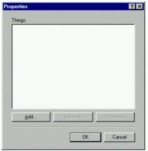

# Inductive User Interface

This topic describes the user interface model known as inductive user interface (IUI). Also called inductive navigation, the IUI model suggests how to make software applications simpler by breaking features into screens or pages that are easy to explain and understand. This IUI model is evident in various Microsoft projects, such as Microsoft Money 2000, the Windows control panel applets, various screens and dialogs in Microsoft Visual Studio 2010, and the task panels in Microsoft Office.

-   [Introduction](#introduction)
-   [IUI in Action: Solving a Common Design Problem](#iui-in-action-solving-a-common-design-problem)
    -   [The problem: software is hard to use](#the-problem-software-is-hard-to-use)
    -   [Deductive user interface](#deductive-user-interface)
    -   [A Solution: Inductive User Interface](#a-solution-inductive-user-interface)
-   [Steps for Creating an Inductive User Interface](#steps-for-creating-an-inductive-user-interface)
    -   [Step one: Focus each page on a single task](#step-one-focus-each-page-on-a-single-task)
    -   [Step two: State the task](#step-two-state-the-task)
    -   [Step three: Make the page's contents suit the task](#step-three-make-the-pages-contents-suit-the-task)
    -   [Step four: Offer links to secondary tasks](#step-four-offer-links-to-secondary-tasks)
-   [Additional Guidelines](#additional-guidelines)
    -   [Use consistent screen templates](#use-consistent-screen-templates)
    -   [Make it obvious how to carry out the task with the controls on the screen](#make-it-obvious-how-to-carry-out-the-task-with-the-controls-on-the-screen)
    -   [Provide an easy way to complete a task and start a new one](#provide-screens-for-starting-tasks)
    -   [Make the next navigational step obvious](#make-the-next-navigational-step-obvious)
-   [User Assistance](#user-assistance)
    -   [Primary assistance](#primary-assistance)
    -   [Secondary assistance](#secondary-assistance)
-   [Appendix: Designing and Testing Microsoft Money 2000](#appendix-designing-and-testing-microsoft-money-2000)
    -   [Designing and testing Money 2000](#designing-and-testing-money-2000)
    -   [Usability tests](#usability-tests)
    -   [Comparison with Web sites](#comparison-with-web-sites)

## Introduction

The IUI is a user interface model that suggests how to make software applications simpler by breaking features into screens or pages that are easy to explain and understand. Microsoft has implemented this model in Money 2000, a large commercial software application. Informal tests suggest that users can perform tasks as quickly in this model as in traditional interfaces, and may find things more easily.

Many commercial software applications include user interfaces in which a screen presents a set of controls, but leaves it to the user to deduce the page's purpose and how to use the controls to accomplish that purpose.

The principles described in this document do not require or imply any particular rigid sets of designs, controls, or visual elements. Like graphical user interfaces in general, the principles in this document leave a lot of room for flexibility and creativity in design.

The general principles of inductive user interface are demonstrated with examples drawn from Money 2000.

> [!IMPORTANT]
> The overall concept of IUI is in its infancy. Designers employing these techniques are learning and discovering more about it as they use it for their software. The information in this document will evolve over time as research and knowledge in this area increases. This topic provides an introduction to IUI, rather than a firm, comprehensive set of guidelines.

 

## IUI in Action: Solving a Common Design Problem

This section discusses a common design problem with today's software products and introduces IUI as a technique for overcoming the problem.

### The problem: software is hard to use

Most software is too hard to use. This conclusion is drawn from usability testing, anecdotal evidence, and personal experiences of software designers. The concept of IUI was created by conducting research, making educated guesses as to what makes current software hard to use, and then proposing solutions. Designers that use IUI should rely on customer satisfaction to determine the ultimate success of the design.

Most current software products are hard to use for the following general reasons:

-   Users do not seem to construct an adequate mental model of the product.

    The interface design for most current software products assumes that users will understand a conceptual model that the designers carefully crafted. Unfortunately, most users do not seem to ever acquire a mental model that is thorough and accurate enough to guide their navigation. These users are likely very busy and overloaded with information. They do not have the time, energy, or desire to study a conceptual model for their software.

-   Even many long-time users never master common procedures.

    Designers know that new users may have trouble at first, but expect these problems to vanish as users learn common tasks. Usability data indicates that this often does not happen. In one study, researchers set up automated equipment to videotape users at home. The tapes showed that users focusing on the task at hand do not necessarily notice the procedure they are following and do not learn from the experience. The next time users perform the same operation, they may stumble through it in exactly the same way.

-   Users must work hard to figure out each feature or screen.

    Most software products are designed for (the few) users who understand its conceptual model and have mastered common procedures. For the majority of customers, each feature or procedure is a frustrating, unwanted puzzle. Users might assume these puzzles are an unavoidable cost of using computers, but they would certainly be happier without this burden.

The best solution to these problems is to find a general strategy for making the features of software products more self-evident and self-explanatory. Users must be able to find a feature every time they need it, and must be able to use that feature every time they want to use it.

### Deductive user interface

Most elements in software today require the user to study them and deduce their behavior, as demonstrated by the following screen shot.

Experienced computer users, including software designers, quickly recognize that this dialog allows them to manage a list of things. They understand the buttons below the list can add, remove, and provide information about list items. However, notice that none of this behavior is explicitly stated in the dialog itself.

Now take another look at the dialog from a casual user's point of view. Many users, when faced with this dialog, will ask, "What am I supposed to do with this?" When the dialog appears, the user must stop and figure out what to do next. First, the user must deduce the fact that the large white rectangle is an empty list box to be filled with items. The box's small text label, "Things," offers a vague hint. Some users would try to type in the list box, because it looks like an edit text box.

Next, the user must deduce that the buttons below the list affect its contents. Some of the buttons are initially disabled, which is another potential source of user confusion. The user must experiment with the controls to learn how the dialog works.

The user might also ask other questions: "How many items should I put in the list? Should I enter items in a specific order? Why did I get this dialog in the first place? What is it for?"

Users are distracted from their goals whenever they must figure out the purpose of a screen and how to use it. This ultimately represents a cost in time and user satisfaction. Even worse, users pay this cost over and over again as they puzzle over the interface each time they use a feature.

A screen should have a title that clearly explains its purpose. When designers create a screen, they rarely require it to have a clearly expressible purpose. Instead, it may simply be part of a larger conceptual model that the user must deduce.

Studies show that many users are confused even by basic operations in software. They have difficulty understanding what the product can do for them, where to go to perform an operation, and how to perform that operation once they have found it. Simplifying software by making fundamental changes is a powerful way to more fully satisfy existing customers and attract new users.

### A Solution: Inductive User Interface

As a new way of designing software, IUI's goal is to reduce the amount of extraneous thinking users must do to successfully move between parts of a product and use its features. The word inductive comes from the verb induce, which means to lead or move by influence or persuasion.

IUI is an extension of the common Web-style interface. In the web environment, pages have to be simple and task-based because each piece of information has to be sent to a server over a relatively slow connection. The server then responds with the next step, and so on. Good web design means focusing on a single task per page and providing navigation through pages. Similarly, inductive navigation starts with focusing the activity on each page to a single, primary task.

A well-designed inductive interface helps users answer two fundamental questions they face when looking at a screen:

-   What am I supposed to do now?
-   Where do I go from here to accomplish my next task?

Software designed according to these principles answers these questions by starting with a fundamental premise: a screen with a single, clearly stated, explicit purpose is easier to understand than a page without such a purpose. If the screen is easier to understand, it will be easier for the user to know what to do and where to go next.

This fundamental premise can be expanded into a series of four steps for designing software that uses IUI:

-   Focus each screen on a single task.
-   State the task.
-   Make the screen's contents fit the task.
-   Offer links to secondary tasks.

While this document describes general principles of IUI, it also demonstrates those principles in action by showing examples from Money 2000 and other software. You should think of these examples as particular expressions of IUI, not a strict model for implementation.

In addition to the four steps listed above, you can strengthen your interface by following these five guidelines:

-   Use consistent screen templates.
-   Provide screens for starting tasks.
-   Make it obvious how to carry out the task with the controls on the screen.
-   Provide an easy way to complete a task and start a new one.
-   Make the next navigational step obvious.

### Processes

Many tasks require users to navigate through a series of screens. A user performing a task might click a link to a secondary task that moves away from the sequence of screens that make up the primary task. When the user completes the secondary task, there should be an easy way to return the user directly to the branching point in the original task. Users are likely to have trouble using conventional navigation controls such as **Back** and **Forward** buttons to return to where they started.

To provide this ability, IUI defines a navigational concept called a process, a screen or series of screens that perform a task. A process acts as a sort of navigational subroutine. Users can begin a process, work through its series of screens, and then on the last page click a "Done" button to quickly return to the page where they began the process.

## Steps for Creating an Inductive User Interface

This section describes in depth the four steps you can use to create an IUI.

### Step one: Focus each page on a single task

The first step in designing an IUI is to take a feature or set of features and break it into separate screens. Each screen should be focused on a single task, called the screen's primary task.

This idea sounds simple, but few applications follow it. Most applications present a screen from which all related features are accomplished. This design requires users to figure out (deduce) what can be done and how to do it.

The primary task can be either specific or open ended. For example, in a personal finance program, a specific task might be "Select the bill you want to pay," while an open-ended task might be "Review the performance of your investments."

The primary task must be something that makes sense to the user, rather than a reflection of an implementation detail or other abstract concept. The task should be something users might think to do, preferably described in their own words.

### Example

This section compares two different releases of Money. The examples show very similar features that allow users to view and manage financial accounts.

The IUI model was developed during the creation of Money 2000, an application for managing personal finances. Money 2000 is the product's eighth major release. Money 2000 is a large Windows program with well over one million lines of code.

Money 2000 is a Web-style application. It is not a Web site, but shares many attributes with Web sites. Its user interface consists of full-screen pages shown in a shared frame, with tools for moving back and forward through a navigational stack. On this foundation, Money 2000 adds a set of new user interface conventions that create a more structured user experience.

Although IUI was first used in the Web-style design of Money 2000, it can also be used with traditional interface elements such as windows and dialog boxes.

In Money 99, users often performed a large variety of tasks on a single screen. For example, the following screen shot shows the **Account Manager** that presented all account-related features in Money 99 on a single screen.

This screen groups a common task, navigating to an account, as well as infrequent tasks like creating and deleting accounts. None of these specific tasks is directly expressed in the screen's title, **Account Manager**. Many users may find this screen as challenging as the sample dialog in Figure 1. In both cases, the user must deduce the purpose of the screen and how to use it.

Money 2000, which follows IUI, offers a nearly identical set of account-related features, but provides them on two separate screens. The following screen shot shows the first of these screens, which is focused entirely on getting the user to pick an account.

The Money 2000 screen contains roughly the same number of visual elements as the earlier Money 99 screen, but the page is now focused entirely on getting the user to pick an account. For example, in the Money 99 version, a user had to make two clicks to open an account: one to select it, and another to select the open operation. In the Money 2000 version, the only reason a user clicks on an account is to open it, and so a single click can suffice. In this way, even though the number of screens might increase, the number of clicks necessary to perform a common task is often reduced.

Occasionally, users will want to add or remove an account. To perform this task in Money 2000, users navigate to a second screen (shown in the following screen shot) that is focused on setting up accounts.

The purpose of each screen is clearer in the IUI version from Money 2000. In addition, each screen has more space to devote to fulfilling its purpose. For example, the Money 99 **Account Manager** could give very little space to the **Delete Account** button, because it was rarely used compared to the other commands on the screen. In contrast, the account setup screen in Money 2000 can feature this command more prominently, making it more discoverable and self-explanatory.

### What is a single task?

How do you know if a screen is really focused on just one task? A screen supporting many tasks might be explained as having only one purpose if that purpose is abstract enough. Here is a rule of thumb: a screen is focused on one purpose if the designer can express that purpose with a concise, meaningful, and natural-sounding screen title.

The designers of Money 2000 considered breaking these screens (**Pick an account to use** and **Set up your accounts in Money**) into more screens. However, because each screen already has a concise, meaningful, and natural-sounding title, the designers believed the screens were focused enough. When designing a screen, if you cannot think of a clear and simple title, you are probably trying to accomplish too much on the screen.

### Step two: State the task

Each screen should be titled with a concise and explicit statement of its primary task. This can be a direct instruction ("Select the account you want to balance") or a question you want the user to answer ("Which account do you want to balance?").

This is another simple-sounding principle that is often not practiced. For example, earlier releases of Money had screens with titles such as **Online Financial Services Manager** and **Balance Account**. Users had to deduce the purpose and behavior of these screens from the arrangement and labels of their controls.

The title of the screen or page is very important. Whether the product uses windows, web-style pages, dialogs, or another design, the title should not be allowed to scroll off.

### Usable screens have clear titles

Screens that perform many tasks require abstract or complex titles. For example, the Money 99 screen shown in Figure 2 allowed the user to both navigate to accounts and set up accounts. The abstract title "Account Manager" was given to this page in an attempt to capture both of these purposes. While users might have some ideas about what an "Account Manager" page might do, they may well not realize that the most common task for this screen was simply choosing an account.

Some screens or commands have abstract purposes that do not readily suggest clear titles. For these screens, designers may choose names that are deliberately vague, such as "Settings;" coined buzzwords, like "QuickStep;" or jargon that reveals implementation details ("Database Compaction"). These kinds of names are often confusing or misleading to users. In addition, such names are usually nouns that do not express the action the user wants to accomplish, which adds to the confusion.

Screen titles and other names are often not determined until near the end of the design process. Designers often ask writers to come up with a suitable name for a screen after it has been designed and coded. At that point, there is no recourse if a good name can't be found, and so the team may have to settle for names that are not clear. The solution to this flaw is for designers to think about clarity in screen functions and titles early in the design process.

Screen functions and titles should focus on the most common tasks performed by customers. Designers are often tempted to provide enormous amounts of functionality in an attempt to satisfy the greatest number of customers, along with the desires of the design team itself. However, additional features always add complexity and other costs.

### Screen title indicates design clarity

In the IUI model, the designers choose the screen titles in the earliest stages of the design process. Instead of picking a title to justify the way the screen works, the title is used to determine whether the screen makes sense. If no suitable title can be found, the feature is redesigned. If no design permits a clear and concise title (that is, if there is no way to explain the feature), the designers might abandon the feature. In the following screen shots, compare the Money 99 bill payment screen on the left, which provides a static label for the page ("Upcoming Bills & Deposits"), and the corresponding Money 2000 screen on the right, which has an explicit title ("Click the bill you'd like to pay"):

A screen title, which is of course just a phrase or sentence, is easier to change than a design or code. Despite this fact, experience with IUI has shown that insisting on a clear screen title early produces better designs. Titles should be chosen with input from the user education and usability team members as well as the product designers.

Team members may sometimes try to postpone this decision, assuming that customers will share their understanding of a screen's purpose. When forced to offer a clear and concise statement of this purpose, however, differences of opinion are often revealed. By resolving these differences and picking a title early, design discussions can proceed more smoothly.

Once a title is chosen, you should not consider it unchangeable. Designers will likely refine screen titles over time, as with any design. However, the first title chosen should be as strong as is possible at that stage of development.

### Guidelines for choosing screen titles

This section describes a simple technique for choosing good screen titles. To use this technique, designers imagine a friend asking, "What is this screen for?" and then come up with a clear, helpful response that completes the sentence "This is the screen where you?." The words that complete the sentence become the screen title.

During the development of Money 2000, the team's documentation writers created screen title guidelines to ensure quality and consistency. For example, these guidelines suggested titles that used verbs and were phrased as questions or direct instructions. Designers avoided static names that permitted more abstraction and might be vague.

To simplify titles, designers avoided compound sentences and tried to use conversational language, avoiding awkward terms and jargon. If designers can't describe the task without resorting to conjunctions ("and", "or"), the screen is probably trying to do more than one task, and it's less likely the user will be able to immediately understand what to do.

Even when a title is carefully chosen, the title region may be too small to adequately explain a complex task. To alleviate this problem, you can include a brief descriptive paragraph at the top of the screen's content area that elaborates on the task.

The following table contains some examples of screen titles in Money 99 and titles for the same or related screens in Money 2000.

| Screen titles in Money 99             | New screen titles in Money 2000                         | Comment                                         |
|---------------------------------------|---------------------------------------------------------|-------------------------------------------------|
| **Account Manager**                   | **Pick an account** **Set up your accounts**  | Static title changed to active titles.          |
| **Account Details**                   | **Change account setup**                                | Static title changed to active, specific title. |
| **Payment Calendar**                  | **Pay a bill**                                          | Vague title made descriptive.                   |
| **Online Financial Services Manager** |                                                         | Page not needed after redesign.                 |

 

### Making the screen title prominent

Once you settle on a useful screen title, it's important to make sure the user's attention is drawn to it. Some studies have shown that users rarely read instructional text. To help overcome this problem, screen titles should be designed to be prominent and appealing in order to draw the user's attention. The screen's visual design should inform the user that the title is the most important thing to be read.

### Step three: Make the page's contents suit the task

When creating software that follows the guidelines of IUI, the hardest design work usually involves breaking features into screens or pages. The next step is to determine which controls will be used on each screen to accomplish its primary task. These controls make up the page's contents, where the user gets work done. The screen title and contents are two halves of a dialogue between the program and the user. The title poses the program's question or gives an instruction, and the user responds through the screen's interface.

If the screen title is clear and simple, designing the screen is usually straightforward. For example, one of the Money 2000 screens shown earlier is titled "Pick an account to use." Given this title, the screen obviously should contain a simple list of accounts the user can choose from. Another Money 2000 screen has the title "Check the items to include in your taxes." Naturally, this screen contains a checklist of items.

Users should be able to easily figure out how to use controls to achieve the screen's primary task. When users are told to select an account, and they can look on the screen to find a list of accounts, they confirm their understanding of the task. This increases the chance that users will be successful, which also increases their confidence in performing other tasks.

### Screen content areas

The exact location and shape of the screen content areas depends on the design of the software. In Money 2000, the screen content region is everything below the screen title and to the right of the task list. This region may scroll on long screens. Some non-essential content might also appear in the status area beneath the task list.

Designers may choose to elaborate on the screen's primary task in a paragraph at the top of the content region. Users are never required to read this text, but they may find it helpful. Many users can skip it and still use the screen successfully. Unlike the title, this description can scroll away if the screen is scrollable. For more details, see [Guidelines for choosing screen titles](#guidelines-for-choosing-screen-titles).

If designers want a page to display non-essential reminders, alerts, or other status information, it can be shown to the left of the main content area, under the task list on the left side of the screen. Functionally, this status area is an additional region for screen content. This area is not prominent enough to contain essential controls.

### Provide a clear exit from the page

After successfully completing a task, the user faces another issue: when and how to leave the screen. For screens whose primary task is navigation, performing the task itself moves the user to the next screen. On other screens, it may be more difficult for the user to know how to proceed. For example, on a screen that asks the user to type information into fields, the user may need help in figuring out when and how to move on. On such pages, it's often useful to offer a clear **Next** or **Done** button in a consistent location.

Usability studies have shown that users prefer to use such buttons even when global navigational buttons, such as **Back** or **Home** buttons on a toolbar, are available. Users often are uncomfortable on screens with no clear exit, even screens whose only purpose is to provide information to be read.

For more information on this subject, see [Provide an easy way to complete a task and start a new one](#provide-screens-for-starting-tasks) in the Additional Guidelines section.

### Step four: Offer links to secondary tasks

The last step in designing a screen is to provide links to secondary tasks, which are features that do not directly accomplish the primary task, but are related to the screen. For example, if the primary task on a screen is to write a letter, secondary tasks on that screen might be to look up a mailing address or print an envelope.

Secondary tasks might bring up dialog boxes, change the visual presentation of the screen's contents, or navigate the user to a different screen. A secondary task might indirectly accomplish the primary task or might redirect lost users to the place that they're searching for.

If a page is a conversation between the computer and the user, a secondary task lets the user ignore the computer's present question and ask the computer to do something else instead. For example, imagine this dialog: Computer: "Which bill do you want to pay?" User: "Actually, what I really want to do is find a bill that I paid a while back."

Some screens in your product will have no secondary tasks, while others will have several. You should avoid creating a long list of tasks that will likely be difficult for the user to scan. If a screen has a relatively long list of secondary tasks, the most common tasks should be placed first, grouped in a separate section, or otherwise emphasized visually.

The list should not include every conceivable secondary task as long as it makes the next navigational step obvious. Instead of offering many secondary tasks, a screen can provide secondary tasks that navigate to subsidiary pages listing more tasks.

### Visual design of secondary tasks

Secondary tasks should be listed in a subordinate position on the screen, where they are accessible if needed but do not distract the user from the primary task. Placing this list in a consistent position on each screen helps users find the list quickly when they need it.

If you display the list of secondary tasks on the left side of the screen, the list itself should not be scrollable, nor should it ever scroll with the page, as shown in the following screen shot of the **Bill Pay** screen from Money 2000.

## Additional Guidelines

This section describes five useful guidelines for creating an IUI according to the four steps described in the preceding section.

### Use consistent screen templates

When designing software that follows the IUI model, you should create a template to use as a guide for every screen. The inductive model does not dictate that you use any particular template. There are many possible variations that can satisfy an inductive design. Your product might need only one template for all its screens, or you might create several different templates for various purposes.

A good template allows a new user to quickly understand how the product's screens work. Consistent use of the template in the product's screens provides good user interface flow from screen to screen. As users learn to expect the same elements to appear in the same places, they can scan and begin to use each new screen more quickly.

### Provide screens for starting tasks

Products designed with IUI often use special screens designed to start users on sets of tasks. These screens are called activity pages because they organize related groups of common tasks. Activity pages provide a starting point for users. An activity page typically presents links to other pages where the user actually gets work done. Activity pages ask the user "What do you want to do now?" and present a list of possible answers. Activity pages may follow a special template to help users recognize them.

An activity page makes a good default start page for a product. When users start an application, they generally have an idea in mind about the task they want to accomplish. Usually, the reason for starting the product is one of a small number of very common tasks. The product's default start page recognizes this by making it obvious how to begin common tasks.

The Money 2000 **Home** page is an example of an activity page. By default, users see this screen, where access to common financial tasks such as paying a bill and balancing an account is displayed, when they start the application.

The following screen shot shows the Money 2000 **Home** page.

Because Money provides many financial features, only the most common financial tasks fit on the **Home** page. For all other tasks, the **Home** page links to a subsidiary set of activity pages called financial centers. Each major area of Money provides a financial center. These screens present the next tier of tasks, serving as a jumping-off point for all features within each area.

For example, the Money**Taxes** area contains the product's tax-related features. The **Taxes** area offers links to these features on a **Tax Center** page, as shown in the following screen shot.

An activity page can also be much simpler if fewer options are available. The following screen shot shows how an activity page might be used for managing Windows user accounts.

### Make it obvious how to carry out the task with the controls on the screen

The best way to follow this guideline is to choose an appropriate screen title and to limit the scope of primary tasks to only the most common. Once you have arrived at a clear title and purpose for the page, choosing the right set of controls will be straightforward.

### Provide an easy way to complete a task and start a new one

The last obstacle a user faces on a screen is figuring out when and how to leave. The user typically leaves the screen by clicking a link or performing a command that navigates to another screen. These links can appear in the screen content area, the task list, or on navigation toolbars. Users can also leave a screen by closing the current file or the application itself.

The task on some screens is to prepare for an operation that the user must confirm or cancel. Such screens usually offer one link that performs and commits the operation, and another link that cancels. If the user ignores these options and clicks another link, the program should perform the less destructive option. Screens should indicate what will happen if the user takes this path. You can phrase the links to make this more obvious. For example, a commit button labeled "Save Changes" implies that changes made on the screen will not take effect until that button is clicked.

Even if users can leave whenever they want, you might still offer a link that suggests an obvious exit from the page. The same is true for pages that simply display static information. For more information on this subject, see the section [Provide a clear exit from the page](#provide-a-clear-exit-from-the-page).

### Starting and completing processes

For the purposes of this article, processes are techniques for dealing with tasks that take the user to more than one screen.

Suppose a user clicks on a link in a screen's content or task list and is taken to another screen. That page in turn might be the first of a series of screens that accomplishes some overall result. At the end of this series of screens, the user wants to return to the screen that preceded the process. There are at least two ways the user could get back ? clicking the Back button repeatedly or returning to the home page and navigating from there ? but neither of these methods is obvious or natural. Most users expect to find a button on the final screen that returns them directly to the original screen.

The IUI model supports this scenario through the concept of a process, a screen or series of screens treated as a navigational unit. Users can enter the process, work through its screens, and on the last screen find a button that returns them to where they started. Importantly, the user can launch the process from multiple places in the product. Users are always returned to the place where they started no matter where they were when they began the process.

### Process name

Each process should be given a name, and the name should appear somewhere on each screen in the process. Money 2000 uses this approach. Each screen that is part of an overall process includes the name of that process along the top. This process name is displayed less prominently than the screen's unique title because it is less important. The process name reminds users which process they are conducting and reinforces the notion that all screens in the process are part of a single feature. For example, the **Money Taxes** area includes a **Tax Estimator** process that spans several screens. Each screen in this process displays both the collective process name and its unique screen title.

### Implementation of processes

The same process can be launched from various links on different screens, and users will always be returned to the correct starting page. This behavior cannot be achieved through a hard-coded link on the final screen of the process, because the destination of the link will vary. Instead, the application can implement this behavior by maintaining a stack of active processes, independent of the normal navigation stack used by **Back** and **Forward** commands. When the user launches a process, the launching screen is pushed on the process stack. When the user clicks the **Done** button on the final screen of the process, the application pops the most recent launching screen off the stack and returns the user to that screen.

When users navigate away from a screen in a process, the process remains active on the process stack. Users can complete the process backing up to the screen where they left it and then continue. This allows users to make a detour, back up, and then go on with the process. To see how this behavior works, begin any online shopping process on the World Wide Web, leave the site, and then press the **Back** button. You will generally be able to pick up where you left off.

### Done button

To finish a screen and move on to the next screen in the process, screens can display a button near the bottom of the page. The label of this button is "Next," "Done," or something similar. If the button ends the process, and the process can be called from multiple locations, the **Done** button's caption can include the name of the calling location.

### Navigation bar

On any screen, users might decide they are finished with the current area of the product and want to start something else. They may not want to explicitly complete the current screen before moving on to another part of the product. A navigation toolbar can offer the user a set of links for starting new tasks. As with other lists of task links, these should follow the principle of making the next navigational step obvious, discussed in detail in the following section.

### Make the next navigational step obvious

Few programs can make all their features available at the same time. Users generally must navigate through a program to find a particular feature. Users are more successful at navigation if they can easily see how to get at least one step closer to their desired result. Screens that use IUI are designed with this principle in mind.

For example, activity pages do not necessarily display every conceivable task or destination the user might want to achieve from that point. Instead, activity pages provides a list of tasks that is complete enough so that users can easily determine the appropriate link to click, even if it only takes them to another page of links. The most frequent tasks should be most prominent and require the least amount of navigation. Less frequent tasks can require more steps.

Here is an example from Money 2000. Suppose users want to perform an operation they only do occasionally, such as checking the estimated amount of next year's income tax payment. Users first begin searching for this feature on the Money 2000 Home page. Because the feature does not appear in the list of common tasks, they must scan the list of financial areas. The **Taxes** area sounds promising, so they click it. The **Tax Center** page contains a link to the tax estimation feature they are looking for, so they click it and complete their task. By applying IUI principles, Money 2000 enables users to intuitively find what they are looking for.

## User Assistance

This section describes a set of suggested guidelines for integrating user assistance text into a product that uses IUI.

Primary assistance refers to all the text that is visible on the screen (as shown in the following screen shot). Primary assistance provides task-focused, textual clues so that users can easily understand all the information presented on the screen. They understand the purpose of the page and the way the objects relate to each other to help accomplish tasks. Because the text is directly on the screen, the information that answers novice questions like "What should I do?" is easy to access and highly visible without the user having to take any action.

Secondary assistance consists of all of the text that is not visible on the screen, and requires some user interaction to access, such as clicking or hovering over a user interface element. This content is not essential to accomplish the task at hand, but is still directly related.

### Primary assistance

Primary assistance can include some or all of the following components:

-   Screen title

    Example: Change your picture

    The screen title is the first and most important item that appears on the screen. Its purpose is to describe in the user's own language the task that can be completed on this page. The screen title should avoid describing the details of how to complete the task. The text in the screen title should only refer to the screen's core task. As a rule of thumb, the simpler and shorter the description of the task, the better defined the task is likely to be. For more in-depth information on this topic, see Step two: [State the task](#step-two-state-the-task).

-   Screen subtitle

    Example: You can also download a new picture from the Internet.

    Even with careful effort, the screen title may not be sufficient to adequately explain a complex task. The subtitle allows you to elaborate on the screen's purpose. You can use a subtitle to help clarify the purpose of the page, provide additional task description, or help set expectations. Users who do not read the subtitle should be able to use the page successfully. Just like the title, the subtitle should avoid describing details for completing the task.

-   Tasks

    Example: Change your screen saver

    Tasks can be presented as text links or graphical images that require user interaction. Commands that are presented as text links should be verb-based and written as clear and concise tasks.

-   Labels for command buttons

    Example: Create Password

    There are three types of command buttons:

    -   Cancel
    -   Done
    -   Commit

    Cancel and Done buttons simply use "Cancel" and "Done" as their labels. Commit buttons should use active text labels instead of "OK." For example, use "Create Password" instead of "OK."

-   Labels for other controls

    Example: Type your password

    Labels for controls such as radio buttons, check boxes, and text boxes should be written clearly and concisely so that users know exactly what the controls are for, which ones to use, and what information needs to be provided to accomplish their task.

-   "Related tasks" links

    Example: Related tasks - Change another account

    "Related tasks" links are explicit entry points to other tasks related to the current feature. They should be written as task-based links.

-   "See also" links

    Example: See also - Change your theme

    "See also" links are secondary tasks. These are related to the primary task but will take the user out of the current context. These should appear as regular task links. For more information on secondary tasks, see [Visual design of secondary tasks](#visual-design-of-secondary-tasks).

### Secondary assistance

Secondary assistance can include some or all of the following components:

-   InfoTips

    You can use an InfoTip to provide the user with additional information about a task link or a command button. For example, an InfoTip on a task link might read, "Displays a page where you can pick a picture to use with your account." The InfoTip appears when the user hovers the mouse over the associated object. You should create InfoTips for all user interface elements that the user can click.

-   "Learn about" help topics

    Example: Learn about - Downloading a file

    "Learn about" links open Help topics such as feature overviews, conceptual information, supporting information, and procedural information. To reduce clutter, you should minimize the number of "Learn about" help topics on the screen.

## Appendix: Designing and Testing Microsoft Money 2000

This section was adapted from the designers' own first-hand descriptions. It discusses how the Money 2000 team modified the design and testing process to accommodate the IUI model.

### Designing and testing Money 2000

Designing Money 2000 using the inductive navigation model led the team to question designs that had been in the product for a long time. Because the model's principles are simple, it was easy to adopt the model in the design process and stay with it. In the end, the designers believe the model helped them make better designs than they could have produced without it.

### Clearer titles and designs

The designers of Money 2000 noticed that they would often describe features using words that didn't actually appear on the screen. In the IUI model, screens should explain themselves. For example, the team explained that the screen labeled **Payment Calendar** was meant for paying bills. In Money 2000, that screen is called **Pay Bills**. All elements that are not related to that purpose have been moved to subsidiary screens, resulting in a clearer design.

Another example involves a screen called **Online Financial Services Manager**. The team struggled to come up with a simple explanation of this screen's purpose. When they could not arrive at one, they removed this screen and distributed its features among more logically defined pages.

### Helping new designers

The team found it easy to teach IUI design techniques to new, inexperienced software designers. The techniques allowed designers at all experience levels to evaluate their designs by using screen titles as a test of clarity. When forced to put a clear and concise title on a poorly designed screen, designers quickly recognized that no title was good enough for the page. They realized that the problem lied not in choosing words for a title, but rather in a flawed screen design. With this understanding, they could then redesign the screen to support a clearer user interaction and, therefore, a clearer title.

### Including writers

As the design progressed, the team realized that documentation writers and editors should be involved in creating screen titles. Writers were limited in their ability to pick good titles in previous releases because they were only involved at a late stage. Screens were typically given temporary working titles by designers or programmers. These titles were used until late in the product cycle when writers were asked to come up with final screen titles. At that point, it was too late to rework poorly designed screens.

In contrast, the Money 2000 team involved writers at the earliest stages of the design process. This brought valuable input on screen titles when it could still help the design. If a screen was too complex to permit a clear title, the writers could suggest the page be redesigned.

By the end of the project, the writers and designers believed the screen titles were clearer and stronger than in previous versions. The writers also found it easier to explain new pages, making the job of documenting the product simpler. All team members thought that involving all disciplines in the design phase made the product better and easier to use.

### Usability tests

While developing Money 2000, the team conducted several usability tests to look at the differences between the old navigation structure of Money 99 and the changes that were made as a result of applying the IUI model.

### Prototype testing

Early in the product development process, the designers created a prototype to explore how users would react to IUI. This work was done very early in the development process to allow time to refine the model's principles before programmers began overhauling the product itself.

The team created a prototype in Microsoft Visual Basic and HTML that simulated personal finance activities normally performed in Money. In the prototype, users could navigate to more than 50 pages representing the main areas of the product. In these areas, they could set up financial accounts, pay bills, view reports, and work with their investments.

Eleven participants performed the same set of tasks in both Money 99 and the IUI prototype. They were randomly assigned to use one of the products first. Four participants were current Money users, four were current users of a competing product, and three had never used a personal finance product before.

Overall preferences indicated that the four current users of Money preferred Money 99 (the version they had been using at home) while the remaining seven users preferred the new prototype to the current version. For all other measures, there was no difference between the users of the three groups. In terms of overall performance, users were in the wrong area of the product twice as many times using Money 99 (2.82 times per task) as in the prototype (1.45 times per task). Other preference data and performance measures, while not significant, appeared to favor the prototype. Based on this data and other testing, the Money product team decided to incorporate IUI principles in Money 2000.

### Product testing

Once the majority of the code for the product was completed, the team performed another usability study to examine the final implementation of IUI. In this test, 10 participants who had never used a personal finance product before were selected to use either Money 99 or Money 2000. All users performed the same tasks.

Users of Money 2000 successfully completed 89% of the tasks, while users of Money 99 successfully completed just 74% of the tasks. As with the prototype, users also appeared to be quicker, but not significantly different, at navigating in Money 2000 compared to Money 99. In addition, overall subjective satisfaction measures for the navigation also tended to be higher for Money 2000 than for Money 99.

### Controlled testing

Because Money 2000 is enormous and complex, it is not well suited to conducting controlled experiments on the effects of applying IUI. Instead, the team created a more constrained environment for the test.

The test involved a "Stock Market Viewer" application that allowed users to modify the display of a stock market report shown on the screen. Users could change which columns of data were included in the report, the order of the report columns, their alignment, and the number of decimal places used. The designers wanted to see how an IUI approach to this task would perform compared to a conventional graphical user interface.

The following screen shot shows the conventional user interface used in the test. A single dialog performs all report customization tasks. Many applications provide a similar dialog for selecting a subset from a list of items. The dialog contains two lists: the left list displays all available report columns, and the right shows the subset of columns the user has selected for the report. Additional controls modify the order and formatting attributes for report columns selected in the right-hand list.

For the IUI version of this task, the team created a Web-style application. Each customization task was placed on a separate page. The application also included a main page, shown in the following screen shot, that asks users how they want to customize the report.

Clicking links on this main page takes the user to additional pages to perform specific customization tasks. For example, the following screen shot shows the page used to select report columns.

In tests of both versions, subjects were asked to customize reports from a given starting state (shown on the screen) to a specified goal state (shown on a paper handout). The computer kept track of the amount of time and the number of attempts subjects made to customize the report. The computer informed users when they had successfully customized the report.

The test included 88 participants. Each participant was asked to customize a set of 11 reports with one of the two versions of the application. In addition, 72 of these participants returned one week later to customize another set of 11 reports using the same version from the first session. Every subject was classified as a novice computer user, primarily using the computer for e-mail, playing solitaire, and surfing the Web.

There were no significant differences between users of the two versions or any of the other variables of interest. Users performed tasks at the same speed, iterated on the task the same number of times, and had the same overall subjective satisfaction ratings for the two versions. This test, therefore, failed to show any measures in which IUI resulted in an improvement or degradation in performance or subjective ratings.

It could be argued that if the user has to navigate more to perform the task, then the amount of time to perform the task should be greater. While this experiment does not suggest this outcome, it's important to note that the mean performance times and their associated standard deviations for the two different approaches to this task were nearly identical.

Further research will be necessary to determine if there are measurable improvements from the use of IUI. At the very least, this test did not provide any evidence that IUI harms performance or product usage.

### Comparison with Web sites

Many well-designed Web sites use principles similar to the IUI model described in this document. This is probably a side effect of the way the Web works. Because it's hard to implement complex interactions between controls on a single Web page, designers often break tasks into pieces that involve more than one trip to the server to get a new page. Some sites even include page titles that clearly state the page's purpose.

Designers of traditional applications have a much richer set of tools available. This gives them more flexibility, but also provides more opportunity to create complex and confusing pages. When creating inductive user interfaces, designers should use this power with discretion and remember to value clarity and simplicity.

 

 

