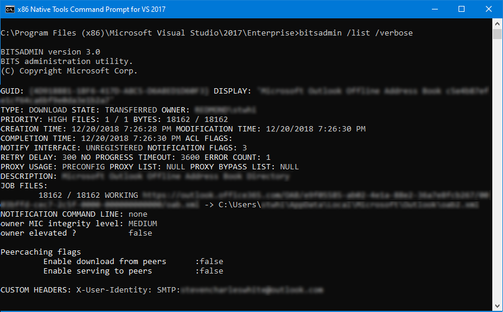

# BITSAdmin tool

BITSAdmin is a command-line tool that you can use to create download or upload jobs and monitor their progress. For full, comprehensive documentation of the tool and all of its commands, see [bitsadmin](/windows-server/administration/windows-commands/bitsadmin) and [bitsadmin examples](/windows-server/administration/windows-commands/bitsadmin-examples) in the Windows IT Pro Center.

For example, to list all BITS jobs, you can issue the command `bitsadmin /list /verbose`. Here's a screenshot of sample output for that command.

## Related topics

* [bitsadmin](/windows-server/administration/windows-commands/bitsadmin)  in the Windows IT Pro Center
* [bitsadmin examples](/windows-server/administration/windows-commands/bitsadmin-examples) in the Windows IT Pro Center
