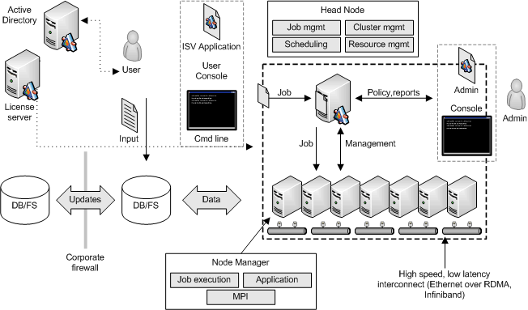

# Compute Cluster Architecture

A *compute cluster* is a top-level organizational unit. Each cluster consists of a set of nodes, a queue, applications, and jobs.

The following diagram illustrates the compute cluster architecture.

A *node* is a single computer with one or more processors. The system administrator adds and removes nodes. Applications can enumerate, approve, pause, and resume nodes through the [**ICluster**](icluster.md) interface. Applications can query node properties through the [**INode**](inode.md) interface.

All nodes in a cluster are part of the same domain. Data sources such as a database or file are accessible from each node. License servers are also accessible from each node to verify that each node that will run an application has a license for the application.

The *head node* manages the cluster and its resources. Jobs are submitted to and scheduled by the head node.

The cluster contains a single queue, which is the organizational unit that contains queued, running, and finished jobs. Finished jobs are periodically removed from the queue. For more information, see [Job Scheduler Architecture](job-scheduler-architecture.md).

## Related topics

<dl> <dt>

[About CCP](about-ccp.md)
</dt> </dl>

 

 

