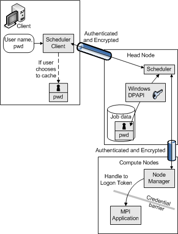

# Credential Handling

The following diagram illustrates credential handling in Compute Cluster Pack.

Credentials are communicated over authenticated, encrypted channels. They are stored with the job data on the head node and erased after the job has finished.

You can cache credentials on the client computer to make job creation easier. In this case, the credentials are encrypted with a key known only to the head node.

During job execution, the scheduler sends a command to each compute node assigned to the job with the job identifier and the credentials. After the scheduler authenticates the job request, it will encrypt the credentials and send the encrypted credentials back to the client computer. Each node manager uses the credentials to create a logon token to be used for the process; no other processes have access to these credentials. The node manager will remove the credentials from the memory after the logon token is created.

For more information, see [Setting User Credentials](setting-user-credentials.md).

## Related topics

<dl> <dt>

[About CCP](about-ccp.md)
</dt> <dt>

[**DeleteCachedCredentials**](icluster-deletecachedcredentials.md)
</dt> <dt>

[**SetCachedCredentials**](icluster-setcachedcredentials.md)
</dt> <dt>

[**SetJobCredentials**](icluster-setjobcredentials.md)
</dt> <dt>

[**SetJobCredentialsFromCache**](icluster-setjobcredentialsfromcache.md)
</dt> </dl>

 

 

