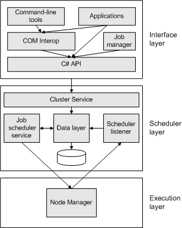

# Job Scheduler Architecture

The job scheduler service is the core scheduling service for the Compute Cluster Pack (CCP). The job scheduler controls resource allocation, job execution, and recovery on failure.

The following diagram illustrates the job scheduler architecture.

The node manager manages compute nodes. Administrators perform approve, pause, resume, and remove operations.

The scheduler listener provides communication between the node manager and the job scheduler. It is called when a compute node starts or a task is finished on a compute node.

The job scheduler service is the core scheduling service. Cluster resources are allocated by job priority. This ensures that high-priority jobs are added at the front of the queue. If jobs have equal priority, resources are allocated to the job that was submitted first. There is no task priority within a job. Resources are allocated to tasks in the order that they were added to the job. The job scheduler selects the best available nodes in the cluster to run each job. A job can also specify a list of nodes on which it can be run, and the job scheduler will choose the best nodes from this list.

The job scheduler also supports backfill. This ensures that a resource-intensive application will not delay other applications that are ready to run. The job scheduler will schedule a lower-priority job if a higher-priority job is waiting for resources to become available and the lower-priority job can be finished with the available resources without delaying the start time of the higher-priority job.

You can extend the scheduler with filters. A *job submission filter* is invoked before a job is queued or modified. It can accept the job as is, modify job terms, or reject the job submission. An *activation filter* is invoked before a job is started. It can perform tasks such as checking software license requirements or implementing resource-allocation policies. If the activation filter returns a nonzero value (fails), the job remains in the queue. The filter is invoked periodically until it succeeds.

The Cluster Service is a .NET remoting service. It provides cluster-wide settings, node-related operations, job-related operations, task-related operations, and resource-usage information.

Applications and command-line tools access the functionality of the job scheduler through the interface layer. For more information, see [CCP Reference](compute-cluster-pack-reference.md) for the native CCP API and [CCP .NET Reference](https://msdn.microsoft.com/library/microsoft.computecluster.aspx) for the .NET CCP API.

## Related topics

<dl> <dt>

[About CCP](about-ccp.md)
</dt> <dt>

[Jobs and Tasks](jobs-and-tasks.md)
</dt> </dl>

 

 

