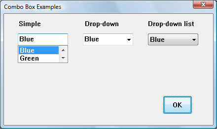
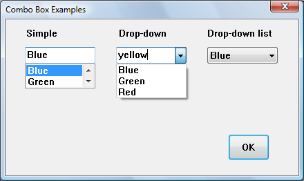
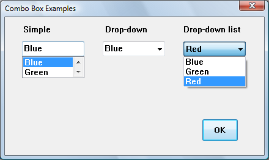

# About Combo Boxes

A combo box combines an edit box or static text and a list.

This topic contains the following sections.

-   [Combo Box Types and Styles](#combo-box-types-and-styles)
-   [Combo Box List](#combo-box-list)
    -   [Current Selection](#current-selection)
    -   [Drop-down Lists](#drop-down-lists)
    -   [List Contents](#list-contents)
-   [Edit Control Selection Fields](#edit-control-selection-fields)
-   [Owner-Drawn Combo Boxes](#owner-drawn-combo-boxes)
-   [Subclassed Combo Boxes](#subclassed-combo-boxes)

## Combo Box Types and Styles

A combo box consists of a list and a selection field. The list presents the options that a user can select, and the selection field displays the current selection. If the selection field is an edit control, the user can enter information not available in the list; otherwise, the user can only select items in the list.

The common controls library includes three main styles of combo box, as shown in the following table.

| Combo box type             | Style constant                                                 | Description                                                                                  |
|----------------------------|----------------------------------------------------------------|----------------------------------------------------------------------------------------------|
| Simple                     | [**CBS\_SIMPLE**](combo-box-styles.md)             | Displays the list at all times, and shows the selected item in an edit control.              |
| Drop-down                  | [**CBS\_DROPDOWN**](combo-box-styles.md)         | Displays the list when the icon is clicked, and shows the selected item in an edit control.  |
| Drop-down list (drop list) | [**CBS\_DROPDOWNLIST**](combo-box-styles.md) | Displays the list when the icon is clicked, and shows the selected item in a static control. |

 

The following screen shots each show the three kinds of combo box as they might appear in Windows Vista. In the first screen shot, the user has selected an item in the simple combo box. The user can also type a new value in the edit box of this control. The list has been sized in the Microsoft Visual Studio resource editor and is only large enough to accommodate two items.

In the second screen shot, the user has typed new text in the edit control of the drop-down combo box. The user could also have selected an existing item. The list box expands to accommodate as many items as possible.

In the third screen shot, the user has opened the drop-down list combo box. The list box expands to accommodate as many items as possible. The user cannot enter new text.

There are also a number of combo box styles that define specific properties. Combo box styles define specific properties of a combo box. You can combine styles; however, some styles apply only to certain combo box types. For a table of combo box styles, see [Combo Box Styles](combo-box-styles.md).

> [!Note]  
> To use visual styles with combo boxes, an application must include a manifest and must call [**InitCommonControls**](/windows/desktop/api/Commctrl/nf-commctrl-initcommoncontrols) at the beginning of the program. For information on visual styles, see [Visual Styles](themes-overview.md). For information on manifests, see [Enabling Visual Styles](cookbook-overview.md).

 

## Combo Box List

The list is the portion of a combo box that displays the items a user can select. Typically, an application initializes the contents of the list when it creates a combo box. Any list item selected by the user is the *current selection*. Multiple items cannot be selected. In simple and drop-down combo boxes, the user can type in the selection field instead of selecting a list item. In these cases, there is no current selection, and it is the application's responsibility to add the item to the list and make it the current selection, if it is appropriate to do so.

This section discusses following topics:

-   [Current Selection](#current-selection)
-   [Drop-down Lists](#drop-down-lists)
-   [List Contents](#list-contents)

### Current Selection

The current selection is a list item that the user has selected; the selected text appears in the selection field of the combo box. However, in the case of a simple combo box or a drop-down combo box, the current selection is only one form of possible user input in a combo box. The user can also type text in the selection field.

The current selection is identified by the zero-based index of the selected list item. An application can set and retrieve it at any time. The parent window or dialog box procedure receives notification when the user changes the current selection for a combo box. The parent window or dialog box is not notified when the application changes the selection.

When a combo box is created, there is no current selection. This is also true for a simple or drop-down combo box, if the user has edited the contents of the selection field. To set the current selection, an application sends the [**CB\_SETCURSEL**](cb-setcursel.md) message to the combo box. An application can also use the [**CB\_SELECTSTRING**](cb-selectstring.md) message to set the current selection to a list item whose string begins with a specified string. To determine the current selection, an application sends the [**CB\_GETCURSEL**](cb-getcursel.md) message to the combo box. If there is no current selection, this message returns CB\_ERR.

When the user changes the current selection in a combo box, the parent window or dialog-box procedure receives a [**WM\_COMMAND**](/windows/desktop/menurc/wm-command) message with the [CBN\_SELCHANGE](cbn-selchange.md) notification code in the high-order word of the *wParam* parameter. This notification code is not sent when the current selection is set using the [**CB\_SETCURSEL**](cb-setcursel.md) message.

A drop-down combo box or drop-down list box sends the [CBN\_CLOSEUP](cbn-closeup.md) notification code to the parent window or dialog-box procedure when the drop-down list closes. If the user changed the current selection, the combo box also sends the [CBN\_SELCHANGE](cbn-selchange.md) notification code when the drop-down list closes. To execute a specific process each time the user selects a list item, you can handle either the CBN\_SELCHANGE or CBN\_CLOSEUP notification code. Typically, you would wait for the CBN\_CLOSEUP notification code before processing a change in the current selection. This can be particularly important if a significant amount of processing is required.

An application could also process the [CBN\_SELENDOK](cbn-selendok.md) and [CBN\_SELENDCANCEL](cbn-selendcancel.md) notification codes. The system sends CBN\_SELENDOK when the user selects a list item, or selects an item and then closes the list. This indicates that the user has finished, and that the selection should be processed. CBN\_SELENDCANCEL is sent when the user selects an item, but then selects another control, presses ESC while the drop-down list is open, or closes the dialog box. This indicates that the user's selection should be ignored. CBN\_SELENDOK is sent before every [CBN\_SELCHANGE](cbn-selchange.md) message.

In a simple combo box, the system sends the [CBN\_DBLCLK](cbn-dblclk.md) notification code when the user double-clicks a list item. In a drop-down combo box or drop-down list, a single click hides the list, so it is not possible to double-click an item.

### Drop-down Lists

Certain notifications and messages apply only to combo boxes containing drop-down lists. When a drop-down list is open or closed, the parent window of a combo box receives a notification in the form of a [**WM\_COMMAND**](/windows/desktop/menurc/wm-command) message. If the list is being opened, the high-order word of *wParam* is [CBN\_DROPDOWN](cbn-dropdown.md). If the list is being closed, it is [CBN\_CLOSEUP](cbn-closeup.md).

An application can open the list of a drop-down combo box or drop-down list box by using the [**CB\_SHOWDROPDOWN**](cb-showdropdown.md) message. It can determine whether the list is open by using the [**CB\_GETDROPPEDSTATE**](cb-getdroppedstate.md) message and can determine the coordinates of a drop-down list by using the [**CB\_GETDROPPEDCONTROLRECT**](cb-getdroppedcontrolrect.md) message. An application can also increase the width of a drop-down list by using the [**CB\_SETDROPPEDWIDTH**](cb-setdroppedwidth.md) message.

### List Contents

When an application creates a combo box, it typically initializes the combo box by adding one or more items to the list. Later, an application may add or delete list items, reinitialize the list, or retrieve item information from it.

An application adds list items to a combo box by sending the [**CB\_ADDSTRING**](cb-addstring.md) message to it. The specified item is added to the end of the list or, in a sorted combo box, in its correct sorted position based on the item's string. In an unsorted combo box, an application can use the [**CB\_INSERTSTRING**](cb-insertstring.md) message to insert an item at a specific position. Once added, a list item is identified by its position.

By using the [**CB\_FINDSTRING**](cb-findstring.md) or [**CB\_FINDSTRINGEXACT**](cb-findstringexact.md) message, an application can determine the position of a list item. **CB\_FINDSTRING** finds an item whose string begins with the specified string. **CB\_FINDSTRINGEXACT** finds an item whose string matches the string exactly. Neither message is case sensitive.

An application can remove a list item by using the [**CB\_DELETESTRING**](cb-deletestring.md) message. If an application needs to reinitialize the combo box list, it can first clear its entire contents by using the [**CB\_RESETCONTENT**](cb-resetcontent.md) message. When adding multiple items to the list after a combo box has already been shown, an application can clear the redraw flag to prevent the combo box from being repainted after each item is added. For more information about redrawing, see the description of the [**WM\_SETREDRAW**](/windows/desktop/gdi/wm-setredraw) message.

To retrieve the string associated with a list item, an application can use the [**CB\_GETLBTEXT**](cb-getlbtext.md) message. The item's string is copied to the buffer specified by the application. To ensure that the buffer is large enough to receive the string, the application can first use the [**CB\_GETLBTEXTLEN**](cb-getlbtextlen.md) message to determine the length of the string. To get the number of list items in a combo box, an application can use the [**CB\_GETCOUNT**](cb-getcount.md) message.

## Edit Control Selection Fields

An application can retrieve or set the contents of the selection field and can determine or set the edit selection. The application can also limit the amount of text a user can type in the selection field. When the contents of the selection field change, the system sends notification messages to the parent window or dialog box procedure.

To retrieve the content of the selection field, an application can send the [**WM\_GETTEXT**](/windows/desktop/winmsg/wm-gettext) message to the combo box. To set the contents of the selection field of a simple or drop-down combo box, an application can send the [**WM\_SETTEXT**](/windows/desktop/winmsg/wm-settext) message to the combo box.

The edit selection is the range of selected text, if any, in the selection field of a simple or drop-down combo box. An application can determine the starting and ending character positions of the current selection by using the [**CB\_GETEDITSEL**](cb-geteditsel.md) message. It can also select characters in the edit selection by using the [**CB\_SETEDITSEL**](cb-seteditsel.md) message.

Initially, the amount of text that the user can type into the selection field is limited by the size of the selection field. However, if the combo box has the [**CBS\_AUTOHSCROLL**](combo-box-styles.md) style, the text can continue beyond the size of the selection field. An application can use the [**CB\_LIMITTEXT**](cb-limittext.md) message to limit the amount of text a user can type into the selection field, regardless of whether the control has the **CBS\_AUTOHSCROLL** style.

When the user edits the content of the selection field, the parent window or dialog box procedure receives notification messages. The [CBN\_EDITUPDATE](cbn-editupdate.md) notification code is sent first, indicating that the text in the selection field has been edited. After the altered text is displayed, the system sends [CBN\_EDITCHANGE](cbn-editchange.md). When the selection field content changes as the result of a list item being selected, these messages are not sent.

## Owner-Drawn Combo Boxes

An application can create an owner-drawn combo box to take responsibility for painting list items. The parent window of an owner-drawn combo box (its owner) receives [**WM\_DRAWITEM**](wm-drawitem.md) messages when a portion of the combo box needs to be painted. An owner-drawn combo box can list information other than, or in addition to, text strings. Owner-drawn combo boxes can be of any type. However, the edit control in a simple or drop-down combo box can only display text, while the owner paints the selection field in a drop-down list box.

The owner of an owner-drawn combo box must process the [**WM\_DRAWITEM**](wm-drawitem.md) message. This message is sent whenever a portion of the combo box must be redrawn. The owner may need to process other messages, depending on the styles specified for the combo box.

An application can create an owner-drawn combo box by specifying the [**CBS\_OWNERDRAWFIXED**](combo-box-styles.md) or [**CBS\_OWNERDRAWVARIABLE**](combo-box-styles.md) style. If all list items in the combo box are the same height, such as strings or icons, an application can use the **CBS\_OWNERDRAWFIXED** style. If list items are of varying height, like bitmaps of different size, an application can use the **CBS\_OWNERDRAWVARIABLE** style.

The owner of an owner-drawn combo box can process a [**WM\_MEASUREITEM**](wm-measureitem.md) message to specify the dimensions of list items in the combo box. If the application creates the combo box by using the [**CBS\_OWNERDRAWFIXED**](combo-box-styles.md) style, the system sends the **WM\_MEASUREITEM** message only once. The dimensions specified by the owner are used for all list items. If the [**CBS\_OWNERDRAWVARIABLE**](combo-box-styles.md) style is used, the system sends a **WM\_MEASUREITEM** message for each list item added to the combo box. The owner can determine or set the height of a list item at any time by using the [**CB\_GETITEMHEIGHT**](cb-getitemheight.md) and [**CB\_SETITEMHEIGHT**](cb-setitemheight.md) messages, respectively.

If the information displayed in an owner-drawn combo box includes text, an application can keep track of the text for each list item by specifying the [**CBS\_HASSTRINGS**](combo-box-styles.md) style. Combo boxes with the [**CBS\_SORT**](combo-box-styles.md) style are sorted based on this text. If a combo box is sorted and not of the **CBS\_HASSTRINGS** style, the owner must process the [**WM\_COMPAREITEM**](wm-compareitem.md) message.

In an owner-drawn combo box, the owner must keep track of list items containing information other than or in addition to text. One convenient way to do this is to save the handle to the information as item data. To free data objects associated with items in a combo box, the owner can process the [**WM\_DELETEITEM**](wm-deleteitem.md) message.

## Subclassed Combo Boxes

Subclassing is a procedure that allows an application to intercept and process messages sent or posted to a window. By using subclassing, an application can substitute its own processing for certain messages, while leaving most message processing to the class-defined window procedure.

When the operating system creates a window, it saves information about it in an internal data structure that includes a pointer to the window procedure. To subclass a window, an application calls the [**SetClassLong**](/windows/desktop/api/winuser/nf-winuser-setclasslonga) function to replace the pointer to that procedure with a pointer to an application-defined subclass procedure. Thereafter, all messages to the window are sent to the subclass procedure. This procedure then uses the [**CallWindowProc**](/windows/desktop/api/winuser/nf-winuser-callwindowproca) function to pass unprocessed messages to the original window procedure. For a description of the message processing performed by the COMBOBOX class window procedure, see [Default Combo Box Behavior](combo-box-features.md).

When the combo box is outside a dialog box, an application cannot process the TAB, ENTER, and ESC keys unless it uses a subclass procedure. When a simple or drop-down combo box receives the input focus, it immediately sets the focus to its child edit control. Therefore, an application must subclass the edit control to intercept keyboard input for a simple or drop-down combo box. For an example of this, see [Subclassing a Combo Box](using-combo-boxes.md).

If a subclass procedure processes the [**WM\_PAINT**](/windows/desktop/gdi/wm-paint) message, it must use the [**BeginPaint**](/windows/desktop/api/winuser/nf-winuser-beginpaint) function to prepare for painting. Before calling the [**EndPaint**](/windows/desktop/api/winuser/nf-winuser-endpaint) function, it passes the device context (DC) handle as the *wParam* parameter for the window procedure. If **EndPaint** is called first, the class window procedure does no painting because **EndPaint** validates the entire window.

A technique related to subclassing is superclassing. A superclass resembles any other class except that its window procedure does not call [**DefWindowProc**](/windows/desktop/api/winuser/nf-winuser-defwindowproca) to handle unprocessed messages. Instead, it passes unprocessed messages to the window procedure for the parent window class. Follow the guidelines in [Window Procedures](/windows/desktop/winmsg/window-procedures) to avoid problems that can occur with subclassing and superclassing.

 

 