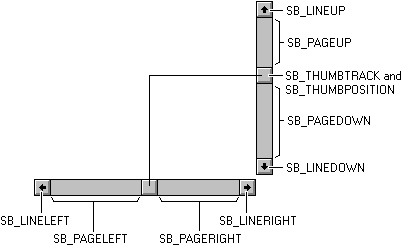

# About Scroll Bars

A window can display a data object, such as a document or a bitmap, that is larger than the window's client area. When provided with a scroll bar, the user can scroll a data object in the client area to bring into view the portions of the object that extend beyond the borders of the window.

Scroll bars should be included in any window for which the content of the client area extends beyond the window's borders. A scroll bar's orientation determines the direction in which scrolling occurs when the user operates the scroll bar. A horizontal scroll bar enables the user to scroll the content of a window to the left or right. A vertical scroll bar enables the user to scroll the content up or down.

The following topics are discussed in this section.

-   [Parts of a Scroll Bar](#parts-of-a-scroll-bar)
-   [Standard Scroll Bars and Scroll Bar Controls](#standard-scroll-bars-and-scroll-bar-controls)
-   [Scroll Box Position and Scrolling Range](#scroll-box-position-and-scrolling-range)
-   [Scroll Bar Visibility](#scroll-bar-visibility)
-   [Scroll Bar Requests](#scroll-bar-requests)
-   [Keyboard Interface for a Scroll Bar](#keyboard-interface-for-a-scroll-bar)
-   [Scrolling the Client Area](#scrolling-the-client-area)
-   [Scroll Bar Colors and Metrics](#scroll-bar-colors-and-metrics)

## Parts of a Scroll Bar

A scroll bar consists of a shaded shaft with an arrow button at each end and a *scroll box* (sometimes called a thumb) between the arrow buttons. A scroll bar represents the overall length or width of a data object in a window's client area; the scroll box represents the portion of the object that is visible in the client area. The position of the scroll box changes whenever the user scrolls a data object to display a different portion of it. The system also adjusts the size of a scroll bar's scroll box so that it indicates what portion of the entire data object is currently visible in the window. If most of the object is visible, the scroll box occupies most of the scroll bar shaft. Similarly, if only a small portion of the object is visible, the scroll box occupies a small part of the scroll bar shaft.

The user scrolls the content of a window by clicking one of the arrow buttons, by clicking the area in the shaded scroll bar shaft, or by dragging the scroll box. When the user clicks an arrow button, the application scrolls the content by one unit (typically a single line or column). When the user clicks the shaded areas, the application scrolls the content by one window. The amount of scrolling that occurs when the user drags the scroll box depends on the distance the user drags the scroll box and on the scrolling range of the scroll bar. For more information about the scrolling range, see [Scroll Box Position and Scrolling Range](#scroll-box-position-and-scrolling-range).

The following screen shot shows a rich edit control with vertical and horizontal scroll bars, as they might appear in Windows Vista. The vertical scroll bar is currently "hot" because the mouse pointer was hovering over it when the screen shot was taken.


## Standard Scroll Bars and Scroll Bar Controls

A scroll bar is included in a window either as a standard scroll bar or as a scroll bar control. A standard scroll bar is located in the nonclient area of a window. It is created with the window and displayed when the window is displayed. The sole purpose of a standard scroll bar is to enable the user to generate scrolling requests for viewing the entire content of the client area. You can include a standard scroll bar in a window by specifying [**WS\_HSCROLL**](/windows/desktop/winmsg/window-styles), [**WS\_VSCROLL**](/windows/desktop/winmsg/window-styles), or both styles when you create the window. The **WS\_HSCROLL** style creates a horizontal scroll bar positioned at the bottom of the client area. The **WS\_VSCROLL** style creates a vertical scroll bar positioned at the right of the client area. The SM\_CXHSCROLL and SM\_CYHSCROLL system metric values define the width and height of a standard horizontal scroll bar. The SM\_CXVSCROLL and SM\_CYVSCROLL values define the width and height of a standard vertical scroll bar. A standard scroll bar is part of its associated window and therefore does not have a window handle of its own.

A scroll bar control is a control window that belongs to the SCROLLBAR window class. A scroll bar control appears and functions like a standard scroll bar, but it is a separate window. As a separate window, a scroll bar control takes direct input focus. Unlike a standard scroll bar, a scroll bar control also has a built-in keyboard interface.

You can use as many scroll bar controls as needed in a single window. When you create a scroll bar control, you must specify the scroll bar's size and position. However, if a scroll bar control's window can be resized, adjustments to the scroll bar's size must be made whenever the size of the window changes.

The advantage of using a standard scroll bar is that the system creates the scroll bar and automatically sets its size and position. However, standard scroll bars are sometimes too restrictive. For example, suppose that you want to divide a client area into quadrants and use a separate set of scroll bars to control the content of each quadrant. You cannot use standard scroll bars because you can only create one set of scroll bars for a particular window. Use scroll bar controls instead, because you can add as many of them to a window as you want.

Applications can provide scroll bar controls for purposes other than scrolling the content of a window. For example, a screen saver application might provide a scroll bar for setting the speed at which graphics are moved about on the screen.

A scroll bar control can have a number of styles that serves to control the orientation and position of the scroll bar. You specify the styles that you want when you call the [**CreateWindowEx**](/windows/desktop/api/winuser/nf-winuser-createwindowexa) function to create a scroll bar control. Some of the styles create a scroll bar control that uses a default width or height. However, you must always specify the x- and y-coordinates and the other dimensions of the scroll bar.

For a table of scroll bar control styles, see [Scroll Bar Control Styles](scroll-bar-control-styles.md).

> [!Note]  
> To use visual styles with scroll bars, an application must include a manifest and must call [**InitCommonControls**](/windows/desktop/api/Commctrl/nf-commctrl-initcommoncontrols) at the beginning of the program. For information on visual styles, see [Visual Styles](themes-overview.md). For information on manifests, see [Enabling Visual Styles](cookbook-overview.md).

 

## Scroll Box Position and Scrolling Range

The position of the scroll box is represented as an integer; it is relative to the left or upper end of the scroll bar, depending on whether the scroll bar is horizontal or vertical. The position must be within the minimum and maximum values of the scrolling range. For example, in a scroll bar with a range of 0 through 100, position 50 is in the middle, with the remaining positions distributed equally along the scroll bar. The initial range depends on the scroll bar. Standard scroll bars have an initial range of 0 through 100; scroll bar controls have an empty range (both minimum and maximum values are zero), unless you supply an explicit range when the control is created. You can change the range at any time. You can use the [**SetScrollInfo**](/windows/desktop/api/Winuser/nf-winuser-setscrollinfo) function to set the range values, and the [**GetScrollInfo**](/windows/desktop/api/Winuser/nf-winuser-getscrollinfo) function to retrieve the current range values.

An application typically adjusts the scroll range to convenient integers, making it easy to translate the scroll box position into a value corresponding to the data object to be scrolled. For example, if an application must display 260 lines of a text file in a window that can show only 16 lines at a time, the vertical scroll bar range can be set to 1 through 244. If the scroll box is at position 1, the first line will be at the top of the window. If the scroll box is at position 244, the last line (line 260) will be at the bottom of the window. If an application attempts to specify a position value that is less than the minimum or more than the maximum, the minimum or maximum scrolling range value is used instead.

You can set a page size for a scroll bar. The *page size* represents the number of data units that can fit in the client area of the owner window given its current size. For example, if the client area can hold 16 lines of text, an application would set the page size to 16. The system uses the page size, along with the scrolling range and length of the scroll bar shaft, to set the size of the scroll box. Whenever a window containing a scroll bar is resized, an application should call the [**SetScrollInfo**](/windows/desktop/api/Winuser/nf-winuser-setscrollinfo) function to set the page size. An application can retrieve the current page size by calling the sending [**GetScrollInfo**](/windows/desktop/api/Winuser/nf-winuser-getscrollinfo) function.

To establish a useful relationship between the scroll bar range and the data object, an application must adjust the range whenever the size of the data object changes.

As the user moves the scroll box in a scroll bar, the scroll bar reports the scroll box position as an integer in the scrolling range. If the position is the minimum value, the scroll box is at the top of a vertical scroll bar or at the left end of a horizontal scroll bar. If the position is the maximum value, the scroll box is at the bottom of a vertical scroll bar or at right end of a horizontal scroll bar.

The maximum value that a scroll bar can report (that is, the maximum scrolling position) depends on the page size. If the scroll bar has a page size greater than one, the maximum scrolling position is less than the maximum range value. You can use the following formula to calculate the maximum scrolling position:


```
MaxScrollPos = MaxRangeValue - (PageSize - 1) 
```


An application must move the scroll box in a scroll bar. Although the user makes a request for scrolling in a scroll bar, the scroll bar does not automatically update the scroll box position. Instead, it passes the request to the parent window, which must scroll the data and update the scroll box position. An application uses the [**SetScrollInfo**](/windows/desktop/api/Winuser/nf-winuser-setscrollinfo) function to update the scroll box position; otherwise, it uses the [**SetScrollPos**](/windows/desktop/api/Winuser/nf-winuser-setscrollpos) function. Because it controls the scroll box movement, the application can move the scroll box in increments that work best for the data being scrolled.

## Scroll Bar Visibility

The system hides and disables a standard scroll bar when equal minimum and maximum values are specified. The system also hides and disables a standard scroll bar if you specify a page size that includes the entire scroll range of the scroll bar. This is the way to temporarily hide a scroll bar when it is not needed for the content of the client area. There is no need to make scrolling requests through the scroll bar when it is hidden. The system enables the scroll bar and shows it again when you set the minimum and maximum values to unequal values and when the page size does not include the entire scroll range. The [**ShowScrollBar**](/windows/desktop/api/Winuser/nf-winuser-showscrollbar) function can also be used to hide or show a scroll bar. It does not affect the scroll bar's range, page size, or scroll box position.

The [**EnableScrollBar**](/windows/desktop/api/Winuser/nf-winuser-enablescrollbar) function can be used to disable one or both arrows of a scroll bar. An application displays disabled arrows in gray and does not respond to user input.

## Scroll Bar Requests

The user makes scrolling requests by clicking various parts of a scroll bar. The system sends the request to the specified window in the form of a [**WM\_HSCROLL**](wm-hscroll.md) or [**WM\_VSCROLL**](wm-vscroll.md) message. A horizontal scroll bar sends the **WM\_HSCROLL** message; a vertical scroll bar sends the **WM\_VSCROLL** message. Each message includes a request code that corresponds to the user's action, to the handle to the scroll bar (scroll bar controls only), and, in some cases, to the position of the scroll box.

The following diagram shows the request code that the user generates when clicking various parts of a scroll bar.



The SB\_ values specify the action the user takes. An application examines the codes that accompany the [**WM\_HSCROLL**](wm-hscroll.md) and [**WM\_VSCROLL**](wm-vscroll.md) messages and then performs the appropriate scrolling operation. In the following table, the user's action is specified for each value, followed by the application's response. In each case, a unit is defined by the application as appropriate for the data. For example, the typical unit for scrolling text vertically is a line of text.


| Request           | Action                                                                               | Response                                                                                                                                                                                                                                                                                                                         |
|-------------------|--------------------------------------------------------------------------------------|----------------------------------------------------------------------------------------------------------------------------------------------------------------------------------------------------------------------------------------------------------------------------------------------------------------------------------|
| SB\_LINEUP        | The user clicks the top scroll arrow.                                                | Decrements the scroll box position; scrolls toward the top of the data by one unit.                                                                                                                                                                                                                                              |
| SB\_LINEDOWN      | The user clicks the bottom scroll arrow.                                             | Increments the scroll box position; scrolls toward the bottom of the data by one unit.                                                                                                                                                                                                                                           |
| SB\_LINELEFT      | The user clicks the left scroll arrow.                                               | Decrements the scroll box position; scrolls toward the left end of the data by one unit.                                                                                                                                                                                                                                         |
| SB\_LINERIGHT     | The user clicks the right scroll arrow.                                              | Increments the scroll box position; scrolls toward the right end of the data by one unit.                                                                                                                                                                                                                                        |
| SB\_PAGEUP        | The user clicks the scroll bar shaft above the scroll box.                           | Decrements the scroll box position by the number of data units in the window; scrolls toward the top of the data by the same number of units.                                                                                                                                                                                    |
| SB\_PAGEDOWN      | The user clicks the scroll bar shaft below the scroll box.                           | Increments the scroll box position by the number of data units in the window; scrolls toward the bottom of the data by the same number of units.                                                                                                                                                                                 |
| SB\_PAGELEFT      | The user clicks the scroll bar shaft to the left of the scroll box.                  | Decrements the scroll box position by the number of data units in the window; scrolls toward the left end of the data by the same number of units.                                                                                                                                                                               |
| SB\_PAGERIGHT     | The user clicks the scroll bar shaft to the right of the scroll box.                 | Increments the scroll box position by the number of data units in the window; scrolls toward the right end of the data by the same number of units.                                                                                                                                                                              |
| SB\_THUMBPOSITION | The user releases the scroll box after dragging it.                                  | Sets the scroll box to the position specified in the message; scrolls the data by the same number of units the scroll box has moved.                                                                                                                                                                                             |
| SB\_THUMBTRACK    | The user drags the scroll box.                                                       | Sets the scroll box to the position specified in the message and scrolls the data by the same number of units the scroll box has moved for applications that draw data quickly. Applications that cannot draw data quickly must wait for the SB\_THUMBPOSITION request code before moving the scroll box and scrolling the data. |
| SB\_ENDSCROLL     | The user releases the mouse after holding it on an arrow or in the scroll bar shaft. | No response is needed.                                                                                                                                                                                                                                                                                                           |


 

A scroll bar generates SB\_THUMBPOSITION and SB\_THUMBTRACK request code when the user clicks and drags the scroll box. An application should be programmed to process either the SB\_THUMBTRACK or SB\_THUMBPOSITION request code.

The SB\_THUMBPOSITION request code occurs when the user releases the mouse button after clicking the scroll box. An application that processes this message performs the scrolling operation after the user has dragged the scroll box to the desired position and released the mouse button.

The SB\_THUMBTRACK request code occurs as the user drags the scroll box. If an application processes SB\_THUMBTRACK request codes, it can scroll the content of a window as the user drags the scroll box. However, a scroll bar can generate many SB\_THUMBTRACK request code in a short period, so an application should process these request codes only if it can quickly repaint the content of the window.

## Keyboard Interface for a Scroll Bar

A scroll bar control provides a built-in keyboard interface that enables the user to issue scrolling requests by using the keyboard; a standard scroll bar does not. When a scroll bar control has the keyboard focus, it sends [**WM\_HSCROLL**](wm-hscroll.md) and [**WM\_VSCROLL**](wm-vscroll.md) messages to its parent window when the user presses the arrow keys. The request code is sent with each message corresponding to the arrow key the user has pressed. Following are the arrow keys and their corresponding request codes.


| Arrow key | Request code                  |
|-----------|-------------------------------|
| DOWN      | SB\_LINEDOWN or SB\_LINERIGHT |
| END       | SB\_BOTTOM                    |
| HOME      | SB\_TOP                       |
| LEFT      | SB\_LINEUP or SB\_LINELEFT    |
| PGDN      | SB\_PAGEDOWN or SB\_PAGERIGHT |
| PGUP      | SB\_PAGEUP or SB\_PAGELEFT    |
| RIGHT     | SB\_LINEDOWN or SB\_LINERIGHT |
| UP        | SB\_LINEUP or SB\_LINELEFT    |


 

 

> [!Note]  
> The keyboard interface of a scroll bar control sends the SB\_TOP and SB\_BOTTOM request codes. The SB\_TOP request code indicates that the user has reached the top value of the scrolling range. An application scrolls the window content downward so that the top of the data object is visible. The SB\_BOTTOM request code indicates that the user has reached the bottom value of the scrolling range. If an application processes the SB\_BOTTOM request code, it scrolls the window content upward so that the bottom of the data object is visible.

 

If you want a keyboard interface for a standard scroll bar, you can create one yourself by processing the [**WM\_KEYDOWN**](/windows/desktop/inputdev/wm-keydown) message in your window procedure and then performing the appropriate scrolling action based on the virtual-key code that accompanies the message. For information about how to create a keyboard interface for a scroll bar, see [Creating a Keyboard Interface for a Standard Scroll Bar](using-scroll-bars.md).

## Scrolling the Client Area

The simplest way to scroll the content of a client area is to erase and then redraw it. This is the method an application is likely to use with SB\_PAGEUP, SB\_PAGEDOWN, and SB\_TOP request codes, which typically require completely new content.

For some request codes, such as SB\_LINEUP and SB\_LINEDOWN, not all the content need be erased, because some remains visible after scrolling occurs. The [**ScrollWindowEx**](/windows/desktop/api/Winuser/nf-winuser-scrollwindowex) function preserves a portion of the client area's content, moves the preserved portion a specified amount, and then prepares the rest of the client area for painting new information. **ScrollWindowEx** uses the [**BitBlt**](/windows/desktop/api/wingdi/nf-wingdi-bitblt) function to move a specific part of the data object to a new location within the client area. Any uncovered part of the client area (anything not preserved) is invalidated, erased, and painted when the next [**WM\_PAINT**](/windows/desktop/gdi/wm-paint) message occurs.

The [**ScrollWindowEx**](/windows/desktop/api/Winuser/nf-winuser-scrollwindowex) function can be used to exclude a portion of the client area from the scrolling operation. This keeps items with fixed positions, such as child windows, from moving within the client area. It automatically invalidates the portion of the client area that is to receive the new information, so the application does not have to compute its own clipping regions. For more information on clipping, see [Clipping](/windows/desktop/gdi/clipping).

Usually an application scrolls the content of a window in the direction opposite that indicated by the scroll bar. For example, when the user clicks the scroll bar shaft in the area below the scroll box, an application scrolls the object in the window upward to reveal a portion of the object that is below the visible portion.

You can also scroll a rectangular region using the [**ScrollDC**](/windows/desktop/api/Winuser/nf-winuser-scrolldc) function.

## Scroll Bar Colors and Metrics

The system-defined color value, COLOR\_SCROLLBAR, controls the color within a scroll bar shaft. Use the [**GetSysColor**](/windows/desktop/api/winuser/nf-winuser-getsyscolor) function to determine the color of the scroll bar shaft and the [**SetSysColors**](/windows/desktop/api/winuser/nf-winuser-setsyscolors) function to set the color of the scroll bar shaft. Note, however, that this change of color affects all scroll bars in the system.

You can get the dimensions of the bitmaps that the system uses in standard scroll bars by calling the [**GetSystemMetrics**](/windows/desktop/api/winuser/nf-winuser-getsystemmetrics) function. Following are the system metric values associated with scroll bars.


| System metric | Description                                                                                                                |
|---------------|----------------------------------------------------------------------------------------------------------------------------|
| SM\_CXHSCROLL | Width of arrow bitmap on horizontal scroll bar                                                                             |
| SM\_CXHTHUMB  | Width of scroll box on horizontal scroll bar. This value retrieves the width a scroll bar that has a page size of zero.    |
| SM\_CXVSCROLL | Width of arrow bitmap on vertical scroll bar                                                                               |
| SM\_CYHSCROLL | Height of arrow bitmap on horizontal scroll bar                                                                            |
| SM\_CYVSCROLL | Height of arrow bitmap on vertical scroll bar                                                                              |
| SM\_CYVTHUMB  | Height of scroll box on vertical scroll bar. This value retrieves the height of a scroll bar that has a page size of zero. |


 

 

 
