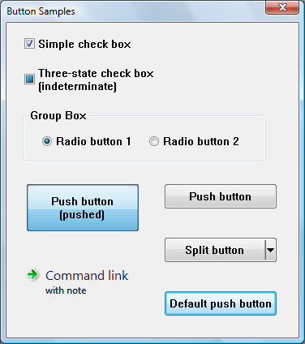

# Button Types

There are several types of buttons and one or more button styles to distinguish between buttons of the same type.

This document discusses the following topics.

-   [Button Types and Styles](#button-types-and-styles)
-   [Check Boxes](#check-boxes)
-   [Group Boxes](#group-boxes)
-   [Push Buttons](#push-buttons)
-   [Radio Buttons](#radio-buttons)
-   [Related topics](#related-topics)

## Button Types and Styles

A button belongs to a type and may have additional styles that affect its appearance and behavior. For a table of button styles, see [Button Styles](button-styles.md).

The following screen shot shows the different types of buttons.

The screen shot shows how buttons might appear in Windows Vista. The appearance will vary on different versions of the operating system, and according to the theme set by the user.

Note the following points about the illustration:

-   The three-state check box is shown in the indeterminate state. When checked or unchecked, it looks like a normal check box.
-   The large push button has been set to the pushed state programmatically (by sending the [**BM\_SETSTATE**](bm-setstate.md) message), so that it retains its appearance even when it is not being clicked.
-   In the visual style shown, the background of the default push button (or another push button that has the input focus) cycles between blue and gray.

## Check Boxes

A *check box* consists of a square box and an application-defined label, icon, or bitmap that indicates a choice the user can make by selecting the button. Applications typically display check boxes to enable the user to choose one or more options that are not mutually exclusive.

A check box can be one of four styles: standard, automatic, three-state, and automatic three-state, as defined by the constants [**BS\_CHECKBOX**](button-styles.md), [**BS\_AUTOCHECKBOX**](button-styles.md), [**BS\_3STATE**](button-styles.md), and [**BS\_AUTO3STATE**](button-styles.md), respectively. Each style can assume two check states: checked (a check mark inside the box) or cleared (no check mark). In addition, a three-state check box can assume an indeterminate state (a shaded box inside the check box), which might signify that the user has not made a choice. Repeatedly clicking a standard or automatic check box toggles it from checked to cleared and back again. Repeatedly clicking a three-state check box toggles it from checked to cleared to indeterminate and then repeats the cycle.

When the user clicks a check box (of any style), the check box receives the keyboard focus. The system sends the check box's parent window a [**WM\_COMMAND**](/windows/desktop/menurc/wm-command) message containing the [BN\_CLICKED](bn-clicked.md) notification code. The parent window does not have to handle this message if it comes from an automatic check box or automatic three-state check box, because the system automatically sets the check state for those styles. But the parent window must handle the message if it comes from a non-automatic check box or three-state check box, because the parent window is responsible for setting the check state for those styles. Regardless of the check box style, the system automatically repaints the check box once its state is changed.

The application can ascertain the state of a check box by using the [**IsDlgButtonChecked**](/windows/desktop/api/Winuser/nf-winuser-isdlgbuttonchecked) function.

## Group Boxes

A *group box* is a rectangle that surrounds a set of controls, such as check boxes or radio buttons, with an application-defined text label in its upper left corner. The sole purpose of a group box is to organize controls related by a common purpose (usually indicated by the label). The group box has only one style, defined by the constant [**BS\_GROUPBOX**](button-styles.md). Because a group box cannot be selected, it has no check state, focus state, or push state.

## Push Buttons

A *push button* is a rectangle containing an application-defined text label, an icon, or a bitmap that indicates what the button does when the user selects it.

A push button can be one of two styles, standard or default, as defined by the constants [**BS\_PUSHBUTTON**](button-styles.md) and [**BS\_DEFPUSHBUTTON**](button-styles.md). A standard push button is typically used to start an operation. It receives the keyboard focus when the user clicks it. A default push button is typically used to indicate the most common or default choice, such as closing the dialog box. It is a button that the user can select by simply pressing ENTER when no other push button in the dialog box has the input focus.

When the user clicks a push button, it receives the keyboard focus. The system sends the button's parent window a [**WM\_COMMAND**](/windows/desktop/menurc/wm-command) message that contains the [BN\_CLICKED](bn-clicked.md) notification code.

The *split button* is a special kind of push button introduced in Windows Vista and [Version 6.00](common-control-versions.md). A split button is divided into two parts. The main part functions like a regular or default push button. The second part has an arrow pointing downward. Typically a menu is displayed when the arrow is clicked.

A split button has the [**BS\_SPLITBUTTON**](button-styles.md) style, or the [**BS\_DEFSPLITBUTTON**](button-styles.md) style if it is the default button in a dialog box. You can modify the appearance of the button by using the [**BCM\_SETSPLITINFO**](bcm-setsplitinfo.md) message or the corresponding [**Button\_SetSplitInfo**](/windows/desktop/api/Commctrl/nf-commctrl-button_setsplitinfo) macro.

When the user clicks on the main part of the split button, it sends a [BN\_CLICKED](bn-clicked.md) notification just like a normal push button. But when the user clicks on the down arrow, it sends a [BCN\_DROPDOWN](bcn-dropdown.md) notification. It is the application's responsibility to display a menu in response to BCN\_DROPDOWN.

Windows Vista and [Version 6.00](common-control-versions.md) also introduced another kind of push button, the *command link*. Visually, a command link is very different from a normal push button, but it has the same functionality. A command link typically displays an arrow icon, a line of text, and additional text in a smaller font.

## Radio Buttons

A *radio button* (also called option button) consists of a round button and an application-defined label, icon, or bitmap that indicates a choice the user can make by selecting the button. An application typically uses radio buttons in a group box to enable the user to choose one of a set of related but mutually exclusive options.

A radio button can be one of two styles: standard or automatic, as defined by the style constants [**BS\_RADIOBUTTON**](button-styles.md) and [**BS\_AUTORADIOBUTTON**](button-styles.md). Each style can assume two check states: checked (a dot in the button) or cleared (no dot in the button).

When the user selects either state, the radio button receives the keyboard focus. The system sends the button's parent window a [**WM\_COMMAND**](/windows/desktop/menurc/wm-command) message containing the [BN\_CLICKED](bn-clicked.md) notification code. The parent window need not handle this message if it comes from an automatic radio button, because the system automatically sets the check state for that style. But the parent window should handle the message if it comes from a non-automatic radio button, because the parent window is responsible for setting the check state for that style. Regardless of the radio button style, the system automatically repaints the button as its state changes.

Radio buttons are arranged in groups, and only one button in the group can be checked at any time. If the [**WS\_GROUP**](/windows/desktop/winmsg/window-styles) flag is set for any radio button, that button is the first button in a group, and all buttons that follow it immediately in the tab order (but do not themselves have the **WS\_GROUP** flag) are part of its group. If no radio buttons have the **WS\_GROUP** flag, all the radio buttons in the dialog box are treated as a single group.

The application can ascertain whether a radio button is checked by using the [**IsDlgButtonChecked**](/windows/desktop/api/Winuser/nf-winuser-isdlgbuttonchecked) function.

## Related topics

<dl> <dt>

**Reference**
</dt> <dt>

[Button Styles](button-styles.md)
</dt> <dt>

**Conceptual**
</dt> <dt>

[Using Buttons](using-buttons.md)
</dt> </dl>

 

 