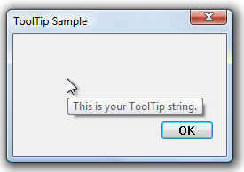

# How to Create a Tooltip for a Rectangular Area

The following example demonstrates how to create a standard tooltip control for a window's entire client area.

The following illustration shows the tooltip that is displayed when the mouse pointer is within the client window of a dialog box. The handle of the dialog box was passed to the function shown in the preceding example.



## What you need to know

### Technologies

-   [Windows Controls](window-controls.md)

### Prerequisites

-   C/C++
-   Windows User Interface Programming

## Instructions

### Create a Tooltip for a Rectangular Area

The following example demonstrates how to create a standard tooltip control for a window's entire client area.


```C++
void CreateToolTipForRect(HWND hwndParent)
{
    // Create a tooltip.
    HWND hwndTT = CreateWindowEx(WS_EX_TOPMOST, TOOLTIPS_CLASS, NULL, 
                                 WS_POPUP | TTS_NOPREFIX | TTS_ALWAYSTIP, 
                                 CW_USEDEFAULT, CW_USEDEFAULT, CW_USEDEFAULT, CW_USEDEFAULT, 
                                 hwndParent, NULL, g_hInst,NULL);

    SetWindowPos(hwndTT, HWND_TOPMOST, 0, 0, 0, 0, 
                 SWP_NOMOVE | SWP_NOSIZE | SWP_NOACTIVATE);

    // Set up "tool" information. In this case, the "tool" is the entire parent window.
    
    TOOLINFO ti = { 0 };
    ti.cbSize   = sizeof(TOOLINFO);
    ti.uFlags   = TTF_SUBCLASS;
    ti.hwnd     = hwndParent;
    ti.hinst    = g_hInst;
    ti.lpszText = TEXT("This is your tooltip string.");
    
    GetClientRect (hwndParent, &ti.rect);

    // Associate the tooltip with the "tool" window.
    SendMessage(hwndTT, TTM_ADDTOOL, 0, (LPARAM) (LPTOOLINFO) &ti); 
} 
```


## Related topics

<dl> <dt>

[Using Tooltip Controls](using-tooltip-contro.md)
</dt> </dl>

 

 


