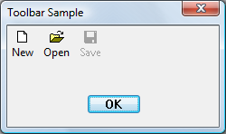

# How to Create Toolbars

To create a toolbar, use the [**CreateWindowEx**](/windows/desktop/api/winuser/nf-winuser-createwindowexa) function, specifying the [**TOOLBARCLASSNAME**](common-control-window-classes.md) window class. The resulting toolbar initially contains no buttons. Add buttons to the toolbar by using the [**TB\_ADDBUTTONS**](tb-addbuttons.md) or [**TB\_INSERTBUTTON**](tb-insertbutton.md) message. You must send the [**TB\_AUTOSIZE**](tb-autosize.md) message after all the items and strings have been inserted into the control, to cause the toolbar to recalculate its size based on its content.

## What you need to know

### Technologies

-   [Windows Controls](window-controls.md)

### Prerequisites

-   C/C++
-   Windows User Interface Programming

## Instructions

### Create a Toolbar

The following example code creates the toolbar shown in the illustration, using standard system icons. The **Save** button is initially disabled.




```C++
HIMAGELIST g_hImageList = NULL;

HWND CreateSimpleToolbar(HWND hWndParent)
{
    // Declare and initialize local constants.
    const int ImageListID    = 0;
    const int numButtons     = 3;
    const int bitmapSize     = 16;
    
    const DWORD buttonStyles = BTNS_AUTOSIZE;

    // Create the toolbar.
    HWND hWndToolbar = CreateWindowEx(0, TOOLBARCLASSNAME, NULL, 
                                      WS_CHILD | TBSTYLE_WRAPABLE, 0, 0, 0, 0, 
                                      hWndParent, NULL, g_hInst, NULL);
        
    if (hWndToolbar == NULL)
        return NULL;

    // Create the image list.
    g_hImageList = ImageList_Create(bitmapSize, bitmapSize,   // Dimensions of individual bitmaps.
                                    ILC_COLOR16 | ILC_MASK,   // Ensures transparent background.
                                    numButtons, 0);

    // Set the image list.
    SendMessage(hWndToolbar, TB_SETIMAGELIST, 
                (WPARAM)ImageListID, 
                (LPARAM)g_hImageList);

    // Load the button images.
    SendMessage(hWndToolbar, TB_LOADIMAGES, 
                (WPARAM)IDB_STD_SMALL_COLOR, 
                (LPARAM)HINST_COMMCTRL);

    // Initialize button info.
    // IDM_NEW, IDM_OPEN, and IDM_SAVE are application-defined command constants.
    
    TBBUTTON tbButtons[numButtons] = 
    {
        { MAKELONG(STD_FILENEW,  ImageListID), IDM_NEW,  TBSTATE_ENABLED, buttonStyles, {0}, 0, (INT_PTR)L"New" },
        { MAKELONG(STD_FILEOPEN, ImageListID), IDM_OPEN, TBSTATE_ENABLED, buttonStyles, {0}, 0, (INT_PTR)L"Open"},
        { MAKELONG(STD_FILESAVE, ImageListID), IDM_SAVE, 0,               buttonStyles, {0}, 0, (INT_PTR)L"Save"}
    };

    // Add buttons.
    SendMessage(hWndToolbar, TB_BUTTONSTRUCTSIZE, (WPARAM)sizeof(TBBUTTON), 0);
    SendMessage(hWndToolbar, TB_ADDBUTTONS,       (WPARAM)numButtons,       (LPARAM)&tbButtons);

    // Resize the toolbar, and then show it.
    SendMessage(hWndToolbar, TB_AUTOSIZE, 0, 0); 
    ShowWindow(hWndToolbar,  TRUE);
    
    return hWndToolbar;
}
```


The following example creates the same toolbar in much the same way, but in this case, the strings are read from a resource.


```C++
HIMAGELIST g_hImageList = NULL;

HWND CreateToolbarFromResource(HWND hWndParent)
{
    // Declare and initialize local constants.
    const int ImageListID    = 0;
    const int numButtons     = 3;
    const int bitmapSize     = 16;
    
    const DWORD buttonStyles = BTNS_AUTOSIZE;

    // Create the toolbar.
    HWND hWndToolbar = CreateWindowEx(0, TOOLBARCLASSNAME, NULL, 
                                      WS_CHILD | TBSTYLE_WRAPABLE, 0, 0, 0, 0,
                                      hWndParent, NULL, g_hInst, NULL);
    if (hWndToolbar == NULL)
        return NULL;

    // Create the image list.
    g_hImageList = ImageList_Create(bitmapSize, bitmapSize, // Dimensions of individual bitmaps.
                                    ILC_COLOR16 | ILC_MASK, // Ensures transparent background.
                                    numButtons, 0);

    // Set the image list.
    SendMessage(hWndToolbar, TB_SETIMAGELIST, 
                (WPARAM)ImageListID, 
                (LPARAM)g_hImageList);

    // Load the button images.
    SendMessage(hWndToolbar, TB_LOADIMAGES, 
                (WPARAM)IDB_STD_SMALL_COLOR, 
                (LPARAM)HINST_COMMCTRL);

    // Load the text from a resource.
    
    // In the string table, the text for all buttons is a single entry that 
    // appears as "~New~Open~Save~~". The separator character is arbitrary, 
    // but it must appear as the first character of the string. The message 
    // returns the index of the first item, and the items are numbered 
    // consecutively.
    
    int iNew = SendMessage(hWndToolbar, TB_ADDSTRING, 
                           (WPARAM)g_hInst, (LPARAM)IDS_NEW); 
 
    // Initialize button info.
    // IDM_NEW, IDM_OPEN, and IDM_SAVE are application-defined command constants.
    
    TBBUTTON tbButtons[numButtons] = 
    {
        { MAKELONG(STD_FILENEW,  ImageListID), IDM_NEW,  TBSTATE_ENABLED, buttonStyles, {0}, 0, iNew },
        { MAKELONG(STD_FILEOPEN, ImageListID), IDM_OPEN, TBSTATE_ENABLED, buttonStyles, {0}, 0, iNew + 1},
        { MAKELONG(STD_FILESAVE, ImageListID), IDM_SAVE, 0,               buttonStyles, {0}, 0, iNew + 2}
    };

    // Add buttons.
    SendMessage(hWndToolbar, TB_BUTTONSTRUCTSIZE, (WPARAM)sizeof(TBBUTTON), 0);
    SendMessage(hWndToolbar, TB_ADDBUTTONS,       (WPARAM)numButtons,       (LPARAM)&tbButtons);

    // Resize the toolbar, and then show it.
    SendMessage(hWndToolbar, TB_AUTOSIZE, 0, 0); 
    ShowWindow(hWndToolbar,  TRUE);
    
    return hWndToolbar;
}
```


## Related topics

<dl> <dt>

[Using Toolbar Controls](using-toolbar-controls.md)
</dt> <dt>

[Windows common controls demo (CppWindowsCommonControls)](https://github.com/microsoftarchive/msdn-code-gallery-microsoft/tree/master/OneCodeTeam/Windows%20common%20controls%20demo%20(CppWindowsCommonControls)/%5BC++%5D-Windows%20common%20controls%20demo%20(CppWindowsCommonControls)/C++/CppWindowsCommonControls)
</dt> </dl>

 

 