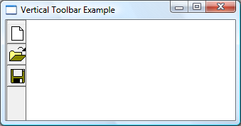

# How to Create Vertical Toolbars

The key to creating a vertical toolbar is to include [**CCS\_VERT**](common-control-styles.md) in the window style, and to set the [**TBSTATE\_WRAP**](toolbar-button-states.md) style for each button.

## What you need to know

### Technologies

-   [Windows Controls](window-controls.md)

### Prerequisites

-   C/C++
-   Windows User Interface Programming

## Instructions

### Create a Vertical Toolbar

The following example code creates the vertical toolbar shown in the following illustration.




```C++
HIMAGELIST g_hImageList = NULL;

HWND CreateVerticalToolbar(HWND hWndParent)
{
    // Define the buttons.
    // IDM_NEW, IDM_0PEN, and IDM_SAVE are application-defined command IDs.
    
    TBBUTTON tbButtons3[numButtons] = 
    {
        {STD_FILENEW,  IDM_NEW,  TBSTATE_ENABLED | TBSTATE_WRAP, BTNS_BUTTON, {0}, 0L, 0},
        {STD_FILEOPEN, IDM_OPEN, TBSTATE_ENABLED | TBSTATE_WRAP, BTNS_BUTTON, {0}, 0L, 0},
        {STD_FILESAVE, IDM_SAVE, TBSTATE_ENABLED | TBSTATE_WRAP, BTNS_BUTTON, {0}, 0L, 0}
    };

    // Create the toolbar window.
    HWND hWndToolbar = CreateWindowEx(0, TOOLBARCLASSNAME, NULL, 
                                      WS_CHILD | WS_VISIBLE | CCS_VERT | WS_BORDER, 0, 0, 0, 0,
                                      hWndParent, NULL, g_hInst, NULL);

    // Create the image list.
    g_hImageList = ImageList_Create(24, 24,                   // Dimensions of individual bitmaps.  
                                    ILC_COLOR16 | ILC_MASK,   // Ensures transparent background.
                                    numButtons, 0);

    // Set the image list.
    SendMessage(hWndToolbar, TB_SETIMAGELIST, 0, (LPARAM)g_hImageList);

    // Load the button images.
    SendMessage(hWndToolbar, TB_LOADIMAGES, (WPARAM)IDB_STD_LARGE_COLOR, (LPARAM)HINST_COMMCTRL);

    // Add them to the toolbar.
    SendMessage(hWndToolbar, TB_BUTTONSTRUCTSIZE,       (WPARAM)sizeof(TBBUTTON), 0);
    SendMessage(hWndToolbar, TB_ADDBUTTONS, numButtons, (LPARAM)&tbButtons3);

    return hWndToolbar;
} 
```


## Related topics

<dl> <dt>

[Using Toolbar Controls](using-toolbar-controls.md)
</dt> <dt>

[Windows common controls demo (CppWindowsCommonControls)](https://github.com/microsoftarchive/msdn-code-gallery-microsoft/tree/master/OneCodeTeam/Windows%20common%20controls%20demo%20(CppWindowsCommonControls)/%5BC++%5D-Windows%20common%20controls%20demo%20(CppWindowsCommonControls)/C++/CppWindowsCommonControls)
</dt> </dl>

 

 


