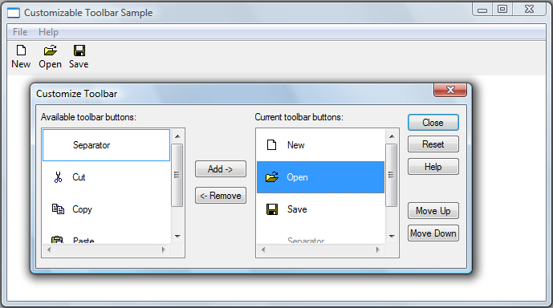

# How to Customize Toolbars

Most Windows-based applications use toolbar controls to provide users with convenient access to the program functionality. However, static toolbars have some shortcomings—such as too little space to effectively display all the available tools. The solution to this problem is to make your application's toolbars user-customizable. Then, users can choose to display only the tools they need, and they can organize them in a way that suits their personal workstyle.

> [!Note]  
> Toolbars in dialog boxes cannot be customized.

 

To enable customization, include the [**CCS\_ADJUSTABLE**](common-control-styles.md) common controls style flag when you create the toolbar control. There are two basic approaches to customization:

-   The customization dialog box. This system-provided dialog box is the simplest approach. It gives users a graphical user interface that allows them to add, delete, or move icons.
-   Dragging and dropping tools. Implementing drag-and-drop functionality allows users to move tools to another location on the toolbar or delete them by dragging them off the toolbar. It provides users a quick and easy way to organize their toolbar, but does not allow them to add tools.

You can implement either approach or both, depending on the needs of the application. Neither of these two approaches to customization provides a built-in mechanism, such as a Cancel or Undo button, to return the toolbar to its former state. You must explicitly use the toolbar control API to store the toolbar's precustomization state. If necessary, you can later use this stored information to restore the toolbar to its original state.

## What you need to know

### Technologies

-   [Windows Controls](window-controls.md)

### Prerequisites

-   C/C++
-   Windows User Interface Programming

## Instructions

### Customization Dialog Box

The customization dialog box is provided by the toolbar control to give users a simple way to add, move, or delete tools. Users can launch it by double-clicking the toolbar. Applications can launch the customization dialog box programmatically by sending the toolbar control a [**TB\_CUSTOMIZE**](tb-customize.md) message.

The following illustration shows an example of the toolbar customization dialog box.



The tools in the list box on the right are those currently on the toolbar. Initially, this list will contain the tools that you specify when you create the toolbar. The list box in the left contains the tools that are available to add to the toolbar. Your application is responsible for populating that list (other than with the Separator, which appears automatically).

The toolbar control notifies your application that it is launching a customization dialog box by sending its parent window a [TBN\_BEGINADJUST](tbn-beginadjust.md) notification code followed by a [TBN\_INITCUSTOMIZE](tbn-initcustomize.md) notification code. In most cases, the application does not need to respond to these notification codes. However, if you do not want the Customize Toolbar dialog box to display a Help button, handle TBN\_INITCUSTOMIZE by returning TBNRF\_HIDEHELP.

The toolbar control then collects the information it needs to initialize the dialog box by sending three series of notification codes, in the following order:

-   A [TBN\_QUERYINSERT](tbn-queryinsert.md) notification code for each button on the toolbar to determine where buttons can be inserted. Return **FALSE** to prevent a button from being inserted to the left of the button specified in the notification message. If you return **FALSE** to all TBN\_QUERYINSERT notification codes, the dialog box will not be displayed.
-   A [TBN\_QUERYDELETE](tbn-querydelete.md) notification code for each tool that is currently on the toolbar. Return **TRUE** if a tool can be deleted, or **FALSE** if not.
-   A series of [TBN\_GETBUTTONINFO](tbn-getbuttoninfo.md) notification codes to populate the list of available buttons. To add a button to the list, fill in the [**NMTOOLBAR**](/windows/win32/api/commctrl/ns-commctrl-nmtoolbara) structure that is passed with the notification code and return **TRUE**. When you have no more tools to add, return **FALSE**. Note that you can return information for buttons that are already on the toolbar; these buttons will not be added to the list.

The dialog box is then displayed, and the user can begin to customize the toolbar.

When the dialog box is open, your application can receive a variety of notification codes, depending on the user's actions:

-   [TBN\_QUERYINSERT](tbn-queryinsert.md). The user has changed the location of a tool on the toolbar or added a tool. Return **FALSE** to prevent the tool from being inserted at that location.
-   [TBN\_DELETINGBUTTON](tbn-deletingbutton.md). The user is about to remove a tool from the toolbar.
-   [TBN\_CUSTHELP](tbn-custhelp.md). The user has clicked the Help button.
-   [TBN\_TOOLBARCHANGE](tbn-toolbarchange.md). The user has added, moved, or deleted a tool.
-   [TBN\_RESET](tbn-reset.md). The user has clicked the Reset button.

After the dialog box is destroyed, your application will receive a [TBN\_ENDADJUST](tbn-endadjust.md) notification code.

The following code example shows one way to implement toolbar customization.


```C++
// The buttons are stored in an array of TBBUTTON structures. 
//
// Constants such as STD_FILENEW are identifiers for the 
// built-in bitmaps that have already been assigned as the toolbar's 
// image list.
//
// Constants such as IDM_NEW are application-defined command identifiers.

TBBUTTON allButtons[] = 
    {
        { MAKELONG(STD_FILENEW,  ImageListID), IDM_NEW,   TBSTATE_ENABLED, 0, {0}, 0, (INT_PTR)L"New" },
        { MAKELONG(STD_FILEOPEN, ImageListID), IDM_OPEN,  TBSTATE_ENABLED, 0, {0}, 0, (INT_PTR)L"Open"},
        { MAKELONG(STD_FILESAVE, ImageListID), IDM_SAVE,  TBSTATE_ENABLED, 0, {0}, 0, (INT_PTR)L"Save"},
        { MAKELONG(STD_CUT,      ImageListID), IDM_CUT,   TBSTATE_ENABLED, 0, {0}, 0, (INT_PTR)L"Cut" },
        { MAKELONG(STD_COPY,     ImageListID), IDM_COPY,  TBSTATE_ENABLED, 0, {0}, 0, (INT_PTR)L"Copy"},
        { MAKELONG(STD_PASTE,    ImageListID), IDM_PASTE, TBSTATE_ENABLED, 0, {0}, 0, (INT_PTR)L"Paste"}
    };

// The following appears in the window's message handler.

case WM_NOTIFY: 
    {
        switch (((LPNMHDR)lParam)->code) 
        {
        
        case TBN_GETBUTTONINFO:  
            {
                LPTBNOTIFY lpTbNotify = (LPTBNOTIFY)lParam;

                // Pass the next button from the array. There is no need to filter out buttons
                // that are already used—they will be ignored.
                
                int buttonCount = sizeof(allButtons) / sizeof(TBBUTTON);
                
                if (lpTbNotify->iItem < buttonCount)
                {
                    lpTbNotify->tbButton = allButtons[lpTbNotify->iItem];
                    return TRUE;
                }
                
                else
                
                {
                    return FALSE;  // No more buttons.
                }
            }
            
            break;

            case TBN_QUERYINSERT:
            
            case TBN_QUERYDELETE:
                return TRUE; 
        }
    }
```


### Dragging and Dropping Tools

Users can also rearrange the buttons on a toolbar by pressing the SHIFT key and dragging the button to another location. The drag-and-drop process is handled automatically by the toolbar control. It displays a ghost image of the button as it is dragged, and rearranges the toolbar after it is dropped. Users cannot add buttons in this way, but they can delete a button by dropping it off the toolbar.

Although the toolbar control normally does this operation automatically, it also sends your application two notification codes: [TBN\_QUERYDELETE](tbn-querydelete.md) and [TBN\_QUERYINSERT](tbn-queryinsert.md). To control the drag-and-drop process, handle these notification codes as follows:

-   The [TBN\_QUERYDELETE](tbn-querydelete.md) notification code is sent as soon as the user attempts to move the button, before the ghost button is displayed. Return **FALSE** to prevent the button from being moved. If you return **TRUE**, the user will be able to either move the tool or delete it by dropping it off the toolbar. If a tool can be moved, it can be deleted. However, if the user deletes a tool, the toolbar control will send your application a [TBN\_DELETINGBUTTON](tbn-deletingbutton.md) notification code, at which point you can choose to reinsert the button at its original location, thereby canceling the deletion.
-   The [TBN\_QUERYINSERT](tbn-queryinsert.md) notification code is sent when the user attempts to drop the button on the toolbar. To prevent the button that is being moved from being dropped to the left of the button specified in the notification, return **FALSE**. This notification code is not sent if the user drops the tool off the toolbar.

If the user attempts to drag a button without also pressing the SHIFT key, the toolbar control will not handle the drag-and-drop operation. However, it will send your application a [TBN\_BEGINDRAG](tbn-begindrag.md) notification code to indicate the start of a drag operation, and a [TBN\_ENDDRAG](tbn-enddrag.md) notification code to indicate the end. If you want to enable this form of drag-and-drop, your application must handle these notification codes, provide the necessary user interface, and modify the toolbar to reflect any changes.

### Saving and Restoring Toolbars

In the process of customizing a toolbar, your application might need to save information so that you can restore the toolbar to its original state. To initiate saving or restoring a toolbar state, send the toolbar control a [**TB\_SAVERESTORE**](tb-saverestore.md) message with the *lParam* set to **TRUE**. The *lParam* value of this message specifies whether you are requesting a save or a restore operation. After the message is sent, there are two ways to handle the save/restore operation:

-   With common controls [version 4.72](common-control-versions.md) and earlier, you must implement a [TBN\_GETBUTTONINFO](tbn-getbuttoninfo.md) handler. The toolbar control sends this notification code to request information about each button as it is restored.
-   Version 5.80 includes a save/restore option. At the beginning of the process, and as each button is saved or restored, your application will receive a [TBN\_SAVE](tbn-save.md) or [TBN\_RESTORE](tbn-restore.md) notification code. To use this option, you must implement notification handlers to provide the bitmap and state information that is needed to successfully save or restore the toolbar state.

Toolbar states are saved in a data stream that consists of blocks of Shell-defined data alternating with blocks of application-defined data. One data block of each type is stored for each button, along with an optional block of global data that applications can place at the beginning of the stream. During the save process, your [TBN\_SAVE](tbn-save.md) handler adds the application-defined blocks to the data stream. During the restore process, the [TBN\_RESTORE](tbn-restore.md) handler reads each block and gives the Shell the information it needs to reconstruct the toolbar.

### How to Handle a TBN\_SAVE Notification

The first [TBN\_SAVE](tbn-save.md) notification code is sent at the beginning of the save process. Before any buttons are saved, the members of the [**NMTBSAVE**](/windows/win32/api/commctrl/ns-commctrl-nmtbsave) structure are set as shown in the following table.


| Member       | Setting                                                                                                                                                                                                                                                                                                                                            |
|--------------|----------------------------------------------------------------------------------------------------------------------------------------------------------------------------------------------------------------------------------------------------------------------------------------------------------------------------------------------------|
| **iItem**    | –1                                                                                                                                                                                                                                                                                                                                                 |
| **cbData**   | The amount of memory needed for Shell-defined data.                                                                                                                                                                                                                                                                                                |
| **cButtons** | The number of buttons.                                                                                                                                                                                                                                                                                                                             |
| **pData**    | The calculated amount of memory needed for application-defined data. Typically, you include some global data, plus data for each button. Add that value to **cbData** and allocate enough memory to **pData** to hold it all.                                                                                                                      |
| **pCurrent** | The first unused byte in the data stream. If you do not require global toolbar information, set **pCurrent** = **pData** so that it points to the start of the data stream. If you do require global toolbar information, store it at **pData**, then set **pCurrent** to the beginning of the unused portion of the data stream before returning. |


 

If you want to add some global toolbar information, put it at the start of the data stream. Advance **pCurrent** to the end of the global data so that it points to the beginning of the unused portion of the data stream, and return.

After you return, the Shell starts saving button information. It adds the Shell-defined data for the first button at **pCurrent** and then advances **pCurrent** to the start of the unused portion.

After each button is saved, a [TBN\_SAVE](tbn-save.md) notification code is sent and [**NMTBSAVE**](/windows/win32/api/commctrl/ns-commctrl-nmtbsave) is returned with these members set as follows.


| Member                       | Setting                                                                                                                                                                                                                                                              |
|------------------------------|----------------------------------------------------------------------------------------------------------------------------------------------------------------------------------------------------------------------------------------------------------------------|
| **iItem**                    | The zero-based index of the button number.                                                                                                                                                                                                                           |
| **pCurrent**                 | A pointer to the first unused byte in the data stream. If you want to store additional information about the button, store it at the location pointed to by **pCurrent** and update **pCurrent** to point to the first unused portion of the data stream after that. |
| [**TBBUTTON**](/windows/desktop/api/Commctrl/ns-commctrl-tbbutton) | A [**TBBUTTON**](/windows/desktop/api/Commctrl/ns-commctrl-tbbutton) structure that describes the button that is being saved.                                                                                                                                                                              |


 

When you receive the notification code, you should extract any button-specific information you need from [**TBBUTTON**](/windows/desktop/api/Commctrl/ns-commctrl-tbbutton). Remember that when you add a button, you can use the **dwData** member of **TBBUTTON** to hold application-specific data. Load your data into the data stream at **pCurrent**. Advance **pCurrent** to the end of your data, again pointing to the beginning of the unused portion of the stream, and return.

The Shell then goes to the next button, adds its information to **pData**, advances **pCurrent**, loads [**TBBUTTON**](/windows/desktop/api/Commctrl/ns-commctrl-tbbutton), and sends another [TBN\_SAVE](tbn-save.md) notification code. This process continues until all buttons are saved.

### Restoring Saved Toolbars

The restore process basically reverses the save process. At the beginning, your application will receive a [TBN\_RESTORE](tbn-restore.md) notification code with the **iItem** member of the [**NMTBRESTORE**](/windows/win32/api/commctrl/ns-commctrl-nmtbrestore) structure set to –1. The **cbData** member is set to the size of **pData**, and **cButtons** is set to the number of buttons.

Your notification handler should extract the global information that was placed at the beginning of **pData** during the save, and advance **pCurrent** to the start of the first block of Shell-defined data. Set **cBytesPerRecord** to the size of the data blocks you used to save the button data. Set **cButtons** to the number of buttons, and return.

The next [**NMTBRESTORE**](/windows/win32/api/commctrl/ns-commctrl-nmtbrestore) is for the first button. The **pCurrent** member points to the start of your first block of button data, and **iItem** is set to the button index. Extract that data and advance **pCurrent**. Load the data into [**TBBUTTON**](/windows/desktop/api/Commctrl/ns-commctrl-tbbutton), and return. To omit a button from the restored toolbar, set the **idCommand** member of **TBBUTTON** to zero. The Shell will repeat the process for the remaining buttons. In addition to the [**NMTBSAVE**](/windows/win32/api/commctrl/ns-commctrl-nmtbsave) and **NMTBRESTORE** messages, you can also use messages such as [TBN\_RESET](tbn-reset.md) to save and restore a toolbar.

The following code example saves a toolbar before it is customized, and restores it if the application receives a [TBN\_RESET](tbn-reset.md) message.


```C++
int               i;
LPNMHDR           lpnmhdr;
static int        nResetCount;
static LPTBBUTTON lpSaveButtons;
LPARAM            lParam;

switch( lpnmhdr->code)
{
    case TBN_BEGINADJUST: // Begin customizing the toolbar.
    {
        LPTBNOTIFY  lpTB = (LPTBNOTIFY)lparam;
       
        // Allocate memory for the button information.
        
        nResetCount   = SendMessage(lpTB->hdr.hwndFrom, TB_BUTTONCOUNT, 0, 0);
        lpSaveButtons = (LPTBBUTTON)GlobalAlloc(GPTR, sizeof(TBBUTTON) * nResetCount);
      
        // In case the user presses reset, save the current configuration 
        // so the original toolbar can be restored.
        
        for(i = 0; i < nResetCount; i++)
        {
            SendMessage(lpTB->hdr.hwndFrom, 
                        TB_GETBUTTON, i, 
                        (LPARAM)(lpSaveButtons + i));
        }
    }
    
    return TRUE;
   
    case TBN_RESET:
    {
        LPTBNOTIFY lpTB = (LPTBNOTIFY)lparam;
        
        int nCount, i;
    
        // Remove all of the existing buttons, starting with the last one.
        
        nCount = SendMessage(lpTB->hdr.hwndFrom, TB_BUTTONCOUNT, 0, 0);
        
        for(i = nCount - 1; i >= 0; i--)
        {
            SendMessage(lpTB->hdr.hwndFrom, TB_DELETEBUTTON, i, 0);
        }
      
        SendMessage(lpTB->hdr.hwndFrom,      // Restore the saved buttons.
                    TB_ADDBUTTONS, 
                    (WPARAM)nResetCount, 
                    (LPARAM)lpSaveButtons);
    }
    
    return TRUE;
   
    case TBN_ENDADJUST:                // Free up the memory you allocated.
        GlobalFree((HGLOBAL)lpSaveButtons);
        
        return TRUE;
}
```


## Related topics

<dl> <dt>

[Using Toolbar Controls](using-toolbar-controls.md)
</dt> <dt>

[**Toolbar Standard Button Image Index Values**](toolbar-standard-button-image-index-values.md)
</dt> <dt>

[Windows common controls demo (CppWindowsCommonControls)](https://github.com/microsoftarchive/msdn-code-gallery-microsoft/tree/master/OneCodeTeam/Windows%20common%20controls%20demo%20(CppWindowsCommonControls)/%5BC++%5D-Windows%20common%20controls%20demo%20(CppWindowsCommonControls)/C++/CppWindowsCommonControls)
</dt> </dl>

 

 


