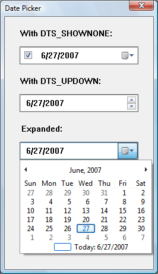
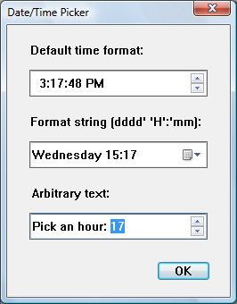

# About Date and Time Picker Controls

A *date and time picker (DTP) control* provides a simple and intuitive interface through which to exchange date and time information with a user. For example, with a DTP control you can ask the user to enter a date and then easily retrieve the selection.

The following topics are discussed:

-   [Date and Time Picker User Interface](#date-and-time-picker-user-interface)
-   [Date and Time Picker Control Styles and Formats](#date-and-time-picker-control-styles-and-formats)
    -   [Preset Formats](#preset-formats)
    -   [Custom formats](#custom-formats)
    -   [Format Strings](#format-strings)
    -   [Callback fields](#callback-fields)
-   [Date and Time Picker Control Notification Messages](#date-and-time-picker-control-notification-messages)
-   [Related topics](#related-topics)

> [!Note]
> Windows does not support dates prior to 1601. See the [**FILETIME**](/windows/desktop/api/minwinbase/ns-minwinbase-filetime) structure for details.
>
> The control is based on the Gregorian calendar, which was introduced in 1753. It will not calculate dates that are consistent with the Julian calendar.

## Date and Time Picker User Interface

The client area of a date and time picker (DTP) control displays date or time information, or both, and acts as the interface through which users modify the information. The date can be selected from a calendar, or by using an up-down control; the time can be changed by typing in fields that are defined by the control's [Format Strings](#format-strings). Optionally, the control displays a check box. When it is checked, the value in the control can be retrieved; otherwise, the control is considered to be uninitialized.

The following illustration shows a window that contains three date-picker controls. The first date-picker control was created with the [**DTS\_SHOWNONE**](date-and-time-picker-control-styles.md) style, the second with the [**DTS\_UPDOWN**](date-and-time-picker-control-styles.md) style, and the third with no special styles. In the third control, the user has clicked the down arrow to display the calendar.

The following illustration shows a windows with three controls that contain the time.

The first control has been created with the [**DTS\_TIMEFORMAT**](date-and-time-picker-control-styles.md) style and shows the time in the default time, which consists of four fields. The user can type a valid value in any of these fields, or select the field and change the value by using the up-down control or arrow keys.

The second control shows a custom format set by using [**DateTime\_SetFormat**](/windows/desktop/api/Commctrl/nf-commctrl-datetime_setformat). As with the first control, the user can change the time fields by typing or by using arrow keys. The day of the week can be changed by selecting a date from the calendar that opens when the user clicks on the down arrow.

The third control shows how arbitrary text can be added to the control. The user can select an hour (from 1 to 24) by typing, by using the arrow keys, or by using the up-down control.

The DTP control automatically updates internal information based on the user's input. The control recognizes the following as valid input.

| Input Category | Description                                                                                                                                                                                                                                                                                                                                                                  |
|----------------|------------------------------------------------------------------------------------------------------------------------------------------------------------------------------------------------------------------------------------------------------------------------------------------------------------------------------------------------------------------------------|
| Arrow Keys     | The control accepts arrow keys to navigate the fields in the control and change values. The user can press the or keys to move through the control If the user attempts to move past the last field in a given direction, the keyboard focus "wraps around" to the field on the opposite side of the control. The and keys change values in the current field incrementally. |
| End and Home   | The control accepts the VK\_END and VK\_HOME virtual keys to change the value within the current field to its upper and lower limits, respectively.                                                                                                                                                                                                                          |
| Function Keys  | The key activates edit mode. The key causes the control to display a drop-down month calendar control (pressing does this as well).                                                                                                                                                                                                                                          |
| Numbers        | The control accepts numeric input in two-character segments. If the value entered by the user is invalid (like setting the month to 14), the control rejects it and resets the display to the previous value.                                                                                                                                                                |
| Plus and Minus | The control accepts the VK\_ADD and VK\_SUBTRACT virtual keys from the numeric keypad to increment and decrement the value in the current field.                                                                                                                                                                                                                             |

 

DTP controls that do not use the [**DTS\_UPDOWN**](date-and-time-picker-control-styles.md) style display an arrow button. If the user clicks this button, a month calendar control drops down. The user can select a specific date by clicking an area of the calendar.

## Date and Time Picker Control Styles and Formats

Date and time picker (DTP) controls have several [Date and Time Picker Control Styles](date-and-time-picker-control-styles.md) that determine a control's appearance and behavior. Specify the style when creating the control with the *dwStyle* parameter of [**CreateWindowEx**](/windows/desktop/api/winuser/nf-winuser-createwindowexa). To retrieve or change the window style after you have created the control, use [**GetWindowLong**](/windows/desktop/api/winuser/nf-winuser-getwindowlonga) and [**SetWindowLong**](/windows/desktop/api/winuser/nf-winuser-setwindowlonga).

### Preset Formats

There are three preset formats available for displaying the date and one for displaying time. Set these formats by choosing one of the following window styles.

|   Format                                                                                                    |   Description                                                         |
|-------------------------------------------------------------------------------------------------------|------------------------------------------------------------|
| [**DTS\_LONGDATEFORMAT**](date-and-time-picker-control-styles.md)                 | The display will look like: "Friday, April 19, 1996".      |
| [**DTS\_SHORTDATEFORMAT**](date-and-time-picker-control-styles.md)               | The display will look like: "4/19/96".                     |
| [**DTS\_SHORTDATECENTURYFORMAT**](date-and-time-picker-control-styles.md) | **Version 5.80**. The display will look like: "4/19/1996". |
| [**DTS\_TIMEFORMAT**](date-and-time-picker-control-styles.md)                         | The display will look like: "5:31:42 PM".                  |

 

### Custom formats

A DTP control relies on a format string to determine how it will display fields of information. If the preset formats are not sufficient, you can create a custom format by defining your own format string. Custom formats provide greater flexibility for an application. They enable you to specify the order in which the control will display fields of information. You can include body text as well as callback fields for requesting information from the user. Once the string is created, you assign it to the DTP control with a [**DTM\_SETFORMAT**](dtm-setformat.md) message.

### Format Strings

A DTP format string consists of a series of elements that represent a particular piece of information and define its display format. The elements will be displayed in the order they appear in the format string.

Date and time format elements will be replaced by the actual date and time. They are defined by the following groups of characters.

| Element | Description                                                                       |
|---------|-----------------------------------------------------------------------------------|
| "d"     | The one- or two-digit day.                                                        |
| "dd"    | The two-digit day. Single-digit day values are preceded by a zero.                |
| "ddd"   | The three-character weekday abbreviation.                                         |
| "dddd"  | The full weekday name.                                                            |
| "h"     | The one- or two-digit hour in 12-hour format.                                     |
| "hh"    | The two-digit hour in 12-hour format. Single-digit values are preceded by a zero. |
| "H"     | The one- or two-digit hour in 24-hour format.                                     |
| "HH"    | The two-digit hour in 24-hour format. Single-digit values are preceded by a zero. |
| "m"     | The one- or two-digit minute.                                                     |
| "mm"    | The two-digit minute. Single-digit values are preceded by a zero.                 |
| "M"     | The one- or two-digit month number.                                               |
| "MM"    | The two-digit month number. Single-digit values are preceded by a zero.           |
| "MMM"   | The three-character month abbreviation.                                           |
| "MMMM"  | The full month name.                                                              |
| "t"     | The one-letter AM/PM abbreviation (that is, AM is displayed as "A").              |
| "tt"    | The two-letter AM/PM abbreviation (that is, AM is displayed as "AM").             |
| "yy"    | The last two digits of the year (that is, 1996 would be displayed as "96").       |
| "yyyy"  | The full year (that is, 1996 would be displayed as "1996").                       |

 

To make the information more readable, you can add body text to the format string by enclosing it in single quotes. Spaces and punctuation marks do not need to be quoted.

> [!Note]  
> Nonformat characters that are not delimited by single quotes will result in unpredictable display by the DTP control.

For example, to display the current date with the format "'Today is: 04:22:31 Tuesday Mar 23, 1996", the format string is "'Today is: 'hh':'m':'s dddd MMM dd', 'yyyy". To include a single quote in your body text, use two consecutive single quotes. For example, "'Don't forget' MMM dd',' yyyy" produces output that looks like: Do not forget Mar 23, 1996. It is not necessary to use quotes with the comma, so "'Don't forget' MMM dd, yyyy" is also valid, and produces the same output.

### Callback fields

In addition to the standard [Format Strings](#format-strings) and body text, you can also define certain parts of the display as [Callback fields](#callback-fields). These fields can be used to query the user for information. To declare a callback field, include one or more "X" characters (ASCII Code 88) anywhere in the format string. You can create callback fields that have a unique identity by repeating the "X" character. Thus, the format string "XX dddd MMM dd', 'yyy XXX" contains two unique callback fields, "XX" and "XXX". Like other DTP control fields, callback fields are displayed in left-to-right order based on their location in the format string.

When the DTP control parses the format string and encounters a callback field, it sends [DTN\_FORMAT](dtn-format.md) and [DTN\_FORMATQUERY](dtn-formatquery.md) notification codes. The format string element corresponding to the callback field is included with the notifications to allow the receiving application to determine which callback field is being queried. The owner of the control must respond to these notifications to ensure that the custom information is properly displayed.

## Date and Time Picker Control Notification Messages

A date and time picker (DTP) control sends notification codes when it receives user input or processes and reacts to callback fields. The parent of the control receives these notification codes in the form of [**WM\_NOTIFY**](wm-notify.md) messages.

The following notification codes are used with DTP controls.

| Notification code                             | Description                                                                                                                                                                                                       |
|-----------------------------------------------|-------------------------------------------------------------------------------------------------------------------------------------------------------------------------------------------------------------------|
| [DTN\_CLOSEUP](dtn-closeup.md)               | Indicates that the drop-down month calendar is about to be removed.                                                                                                                                               |
| [DTN\_DATETIMECHANGE](dtn-datetimechange.md) | Signals a change within the DTP control.                                                                                                                                                                          |
| [DTN\_DROPDOWN](dtn-dropdown.md)             | Indicates that the drop-down month calendar is about to be displayed.                                                                                                                                             |
| [DTN\_FORMAT](dtn-format.md)                 | Requests text to display in a portion of the format string described as a callback field.                                                                                                                         |
| [DTN\_FORMATQUERY](dtn-formatquery.md)       | Requests information about the maximum allowable size of the text to be displayed in a callback field.                                                                                                            |
| [DTN\_USERSTRING](dtn-userstring.md)         | Signals the end of a user's edit operation within the control. This notification is sent only by DTP controls that use the [**DTS\_APPCANPARSE**](date-and-time-picker-control-styles.md) style. |
| [DTN\_WMKEYDOWN](dtn-wmkeydown.md)           | Signals that the user has pressed a key in a callback field of the DTP control.                                                                                                                                   |

 

## Related topics

<dl> <dt>

[Date and Time Picker Control Reference](date-and-time-picker-control-reference.md)
</dt> </dl>

 

 