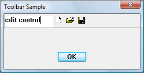

# How to Embed Nonbutton Controls in Toolbars

Toolbars support only buttons; therefore, if your application requires a different kind of control, you must create a child window. The following illustration shows a toolbar with an embedded edit control.



> [!Note]  
> Consider using [Rebar Controls](rebar-controls.md) instead of placing controls in toolbars.

 

Any type of window can be placed on a toolbar. The following example code adds an edit control as a child of the toolbar control window. Because the toolbar is created and then the edit control added, you must provide space for the edit control. One way to do this is to add a separator as a placeholder in the toolbar, setting the width of the separator to the number of pixels you want to reserve.

## What you need to know

### Technologies

-   [Windows Controls](window-controls.md)

### Prerequisites

-   C/C++
-   Windows User Interface Programming

## Instructions

### Embed a Nonbutton Control in a Toolbar

The following code snippet creates the toolbar in the preceding illustration.


```C++
// IDM_NEW, IDM_OPEN, and IDM_SAVE are application-defined command constants.

HIMAGELIST g_hImageList = NULL;

HWND CreateToolbarWithEdit(HWND hWndParent)
{
    const int ImageListID = 0;    // Define some constants.
    const int bitmapSize  = 16;
    
    const int cx_edit = 100;      // Dimensions of edit control.
    const int cy_edit = 35;  

    TBBUTTON tbButtons[] =        // Toolbar buttons.
    {
        // The separator is set to the width of the edit control. 
        
        {cx_edit, 0, TBSTATE_ENABLED, BTNS_SEP, {0}, 0, -1},
        {STD_FILENEW, IDM_NEW, TBSTATE_ENABLED, BTNS_BUTTON, {0}, 0, 0},
        {STD_FILEOPEN, IDM_OPEN, TBSTATE_ENABLED, BTNS_BUTTON, {0}, 0, 0},
        {STD_FILESAVE, IDM_SAVE, TBSTATE_ENABLED, BTNS_BUTTON, {0}, 0, 0},
        {0, 0, TBSTATE_ENABLED, BTNS_SEP, {0}, 0, 0},
    };

    // Create the toolbar.
    HWND hWndToolbar = CreateWindowEx(0, TOOLBARCLASSNAME, L"Toolbar", 
                                      WS_CHILD | WS_VISIBLE | WS_BORDER, 
                                      0, 0, 0, 0,
                                      hWndParent, NULL, HINST_COMMCTRL, NULL);

    if (!hWndToolbar)
        return NULL;
    
    int numButtons = sizeof(tbButtons) / sizeof(TBBUTTON);

    // Create the image list.
    g_hImageList = ImageList_Create(bitmapSize, bitmapSize, // Dimensions of individual bitmaps.
                                    0,                      // Flags.
                                    numButtons, 0);

    // Set the image list.
    SendMessage(hWndToolbar, TB_SETIMAGELIST, (WPARAM)ImageListID, (LPARAM)g_hImageList);

    // Load the button images.
    SendMessage(hWndToolbar, TB_LOADIMAGES, (WPARAM)IDB_STD_SMALL_COLOR, (LPARAM)HINST_COMMCTRL);

    // Add buttons.
    SendMessage(hWndToolbar, TB_BUTTONSTRUCTSIZE, (WPARAM)sizeof(TBBUTTON), 0);
    SendMessage(hWndToolbar, TB_ADDBUTTONS,       (WPARAM)numButtons,       (LPARAM)&tbButtons);

    // Create the edit control child window.    
    HWND hWndEdit = CreateWindowEx(0L, L"Edit", NULL, 
                                   WS_CHILD | WS_BORDER | WS_VISIBLE | ES_LEFT | ES_AUTOVSCROLL | ES_MULTILINE, 
                                   0, 0, cx_edit, cy_edit, 
                                   hWndToolbar, (HMENU) IDM_EDIT, g_hInst, 0 );
    
    if (!hWndEdit)
    {
        DestroyWindow(hWndToolbar);
        ImageList_Destroy(g_hImageList);
        
        return NULL;
    }
    
    return hWndToolbar;    // Return the toolbar with the embedded edit control.
}
```


This example hard-codes the dimensions of the child window; however, to make a more robust application, determine the size of the toolbar and make the edit control window to fit.

You might want the edit control notifications to go to another window, such as the toolbar's parent. To do this, create the edit control as a child of the toolbar's parent window. Then change the parent of the edit control to the toolbar as follows.


```
SetParent (hWndEdit, hWndToolbar);
```


Notifications go to the original parent. Therefore, the edit control messages go to the parent of the toolbar even though the edit window resides in the toolbar window.

## Related topics

<dl> <dt>

[Using Toolbar Controls](using-toolbar-controls.md)
</dt> <dt>

[Windows common controls demo (CppWindowsCommonControls)](https://github.com/microsoftarchive/msdn-code-gallery-microsoft/tree/master/OneCodeTeam/Windows%20common%20controls%20demo%20(CppWindowsCommonControls)/%5BC++%5D-Windows%20common%20controls%20demo%20(CppWindowsCommonControls)/C++/CppWindowsCommonControls)
</dt> </dl>

 

 


