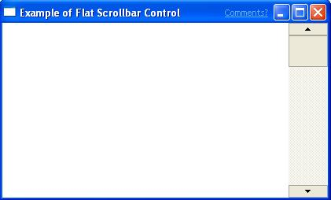

# Flat Scroll Bars

Microsoft Internet Explorer 4.0 introduced a new visual technology called flat scroll bars. Functionally, flat scroll bars behave just like standard scroll bars. The difference is that you can customize their appearance to a greater extent than standard scroll bars.

The following illustration shows a window that contains a flat scroll bar.



> [!Note]  
> Flat scroll bars are supported by Comctl32.dll versions 4.71 through 5.82. Comctl32.dll versions 6.00 and later do not support flat scroll bars.

 

## Using Flat Scroll Bars

This section describes how to implement flat scroll bars in your application.

### Before You Begin

To use the flat scroll bar functions, you must include Commctrl.h in your source files and link with Comctl32.lib.

### Adding Flat Scroll Bars to a Window

To add flat scroll bars to a window, call [**InitializeFlatSB**](/windows/desktop/api/Commctrl/nf-commctrl-initializeflatsb), passing the handle to the window. Instead of using the standard scroll bar functions to manipulate your scroll bars, you must use the equivalent FlatSB\_XXX function. There are flat scroll bar functions for setting and retrieving the scroll information, range, and position. If flat scroll bars haven't been initialized for your window, the flat scroll bar API will defer to the corresponding standard functions, if any are used. This allows you to turn flat scroll bars on and off without having to write conditional code.

Because an application may have set custom metrics for its flat scroll bars, they are not automatically updated when system metrics change. When the system scroll bar metrics change, a [**WM\_SETTINGCHANGE**](/windows/desktop/winmsg/wm-settingchange) message is broadcast, with its *wParam* set to [**SPI\_SETNONCLIENTMETRICS**](/windows/desktop/api/winuser/nf-winuser-systemparametersinfoa). To update flat scroll bars to the new system metrics, applications must handle this message and change the flat scroll bar's metric-dependent properties explicitly.

To update your scroll bar properties, use [**FlatSB\_SetScrollProp**](/windows/desktop/api/Commctrl/nf-commctrl-flatsb_setscrollprop). The following code fragment changes a flat scroll bar's metric dependent properties to the current system values.


```
void FlatSB_UpdateMetrics(HWND hWnd)
{
FlatSB_SetScrollProp(hWnd, WSB_PROP_CXVSCROLL, GetSystemMetrics(SM_CXVSCROLL), FALSE);
FlatSB_SetScrollProp(hWnd, WSB_PROP_CXHSCROLL, GetSystemMetrics(SM_CXHSCROLL), FALSE);
FlatSB_SetScrollProp(hWnd, WSB_PROP_CYVSCROLL, GetSystemMetrics(SM_CYVSCROLL), FALSE);
FlatSB_SetScrollProp(hWnd, WSB_PROP_CYHSCROLL, GetSystemMetrics(SM_CYHSCROLL), FALSE);
FlatSB_SetScrollProp(hWnd, WSB_PROP_CXHTHUMB, GetSystemMetrics(SM_CXHTHUMB), FALSE);
FlatSB_SetScrollProp(hWnd, WSB_PROP_CYVTHUMB, GetSystemMetrics(SM_CYVTHUMB), TRUE);
}
```


### Enhancing Flat Scroll Bars

[**FlatSB\_SetScrollProp**](/windows/desktop/api/Commctrl/nf-commctrl-flatsb_setscrollprop) allows you to modify the flat scroll bars to customize the look of your window. For vertical scroll bars, you can change the width of the bar and the height of the direction arrows. For horizontal scroll bars, you can change the height of the bar and the width of the direction arrows. You can also change the background color of both the horizontal and vertical scroll bars.

[**FlatSB\_SetScrollProp**](/windows/desktop/api/Commctrl/nf-commctrl-flatsb_setscrollprop) also allows you to customize how the flat scroll bars are displayed. By changing the WSB\_PROP\_VSTYLE and WSB\_PROP\_HSTYLE properties, you can set the type of scroll bar that you want to use. Three styles are available.


|   Style                 |   Description                                                                                                                                                                       |
|--------------------|--------------------------------------------------------------------------------------------------------------------------------------------------------------------------|
| FSB\_ENCARTA\_MODE | A standard flat scroll bar is displayed. When the mouse moves over a direction button or the thumb, that portion of the scroll bar will be displayed in 3-D.             |
| FSB\_FLAT\_MODE    | A standard flat scroll bar is displayed. When the mouse moves over a direction button or the thumb, that portion of the scroll bar will be displayed in inverted colors. |
| FSB\_REGULAR\_MODE | A normal, nonflat scroll bar is displayed. No special visual effects will be applied.                                                                                    |


 

### Removing Flat Scroll Bars

If you want to remove flat scroll bars from your window, call the [**UninitializeFlatSB**](/windows/desktop/api/Commctrl/nf-commctrl-uninitializeflatsb) function, passing the handle to the window. This function only removes flat scroll bars from your window at run time. You do not need to call this function when your window is destroyed.

 

 