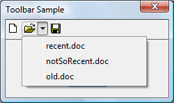
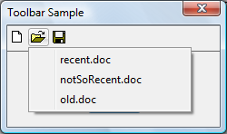

# How to Handle Drop-down Buttons

A drop-down button can present users with a list of options. To create this style of button, specify the [**BTNS\_DROPDOWN**](https://www.bing.com/search?q=**BTNS\_DROPDOWN**) style (also called [**TBSTYLE\_DROPDOWN**](https://www.bing.com/search?q=**TBSTYLE\_DROPDOWN**) for compatibility with previous versions of the common controls). To show a drop-down button with an arrow, you must also set the [**TBSTYLE\_EX\_DRAWDDARROWS**](https://www.bing.com/search?q=**TBSTYLE\_EX\_DRAWDDARROWS**) toolbar style by sending a [**TB\_SETEXTENDEDSTYLE**](tb-setextendedstyle.md) message.

The following illustration shows a drop-down "Open" button with the context menu open and showing a list of files. In this example, the toolbar has the [**TBSTYLE\_EX\_DRAWDDARROWS**](https://www.bing.com/search?q=**TBSTYLE\_EX\_DRAWDDARROWS**) style.



The following illustration shows the same toolbar, this time without the [**TBSTYLE\_EX\_DRAWDDARROWS**](https://www.bing.com/search?q=**TBSTYLE\_EX\_DRAWDDARROWS**) style.



When users click a toolbar button that uses the [**BTNS\_DROPDOWN**](https://www.bing.com/search?q=**BTNS\_DROPDOWN**) style, the toolbar control sends its parent window a [TBN\_DROPDOWN](tbn-dropdown.md) notification code.

## What you need to know

### Technologies

-   [Windows Controls](window-controls.md)

### Prerequisites

-   C/C++
-   Windows User Interface Programming

## Instructions

### Handle a Drop-down Button

The following code example demonstrates how an application can support a drop-down button in a toolbar control.


```C++
BOOL DoNotify(HWND hwnd, UINT msg, WPARAM wParam, LPARAM lParam)
{

    #define lpnm   ((LPNMHDR)lParam)
    #define lpnmTB ((LPNMTOOLBAR)lParam)

    switch(lpnm->code)
    {
        case TBN_DROPDOWN:
        {
            // Get the coordinates of the button.
            RECT rc;
            SendMessage(lpnmTB->hdr.hwndFrom, TB_GETRECT, (WPARAM)lpnmTB->iItem, (LPARAM)&amp;rc);

            // Convert to screen coordinates.            
            MapWindowPoints(lpnmTB->hdr.hwndFrom, HWND_DESKTOP, (LPPOINT)&amp;rc, 2);                         
        
            // Get the menu.
            HMENU hMenuLoaded = LoadMenu(g_hinst, MAKEINTRESOURCE(IDR_POPUP)); 
         
            // Get the submenu for the first menu item.
            HMENU hPopupMenu = GetSubMenu(hMenuLoaded, 0);

            // Set up the pop-up menu.
            // In case the toolbar is too close to the bottom of the screen, 
            // set rcExclude equal to the button rectangle and the menu will appear above 
            // the button, and not below it.
         
            TPMPARAMS tpm;
         
            tpm.cbSize    = sizeof(TPMPARAMS);
            tpm.rcExclude = rc;
         
            // Show the menu and wait for input. 
            // If the user selects an item, its WM_COMMAND is sent.
         
            TrackPopupMenuEx(hPopupMenu, 
                             TPM_LEFTALIGN | TPM_LEFTBUTTON | TPM_VERTICAL, 
                             rc.left, rc.bottom, g_hwndMain, &amp;tpm);

            DestroyMenu(hMenuLoaded);
         
        return (FALSE);
      
        }
    }
   
    return FALSE;
}
```


## Related topics

<dl> <dt>

[Using Toolbar Controls](using-toolbar-controls.md)
</dt> <dt>

[Windows common controls demo (CppWindowsCommonControls)](http://go.microsoft.com/fwlink/p/?linkid=214295)
</dt> </dl>

 

 


