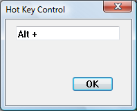

# About Hot Key Controls

A hot key control is a window that enables the user to enter a combination of keystrokes to be used as a hot key. A hot key is a key combination that the user can press to perform an action quickly. For example, a user can create a hot key that activates a given window and brings it to the top of the z-order. The hot key control displays the user's choices and ensures that the user selects a valid key combination. The following screen shot shows how a hot key control appears in a dialog box after the user presses the Alt key.

## Using Hot Key Controls

When the user enters a key combination to be used as a hot key, the names of the keys appear in the hot key control. A key combination can consist of a modifier key (such as CTRL, ALT, or SHIFT) and an accompanying key (such as a character key, an arrow key, a function key, and so on).

After the user has chosen a key combination, the application retrieves the key combination from the hot key control and uses it to set up a hot key in the system. The information retrieved from the hot key control includes a flag indicating the modifier key and the virtual key code of the accompanying key.

The application can use the information provided by a hot key control to set up a global hot key or a thread-specific hot key. A global hot key is associated with a particular window; it allows the user to activate the window from any part of the system. An application sets a global hot key by using the [**WM\_SETHOTKEY**](/windows/desktop/inputdev/wm-sethotkey) message. Whenever the user presses a global hot key, the window specified in **WM\_SETHOTKEY** receives a [**WM\_SYSCOMMAND**](/windows/desktop/menurc/wm-syscommand) message that specifies the [**SC\_HOTKEY**](/windows/desktop/inputdev/wm-sethotkey) value. This message activates the window that receives it. The hot key remains valid until the application that called **WM\_SETHOTKEY** exits.

A thread-specific hot key generates a [**WM\_HOTKEY**](/windows/desktop/inputdev/wm-hotkey) message that is posted to the beginning of a particular thread so that it is removed by the next iteration of the message loop. An application sets a thread-specific hot key by using the [**RegisterHotKey**](/windows/desktop/api/winuser/nf-winuser-registerhotkey) function.

### Hot Key Control Messages

After creating a hot key control, an application interacts with it by using three messages: [**HKM\_SETRULES**](hkm-setrules.md), [**HKM\_SETHOTKEY**](hkm-sethotkey.md), and [**HKM\_GETHOTKEY**](hkm-gethotkey.md).

An application can send the [**HKM\_SETRULES**](hkm-setrules.md) message to specify a set of CTRL, ALT, and SHIFT key combinations that are considered invalid hot keys. If the application specifies an invalid key combination, it should also specify a default modifier combination to use when the user selects the invalid combination. When the user enters the invalid combination, the system performs a logical OR operation on the invalid combination and the default combination. The result is considered a valid combination; it is converted to a string and displayed in the control.

The [**HKM\_SETHOTKEY**](hkm-sethotkey.md) message allows an application to set the hot key combination for a hot key control. This message is also typically used when the hot key control is created.

Applications use the [**HKM\_GETHOTKEY**](hkm-gethotkey.md) message to retrieve the virtual key code and modifier flags of the hot key chosen by the user.

### Hot Key Control Notifications

The hot key control does not send any notification codes via the [**WM\_NOTIFY**](wm-notify.md) message. It will, however, send the [EN\_CHANGE](en-change.md) notification via the [**WM\_COMMAND**](/windows/desktop/menurc/wm-command) message when the user changes the contents of the control.

### Default Hot Key Message Processing

This section describes the window messages handled by the window procedure for the pre defined [**HOTKEY\_CLASS**](common-control-window-classes.md) window class used with hot key controls.

|    Message                                            |    Processing performed                               |
|------------------------------------------------|--------------------------------------------------------------|
| [**WM\_CHAR**](/windows/desktop/inputdev/wm-char)               | Retrieves the virtual key code.             |
| [**WM\_CREATE**](/windows/desktop/winmsg/wm-create)             | Initializes the hot key control, clears any hot key rules, and uses the system font.   |
| [**WM\_ERASEBKGND**](/windows/desktop/winmsg/wm-erasebkgnd)     | Hides the caret, calls the [**DefWindowProc**](/windows/desktop/api/winuser/nf-winuser-defwindowproca) function, and shows the caret again.   |
| [**WM\_GETDLGCODE**](/windows/desktop/dlgbox/wm-getdlgcode)     | Returns a combination of the [**DLGC\_WANTCHARS**](/windows/desktop/dlgbox/wm-getdlgcode) and [**DLGC\_WANTARROWS**](/windows/desktop/dlgbox/wm-getdlgcode) values.   |
| [**WM\_GETFONT**](/windows/desktop/winmsg/wm-getfont)           | Retrieves the font.                         |
| [**WM\_KEYDOWN**](/windows/desktop/inputdev/wm-keydown)         | Calls the [**DefWindowProc**](/windows/desktop/api/winuser/nf-winuser-defwindowproca) function if the key is ENTER, TAB, SPACE BAR, DEL, ESC, or BACKSPACE. If the key is SHIFT, CTRL, or ALT, it checks whether the combination is valid and, if it is, sets the hot key using the combination. All other keys are set as hot keys without their validity being checked first. |
| [**WM\_KEYUP**](/windows/desktop/inputdev/wm-keyup)             | Retrieves the virtual key code.             |
| [**WM\_KILLFOCUS**](/windows/desktop/inputdev/wm-killfocus)     | Destroys the caret.                         |
| [**WM\_LBUTTONDOWN**](/windows/desktop/inputdev/wm-lbuttondown) | Sets the focus to the window.               |
| [**WM\_NCCREATE**](/windows/desktop/winmsg/wm-nccreate)         | Sets the [**WS\_EX\_CLIENTEDGE**](/windows/desktop/winmsg/extended-window-styles) window style.        |
| [**WM\_PAINT**](/windows/desktop/gdi/wm-paint)                  | Paints the hot key control.                 |
| [**WM\_SETFOCUS**](/windows/desktop/inputdev/wm-setfocus)       | Creates and shows the caret.                |
| [**WM\_SETFONT**](/windows/desktop/winmsg/wm-setfont)           | Sets the font.                              |
| [**WM\_SYSCHAR**](/windows/desktop/menurc/wm-syschar)           | Retrieves the virtual key code.             |
| [**WM\_SYSKEYDOWN**](/windows/desktop/inputdev/wm-syskeydown)   | Calls the [**DefWindowProc**](/windows/desktop/api/winuser/nf-winuser-defwindowproca) function if the key is ENTER, TAB, SPACE BAR, DEL, ESC, or BACKSPACE. If the key is SHIFT, CTRL, or ALT, it checks whether the combination is valid and, if it is, sets the hot key using the combination. All other keys are set as hot keys without their validity being checked first. |
| [**WM\_SYSKEYUP**](/windows/desktop/inputdev/wm-syskeyup)       | Retrieves the virtual key code.             |
