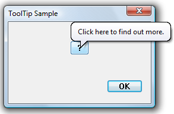
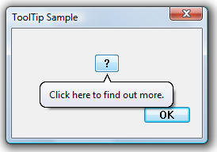

# How to Implement Balloon Tooltips

Balloon tooltips are similar to standard tooltips, but are displayed in a cartoon-style "balloon" with a stem pointing to the tool. Balloon tooltips can be either single-line or multiline. They are created and handled in much the same way as standard tooltips.

The default position of the stem and rectangle is shown in the following illustration. If the tool is too close to the top of the screen, the tooltip appears below and to the right of the tool's rectangle. If the tool is too close to the right side of the screen, similar principles apply, but the tooltip appears to the left of the tool's rectangle.



You can change the default positioning by setting the **TTF\_CENTERTIP** flag in the **uFlags** member of the tooltip [**TOOLINFO**](/windows/win32/api/commctrl/ns-commctrl-tttoolinfoa) structure. In that case, the stem normally points to the center of the lower edge of the tool's rectangle, and the text rectangle is displayed directly below the tool. The stem attaches to the text rectangle at the center of the upper edge. If the tool is too close to the bottom of the screen, the text rectangle is centered above the tool, and the stem attaches to the center of the lower edge.

The following illustration shows a tooltip that is centered on the tool.



If you want to specify where the stem points, set the **TTF\_TRACK** flag in the **uFlags** member of the tooltip [**TOOLINFO**](/windows/win32/api/commctrl/ns-commctrl-tttoolinfoa) structure. You then specify the coordinate by sending a [**TTM\_TRACKPOSITION**](ttm-trackposition.md) message, with the x- and y-coordinates in the *lParam* value. If **TTF\_CENTERTIP** is also set, the stem still points to the position specified by the **TTM\_TRACKPOSITION** message.

## What you need to know

### Technologies

-   [Windows Controls](window-controls.md)

### Prerequisites

-   C/C++
-   Windows User Interface Programming

## Instructions

### Implement Balloon Tooltips

The following example code shows how to implement a centered balloon tooltip by using the **TTS\_BALLOON** tooltip control style.


```C++
hwndToolTips = CreateWindow(TOOLTIPS_CLASS, NULL, 
                            WS_POPUP | TTS_NOPREFIX | TTS_BALLOON, 
                            0, 0, 0, 0, NULL, NULL, g_hinst, NULL);

if (hwndTooltip)
{
    TOOLINFO ti;

    ti.cbSize   = sizeof(ti);
    ti.uFlags   = TTF_TRANSPARENT | TTF_CENTERTIP;
    ti.hwnd     = hwnd;
    ti.uId      = 0;
    ti.hinst    = NULL;
    ti.lpszText = LPSTR_TEXTCALLBACK;

    GetClientRect(hwnd, &ti.rect);

    SendMessage(hwndToolTips, TTM_ADDTOOL, 0, (LPARAM) &ti );

}
            
```


## Related topics

<dl> <dt>

[Using Tooltip Controls](using-tooltip-contro.md)
</dt> <dt>

[**Tooltip Styles**](tooltip-styles.md)
</dt> </dl>

 

 


