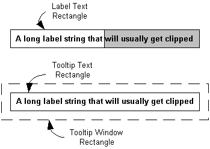

# How to Implement In-Place Tooltips

In-place tooltips are used to display text strings for objects that have been clipped. For an illustration, see [About Tooltip Controls](tooltip-controls.md).

The difference between ordinary and in-place tooltips is positioning. By default, when the mouse pointer hovers over a region that has a tooltip associated with it, the tooltip is displayed adjacent to the region. However, tooltips are windows, and they can be positioned anywhere you choose by calling [**SetWindowPos**](/windows/desktop/api/winuser/nf-winuser-setwindowpos). Creating an in-place tooltip is a matter of positioning the tooltip window so that it overlays the text string.

## What you need to know

### Technologies

-   [Windows Controls](window-controls.md)

### Prerequisites

-   C/C++
-   Windows User Interface Programming

## Instructions

### Positioning an In-Place Tooltip

You need to keep track of three rectangles when positioning an in-place tooltip:

1.  The rectangle that surrounds the complete label text.
2.  The rectangle that surrounds the tooltip text. The tooltip text is identical to the complete label text, and normally is the same size and font. The two text rectangles will thus usually be the same size.
3.  The tooltip window rectangle. This rectangle is somewhat larger than the tooltip text rectangle that it encloses.


The three rectangles are shown schematically in the following illustration. The hidden portion of the label text is indicated by a gray background.



To create an in-place tooltip, you must position the tooltip text rectangle so that it overlays the label text rectangle. The procedure for aligning the two rectangles is relatively straightforward:

1.  Define the label text rectangle.
2.  Position the tooltip window so that the tooltip text rectangle overlays the label text rectangle.


In practice, it is usually sufficient to align the upper-left corner of the two text rectangles. Attempting to resize the tooltip text rectangle to exactly match the label text rectangle could cause problems with the tooltip display.

The problem with this simple scheme is that you cannot position the tooltip text rectangle directly. Instead, you must position the tooltip window rectangle just far enough above and to the left of the label text rectangle so that the corners of the two text rectangles coincide. In other words, you need to know the offset between the tooltip window rectangle and its enclosed text rectangle. In general, there is no simple way to determine this offset.

### Implement In-Place Tooltips

The following code fragment illustrates how to use a [**TTM\_ADJUSTRECT**](ttm-adjustrect.md) message in a [TTN\_SHOW](ttn-show.md) handler to display an in-place tooltip. Your application indicates that the label text is truncated by setting the private *fMyStringIsTruncated* variable to **TRUE**. The handler calls an application-defined function, **GetMyItemRect**, to retrieve the label text rectangle. This rectangle is passed to the tooltip control with **TTM\_ADJUSTRECT**, which returns the corresponding window rectangle. [**SetWindowPos**](/windows/desktop/api/winuser/nf-winuser-setwindowpos) is then called to position the tooltip over the label.


```C++
case TTN_SHOW:
            
    if (fMyStringIsTruncated) 
    {
        RECT rc;
        
        GetMyItemRect(&rc);
        
        SendMessage(hwndToolTip, TTM_ADJUSTRECT, TRUE, (LPARAM)&rc);
        
        SetWindowPos(hwndToolTip, NULL, rc.left, rc.top, 0, 0, 
                     SWP_NOSIZE | SWP_NOZORDER | SWP_NOACTIVATE);
    }
```


This example does not change the size of the tooltip, just its position. The two text rectangles are aligned at their upper-left corners, but not necessarily with the same dimensions. In practice, the difference is usually small, and this approach is recommended for most purposes. While you can, in principle, use [**SetWindowPos**](/windows/desktop/api/winuser/nf-winuser-setwindowpos) to resize as well as reposition the tooltip, doing so might have unpredictable consequences.

## Remarks

Common controls [version 5.80](common-control-versions.md) simplifies the use of in-place tooltips by the addition of a new message, [**TTM\_ADJUSTRECT**](ttm-adjustrect.md). Send this message with the coordinates of the label text rectangle that you want the tooltip to overlay, and it returns the coordinates of an appropriately positioned tooltip window rectangle.

## Related topics

<dl> <dt>

[Using Tooltip Controls](using-tooltip-contro.md)
</dt> </dl>

 

 