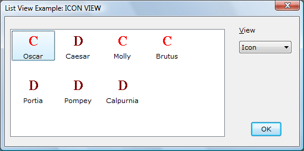
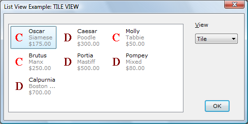
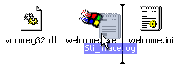

# About List-View Controls

See the [Virtual listview control sample](https://github.com/microsoft/Windows-classic-samples/tree/master/Samples/Win7Samples/winui/controls/common/vlistvw).

A list-view control is a window that displays a collection of items. List-view controls provide several ways to arrange and display items and are much more flexible than simple [List Boxes](list-boxes.md). For example, additional information about each item can be displayed in columns to the right of the icon and label.

-   [List-View Styles and Views](#list-view-styles-and-views)
    -   [Extended List-View Styles](#extended-list-view-styles)
-   [Virtual List-View Style](#virtual-list-view-style)
    -   [Creating a Virtual List-View Control](#creating-a-virtual-list-view-control)
    -   [Compatibility Issues](#compatibility-issues)
    -   [Handling Virtual List-View Control Notification Codes](#handling-virtual-list-view-control-notification-codes)
    -   [Cache Management](#cache-management)
-   [List-View Working Areas](#list-view-working-areas)
-   [List-View Image Lists](#list-view-image-lists)
-   [List-View Items and Subitems](#list-view-items-and-subitems)
    -   [List-View Item States](#list-view-item-states)
    -   [Callback Items and the Callback Mask](#callback-items-and-the-callback-mask)
    -   [List-View Item Position](#list-view-item-position)
    -   [Arranging, Sorting, and Finding Items](#arranging-sorting-and-finding-items)
-   [List-View Columns](#list-view-columns)
-   [List-View Scroll Position](#list-view-scroll-position)
-   [List-View Label Editing](#list-view-label-editing)
-   [List-View Colors](#list-view-colors)
-   [Arranging List Items by Group](#arranging-list-items-by-group)
-   [Insertion Marks](#insertion-marks)

## List-View Styles and Views

List-view controls can display items in five different views. The control's window style specifies the default view. Additional window styles specify the alignment of items and control-specific features. The following table describes the views.

| View Name             | Description                                                                                                                                                                                                                                                                                                                                                                                                                                                                                                                                           |
|-----------------------|-------------------------------------------------------------------------------------------------------------------------------------------------------------------------------------------------------------------------------------------------------------------------------------------------------------------------------------------------------------------------------------------------------------------------------------------------------------------------------------------------------------------------------------------------------|
| Icon view             | Specified by the [**LVS\_ICON**](list-view-window-styles.md) window style or by passing **LV\_VIEW\_ICON** with the [**LVM\_SETVIEW**](lvm-setview.md) message. Each item appears as a full-sized icon with a label below it. The user can drag the items to any location in the list-view window.                                                                                                                                                                                                                                         |
| Small icon view       | Specified by the [**LVS\_SMALLICON**](list-view-window-styles.md) window style or by passing **LV\_VIEW\_SMALLICON** with [**LVM\_SETVIEW**](lvm-setview.md). Each item appears as a small icon with the label to the right of it. The user can drag the items to any location.                                                                                                                                                                                                                                                       |
| List view             | Specified by the [**LVS\_LIST**](list-view-window-styles.md) window style or by passing **LV\_VIEW\_LIST** with [**LVM\_SETVIEW**](lvm-setview.md). Each item appears as a small icon with a label to the right of it. Items are arranged in columns and the user cannot drag them to an arbitrary location.                                                                                                                                                                                                                               |
| Report (details) view | Specified by the [**LVS\_REPORT**](list-view-window-styles.md) window style or by passing **LV\_VIEW\_DETAILS** with [**LVM\_SETVIEW**](lvm-setview.md). Each item appears on its own line, with information arranged in columns. The leftmost column is always left justified and contains the small icon and label. Subsequent columns contain subitems as specified by the application. Each column has a header, unless you also specify the [**LVS\_NOCOLUMNHEADER**](list-view-window-styles.md) window style. |
| Tile View             | **Version 6 and later.** Specified by passing **LV\_VIEW\_TILE** with [**LVM\_SETVIEW**](lvm-setview.md). Each item appears as a full-sized icon with a label of one or more lines beside it.                                                                                                                                                                                                                                                                                                                                                        |

 

The following screen shots use views to show different amounts of information about each of seven pets. The views demonstrate how the information might appear on Windows Vista. The visual styles for the control have been set to the "Explorer" theme by using [**SetWindowTheme**](/windows/desktop/api/Uxtheme/nf-uxtheme-setwindowtheme).

The following screen shot shows the details view.

The following screen shot shows the icon view.

The following screen shot shows the list view.

The following screen shot shows the tile view.

You can change the view type after you create a list-view control. To retrieve and change the window style, use the [**GetWindowLong**](/windows/desktop/api/winuser/nf-winuser-getwindowlonga) and [**SetWindowLong**](/windows/desktop/api/winuser/nf-winuser-setwindowlonga) functions. To determine the window styles of the current view, use the [**LVS\_TYPEMASK**](list-view-window-styles.md) value.

You can control the way items are arranged in icon or small icon view by specifying either the [**LVS\_ALIGNTOP**](list-view-window-styles.md) (default) or [**LVS\_ALIGNLEFT**](list-view-window-styles.md) window style.

You can change the alignment after you create a list-view control. To determine the current alignment, use the [**LVS\_ALIGNMASK**](list-view-window-styles.md) value.

Additional window styles provide other options, such as whether a user can edit labels or select more than one item at a time. For a complete list, see [List-View Window Styles](list-view-window-styles.md).

### Extended List-View Styles

The extended list-view control styles provide options such as check boxes, flat scroll bars, grid lines, and hot-tracking. For a complete list, see [Extended List-View Styles](extended-list-view-styles.md). You do not access extended list-view styles in the same manner as standard window styles. You do not use the [**GetWindowLong**](/windows/desktop/api/winuser/nf-winuser-getwindowlonga) and [**SetWindowLong**](/windows/desktop/api/winuser/nf-winuser-setwindowlonga) functions to make extended style changes.

There are two messages that set and retrieve extended style information, [**LVM\_SETEXTENDEDLISTVIEWSTYLE**](lvm-setextendedlistviewstyle.md) and [**LVM\_GETEXTENDEDLISTVIEWSTYLE**](lvm-getextendedlistviewstyle.md). Instead of sending the messages explicitly, you can use the following corresponding macros: [**ListView\_SetExtendedListViewStyle**](/windows/desktop/api/Commctrl/nf-commctrl-listview_setextendedlistviewstyle), [**ListView\_SetExtendedListViewStyleEx**](/windows/desktop/api/Commctrl/nf-commctrl-listview_setextendedlistviewstyleex), and [**ListView\_GetExtendedListViewStyle**](/windows/desktop/api/Commctrl/nf-commctrl-listview_getextendedlistviewstyle).

## Virtual List-View Style

A virtual list view is a list-view control that has the [**LVS\_OWNERDATA**](list-view-window-styles.md) style. This style enables the control to handle millions of items because the owner receives the burden of managing item data. This allows you to use the virtual list-view control with large databases of information, where specific methods of data access are already in place.

A virtual list-view control maintains very little item information itself. Except for the item selection and focus information, the owner of the control must manage all item information. Other processes request item information from the owner by using [LVN\_GETDISPINFO](lvn-getdispinfo.md) notification codes.

Because this type of list control is intended for large data sets, it is recommended that you cache requested item data to improve retrieval performance. The list view provides a cache-hinting mechanism to assist in optimizing the cache. The hint is implemented in the form of an [LVN\_ODCACHEHINT](lvn-odcachehint.md) notification code.

### Creating a Virtual List-View Control

You create virtual list-view controls using the [**CreateWindow**](/windows/desktop/api/winuser/nf-winuser-createwindowa) or [**CreateWindowEx**](/windows/desktop/api/winuser/nf-winuser-createwindowexa) function, specifying the [**LVS\_OWNERDATA**](list-view-window-styles.md) window style as part of the *dwStyle* function parameter. Dynamically switching to and from the **LVS\_OWNERDATA** style is not supported.

You can use the [**LVS\_OWNERDATA**](list-view-window-styles.md) style in combination with most other window styles, except the [**LVS\_SORTASCENDING**](list-view-window-styles.md) or [**LVS\_SORTDESCENDING**](list-view-window-styles.md) style. All virtual list-view controls default to the [**LVS\_AUTOARRANGE**](list-view-window-styles.md) style.

To enable items to be displayed in the list, you must first send the [**LVM\_SETITEMCOUNT**](lvm-setitemcount.md) message, either explicitly or by using the [**ListView\_SetItemCountEx**](/windows/desktop/api/Commctrl/nf-commctrl-listview_setitemcountex) macro.

The following messages are not supported under the [**LVS\_OWNERDATA**](list-view-window-styles.md) style: [**LVM\_ENABLEGROUPVIEW**](lvm-enablegroupview.md), [**LVM\_GETITEMTEXT**](lvm-getitemtext.md), [**LVM\_SETTILEINFO**](lvm-settileinfo.md), and [**LVM\_MAPIDTOINDEX**](lvm-mapidtoindex.md).

### Compatibility Issues

All four of the list-view styles—icon, small icon, list, and report view—support the [**LVS\_OWNERDATA**](list-view-window-styles.md) style. List-view controls that have the **LVS\_OWNERDATA** style do not store any item-specific information. Therefore, the only valid item state flags that you can apply to an item are [**LVIS\_SELECTED**](list-view-item-states.md) and [**LVIS\_FOCUSED**](list-view-item-states.md). No other state information is stored. In particular, the list-view control does not maintain state or overlay images for each item. However, you can have the list-view control query your application for these images by sending it an [**LVM\_SETCALLBACKMASK**](lvm-setcallbackmask.md) message.

Most list-view control messages and the associated macros are fully supported. However, some messages have limitations or are unsupported when you use the [**LVS\_OWNERDATA**](list-view-window-styles.md) style. The following table summarizes the affected messages.

| Message                                             | Limitation                                                                                                                                                                                                                                                      |
|-----------------------------------------------------|-----------------------------------------------------------------------------------------------------------------------------------------------------------------------------------------------------------------------------------------------------------------|
| [**LVM\_ARRANGE**](lvm-arrange.md)                 | Does not support the **LVA\_SNAPTOGRID** style.                                                                                                                                                                                                                 |
| [**LVM\_DELETEALLITEMS**](lvm-deleteallitems.md)   | Sets the item count to zero and clears all internal selection variables, but it does not actually delete any items. It makes a notification callback.                                                                                                           |
| [**LVM\_DELETEITEM**](lvm-deleteitem.md)           | Is supported for selection integrity only and does not actually delete an item.                                                                                                                                                                                 |
| [**LVM\_GETITEMSTATE**](lvm-getitemstate.md)       | Returns only focus and selection states (that is, those states stored by the list-view control).                                                                                                                                                                |
| [**LVM\_GETNEXTITEM**](lvm-getnextitem.md)         | Does not support the list-view search criteria **LVNI\_CUT**, **LVNI\_HIDDEN**, or **LVNI\_DROPHILITED**. All other criteria are supported.                                                                                                                     |
| [**LVM\_GETWORKAREAS**](lvm-getworkareas.md)       | Is not supported.                                                                                                                                                                                                                                               |
| [**LVM\_INSERTITEM**](lvm-insertitem.md)           | Is supported for selection integrity only.                                                                                                                                                                                                                      |
| [**LVM\_SETITEM**](lvm-setitem.md)                 | Is not supported. To set the item state, use the [**ListView\_SetItemState**](/windows/desktop/api/Commctrl/nf-commctrl-listview_setitemstate) message.                                                                                                                                               |
| [**LVM\_SETITEMCOUNT**](lvm-setitemcount.md)       | Sets the number of items currently in the list. If the list-view control sends a notification that requests data for any item up to the maximum set, the owner must be prepared to supply that data. The message parameters support virtual list-view controls. |
| [**LVM\_SETITEMPOSITION**](lvm-setitemposition.md) | Is not supported.                                                                                                                                                                                                                                               |
| [**LVM\_SETITEMSTATE**](lvm-setitemstate.md)       | Allows only the selection and focus states to be changed for the item.                                                                                                                                                                                          |
| [**LVM\_SETITEMTEXT**](lvm-setitemtext.md)         | Is not supported. It is the application's responsibility to maintain the item texts.                                                                                                                                                                            |
| [**LVM\_SETWORKAREAS**](lvm-setworkareas.md)       | Is not supported.                                                                                                                                                                                                                                               |
| [**LVM\_SORTITEMS**](lvm-sortitems.md)             | Is not supported. It is the application's responsibility to present the items in the desired order.                                                                                                                                                             |

 

### Handling Virtual List-View Control Notification Codes

List-view controls with the [**LVS\_OWNERDATA**](list-view-window-styles.md) style send the same notification codes as other list-view controls and two additional ones: [LVN\_ODCACHEHINT](lvn-odcachehint.md) and [LVN\_ODFINDITEM](lvn-odfinditem.md). The following are the most common notifications that the list-view control with the **LVS\_OWNERDATA** style sends.

|                                         |                                                                                                                                                                                                                                                                                                                                                                                                                                                                                                                                                                                                                                                                                                                           |
|-----------------------------------------|---------------------------------------------------------------------------------------------------------------------------------------------------------------------------------------------------------------------------------------------------------------------------------------------------------------------------------------------------------------------------------------------------------------------------------------------------------------------------------------------------------------------------------------------------------------------------------------------------------------------------------------------------------------------------------------------------------------------------|
| [LVN\_GETDISPINFO](lvn-getdispinfo.md) | A virtual list-view control maintains very little item information on its own. As a result, it often sends the [LVN\_GETDISPINFO](lvn-getdispinfo.md) notification code to request item information. This message is handled in much the same way as callback items in a standard list control. Because the number of items supported by the control can be very large, caching item data improves performance. When handling LVN\_GETDISPINFO, the owner of the control first attempts to supply requested item information from the cache (for more information, see [Cache Management](#cache-management)). If the requested item is not cached, the owner must be prepared to supply the information by other means. |
| [LVN\_ODCACHEHINT](lvn-odcachehint.md) | A virtual list view sends the [LVN\_ODCACHEHINT](lvn-odcachehint.md) notification code to assist in optimizing the cache. The notification code provides inclusive index values for a range of items that it recommends be cached. Upon receiving the notification code, the owner must be prepared to load the cache with item information for the requested range so that the information will be readily available when an [LVN\_GETDISPINFO](lvn-getdispinfo.md) message is sent.                                                                                                                                                                                                                                   |
| [LVN\_ODFINDITEM](lvn-odfinditem.md)   | The [LVN\_ODFINDITEM](lvn-odfinditem.md) notification code is sent by a virtual list-view control when the control needs the owner to find a particular callback item. The notification code is sent when the list-view control receives quick key access or when it receives an [**LVM\_FINDITEM**](lvm-finditem.md) message. Search information is sent in the form of an [**LVFINDINFO**](/windows/win32/api/commctrl/ns-commctrl-lvfindinfoa) structure, which is a member of the [**NMLVFINDITEM**](/windows/win32/api/commctrl/ns-commctrl-nmlvfinditema) structure. The owner must be prepared to search for an item that matches the information given by the list-view control. The owner returns the index of the item if successful, or -1 if no matching item is found.               |

 

### Cache Management

A list-view control with the [**LVS\_OWNERDATA**](list-view-window-styles.md) style produces a large number of [LVN\_GETDISPINFO](lvn-getdispinfo.md) notification codes and, to assist in optimizing the cache, an [LVN\_ODCACHEHINT](lvn-odcachehint.md) message. LVN\_ODCACHEHINT messages provide information about the recommended items to include within the cache. These messages are sent as [**WM\_NOTIFY**](wm-notify.md) messages, with the *lParam* value acting as the address of an [**NMLVCACHEHINT**](/windows/win32/api/commctrl/ns-commctrl-nmlvcachehint) structure.

The [**NMLVCACHEHINT**](/windows/win32/api/commctrl/ns-commctrl-nmlvcachehint) structure includes two integer members, **iFrom** and **iTo**, that represent the inclusive endpoints of a range of items that most likely will be needed. The owner must be prepared to load the cache with the item information for each of the items within the recommended range.

The list control often needs item information for the first item (offset 0). The [LVN\_ODCACHEHINT](lvn-odcachehint.md) notification code might not always include item 0, but it must always be included in the cache.

The last items in the list are accessed often. Therefore, the owner might want to keep a second cache that includes the items at the end of the list. The requested range from [LVN\_ODCACHEHINT](lvn-odcachehint.md) can be checked against the end cache to make it available automatically instead of reloading the same end range each time.

## List-View Working Areas

List-view controls support working areas, which are rectangular virtual areas that the list-view control uses to arrange its items. A working area is not a window and cannot have a visible border. By default, the list-view control has no working areas. By creating a working area, you can create an empty border on the left, top, or right of the items or cause a horizontal scroll bar to be displayed when there normally would not be one.

When a working area is created, items that lie within the working area become members of the working area. Similarly, if an item is moved into a working area, the item becomes a member of that working area. If an item does not lie within any working area, it automatically becomes a member of the first (index 0) working area. To place new item within a specific working area, you must first create the item and then use either the [**LVM\_SETITEMPOSITION**](lvm-setitemposition.md) or the [**LVM\_SETITEMPOSITION32**](lvm-setitemposition32.md) message to move it into the desired working area.

The following illustration is an example of a list-view control that contains four working areas, each in a different quadrant of the client area.

Multiple working areas can be used for creating different areas within one view. You can create areas in a single view that have different meanings. For example, a view of a file system might have an area for read/write files and another area for read-only files. The user can categorize items by placing them in different working areas. If a file is moved into the read-only area, it will automatically become read-only.

Multiple working areas can intersect, but any items that lie within the intersection become members of the area with the lower index; therefore, it is best to avoid this situation. When sorting multiple work areas, the items are sorted compared to the other items in the same working area.

The number of working areas can be retrieved with the [**LVM\_GETNUMBEROFWORKAREAS**](lvm-getnumberofworkareas.md) message. The working areas are changed with the [**LVM\_SETWORKAREAS**](lvm-setworkareas.md) message and can be retrieved with the [**LVM\_GETWORKAREAS**](lvm-getworkareas.md) message. Both of these messages take the address of an array of [**RECT**](/previous-versions//dd162897(v=vs.85)) structures as the *lParam* and the number of **RECT** structures as the *wParam*. The **left** and **top** members of these structures specify the coordinates of the upper-left corner (the origin) of the working area, and the **right** and **bottom** members specify the lower-right corner of the working area. All the coordinates are in client coordinates of the list view. The maximum number of working areas allowed is defined by the **LV\_MAX\_WORKAREAS** value.

Changing the working area has no effect on list-view controls that have the [**LVS\_LIST**](list-view-window-styles.md) or [**LVS\_REPORT**](list-view-window-styles.md) view, but the working areas will be maintained when the view type is changed. With the [**LVS\_ICON**](list-view-window-styles.md) and [**LVS\_SMALLICON**](list-view-window-styles.md) views, the working area can be modified to change the way the items are displayed. Making the width of the working area (right - left) greater than the client width of the control causes the items to be wrapped at that width and the horizontal scroll bar to be displayed. Making the width of the working area narrower than the width of the control's client area causes the items to be wrapped within the working area and not the client area. Setting the **left** or **top** member to a positive value causes the items to be displayed starting at the working area, creating an empty space between the edge of the control and the items. An empty space can also be created between the right edge of the control and the items by making the width of the working area less than the client width of the control.

## List-View Image Lists

By default, a list-view control does not display item images. To display item images, you must create image lists and associate them with the control. A list-view control can have three image lists:

-   An image list that contains full-sized icons displayed when the control is in icon view.
-   An image list that contains small icons displayed when the control is in small icon view, list view, or report view.
-   An image list that contains state images, which are displayed to the left of the full-sized or small icon. You can use state images, such as checked and cleared check boxes, to indicate application-defined item states. State images are displayed in icon view, small icon view, list view, and report view.

The full-sized and small icon image lists can also contain *overlay images*, which are designed to be drawn transparently over the item icons.

To use overlay images in a list-view control:

1.  Call the [**ImageList\_SetOverlayImage**](/windows/desktop/api/Commctrl/nf-commctrl-imagelist_setoverlayimage) function to assign an overlay image index to an image in the full-sized and small icon image lists. An overlay image is identified by a one-based index.
2.  You can associate an overlay image index with an item when you call the [**ListView\_InsertItem**](/windows/desktop/api/Commctrl/nf-commctrl-listview_insertitem) or [**ListView\_SetItem**](/windows/desktop/api/Commctrl/nf-commctrl-listview_setitem) macro. Use the [**INDEXTOOVERLAYMASK**](/windows/desktop/api/Commctrl/nf-commctrl-indextooverlaymask) macro to specify an overlay image index in the **state** member of the item's [**LVITEM**](/windows/win32/api/commctrl/ns-commctrl-lvitema) structure. You must also set the [**LVIS\_OVERLAYMASK**](list-view-item-states.md) bits in the **stateMask** member.

If a state image list is specified, a list-view control reserves space to the left of each item's icon for a state image.

To associate a state image with an item, use the [**INDEXTOSTATEIMAGEMASK**](/windows/desktop/api/Commctrl/nf-commctrl-indextostateimagemask) macro to specify a state image index in the **state** member of the [**LVITEM**](/windows/win32/api/commctrl/ns-commctrl-lvitema) structure. The index identifies an image in the control's state image list. Although image list indexes are zero-based, the control uses one-based indexes to identify state images. A state image index of zero indicates that an item has no state image.

By default, when a list-view control is destroyed, it destroys the image lists assigned to it. However, if a list-view control has the [**LVS\_SHAREIMAGELISTS**](list-view-window-styles.md) window style, the application is responsible for destroying the image lists when they are no longer in use. You should specify this style if you assign the same image lists to multiple list-view controls; otherwise, more than one control might try to destroy the same image list.

## List-View Items and Subitems

Each item in a list-view control has an icon, a label, a current state, and an application-defined value. By using list-view messages, you can add, modify, and delete items as well as retrieve information about items.

Each item can have one or more *subitems*. A subitem is a string that, in report view, is displayed in a column separate from the item's icon and label. To specify the text of a subitem, use the [**LVM\_SETITEMTEXT**](lvm-setitemtext.md) or [**LVM\_SETITEM**](lvm-setitem.md) message. All items in a list-view control have the same number of subitems. The number of subitems is determined by the number of columns in the list-view control. When you add a column to a list-view control, you specify its associated subitem index.

The [**LVITEM**](/windows/win32/api/commctrl/ns-commctrl-lvitema) structure defines a list-view item or subitem. The **iItem** member is the zero-based index of the item. The **iSubItem** member is the one-based index of a subitem or zero if the structure contains information about an item. Additional members specify the item's text, icon, state, and item data. *Item data* is an application-defined value associated with a list-view item.

To add an item to a list-view control, use the [**LVM\_INSERTITEM**](lvm-insertitem.md) message, specifying the address of an [**LVITEM**](/windows/win32/api/commctrl/ns-commctrl-lvitema) structure. Before adding multiple items, you can send the control an [**LVM\_SETITEMCOUNT**](lvm-setitemcount.md) message, specifying the number of items the control will ultimately contain. This message enables the list-view control to reallocate its internal data structures only once rather than every time you add an item. You can determine the number of items in a list-view control by using the [**LVM\_GETITEMCOUNT**](lvm-getitemcount.md) message. If you are adding a large number of items to a list-view control, you can speed up the process by disabling redrawing before adding the items, then enable redrawing after the items are added. Use the [**WM\_SETREDRAW**](/windows/desktop/gdi/wm-setredraw) message to enable and disable redrawing.

To change the attributes of a list-view item, use the [**LVM\_SETITEM**](lvm-setitem.md) message, specifying the address of an [**LVITEM**](/windows/win32/api/commctrl/ns-commctrl-lvitema) structure. The **mask** member of this structure specifies the item attributes you want to change. For example, to change only the text of an item or subitem, use the [**LVM\_SETITEMTEXT**](lvm-setitemtext.md) message.

To retrieve information about a list-view item, use the [**LVM\_GETITEM**](lvm-getitem.md) message, specifying the address of the [**LVITEM**](/windows/win32/api/commctrl/ns-commctrl-lvitema) structure to fill in. The **mask** member of this structure specifies the item attributes to be retrieved. To retrieve only an item or subitem's text, use the [**LVM\_GETITEMTEXT**](lvm-getitemtext.md) message.

To delete a list-view item, use the [**LVM\_DELETEITEM**](lvm-deleteitem.md) message. You can delete all items in a list-view control by using the [**LVM\_DELETEALLITEMS**](lvm-deleteallitems.md) message.

### List-View Item States

An item's state is a value that specifies the item's availability, indicates user actions, or otherwise reflects the item's status. A list-view control changes some state bits, such as when the user selects an item. An application might change other state bits to disable or hide the item or to specify an overlay image or state image. For more information about overlay images and state images, see [List-View Image Lists](#list-view-image-lists).

An item's state is specified by the **state** member of the [**LVITEM**](/windows/win32/api/commctrl/ns-commctrl-lvitema) structure. When you specify or change an item's state, the **stateMask** member specifies which state bits you need to change. You can change an item's state by using the [**LVM\_SETITEMSTATE**](lvm-setitemstate.md) message. You can specify an item's state when you create it or when you change its attributes by using the [**LVM\_SETITEM**](lvm-setitem.md) message. To determine an item's current state, use the [**LVM\_GETITEMSTATE**](lvm-getitemstate.md) or [**LVM\_GETITEM**](lvm-getitem.md) message.

To set an item's overlay image, the **stateMask** member of the [**LVITEM**](/windows/win32/api/commctrl/ns-commctrl-lvitema) structure must include the [**LVIS\_OVERLAYMASK**](list-view-item-states.md) value, and the **state** member must include the one-based index of the overlay image shifted left 8 bits by using the [**INDEXTOOVERLAYMASK**](/windows/desktop/api/Commctrl/nf-commctrl-indextooverlaymask) macro. The index can be zero to specify no overlay image.

To set an item's state image, the **stateMask** member of the [**LVITEM**](/windows/win32/api/commctrl/ns-commctrl-lvitema) structure must include the [**LVIS\_STATEIMAGEMASK**](list-view-item-states.md) value, and the **state** member must include the one-based index of the state image shifted left 12 bits by using the [**INDEXTOSTATEIMAGEMASK**](/windows/desktop/api/Commctrl/nf-commctrl-indextostateimagemask) macro. The index can be zero to specify no state image.

### Callback Items and the Callback Mask

For each of its items, a list-view control typically stores the label text, the image list index of the item's icons, and a set of bit flags for the item's state. You can define callback items or change the control's callback mask to indicate that the application, rather than the control, stores some or all of this information. You might want to use callbacks if your application stores some of this information.

A *callback item* in a list-view control is an item for which the application stores the text or icon index, or both. You can define callback items when you send the [**LVM\_INSERTITEM**](lvm-insertitem.md) message to add an item to the list-view control. If the application stores the text for the item or subitem, set the **pszText** member of the item's [**LVITEM**](/windows/win32/api/commctrl/ns-commctrl-lvitema) structure to **LPSTR\_TEXTCALLBACK**. If the application stores the icon index for an item, set the **iImage** member of the item's **LVITEM** structure to **I\_IMAGECALLBACK**.

The *callback mask* of a list-view control is a set of bit flags that specify the item states for which the application, rather than the control, stores the current data. The callback mask applies to all of the control's items, unlike the callback item designation, which applies to a specific item. The callback mask is zero by default, meaning that the list-view control stores all item state information. After creating a list-view control and initializing its items, you can send the [**LVM\_SETCALLBACKMASK**](lvm-setcallbackmask.md) message to change the callback mask. To retrieve the current callback mask, send the [**LVM\_GETCALLBACKMASK**](lvm-getcallbackmask.md) message.

When a list-view control must display or sort a list-view item for which the application stores callback information, the control sends the [LVN\_GETDISPINFO](lvn-getdispinfo.md) notification code to the control's parent window. This message specifies an [**NMLVDISPINFO**](/windows/win32/api/commctrl/ns-commctrl-nmlvdispinfoa) structure that contains the type of information required and identifies the item or subitem to retrieve. The parent window must process LVN\_GETDISPINFO to provide the requested data.

If the list-view control detects a change in an item's callback information, such as a change in the text, icon, or state information, the control sends an [LVN\_SETDISPINFO](lvn-setdispinfo.md) notification code to notify you of the change.

If you change a callback item's attributes or state bits, you use the [**LVM\_UPDATE**](lvm-update.md) message to force the control to repaint the item. This message also causes the control to arrange its items if it has the [**LVS\_AUTOARRANGE**](list-view-window-styles.md) style. You can use the [**LVM\_REDRAWITEMS**](lvm-redrawitems.md) message to redraw a range of items by invalidating the corresponding portions of the list-view control's client area.

By effectively using callback items and the callback mask, you can ensure that each item attribute is maintained in only one place. Doing this can simplify your application, but the only space saved is the memory that would otherwise be required to store item labels and subitem text.

### List-View Item Position

Every list-view item has a position and size, which you can retrieve and set using messages. You can also determine which item, if any, is at a specified position. The position of list-view items is specified in *view coordinates*, which are client coordinates offset by the scroll position.

To retrieve and set an item's position, use the [**LVM\_GETITEMPOSITION**](lvm-getitemposition.md) and [**LVM\_SETITEMPOSITION**](lvm-setitemposition.md) messages. **LVM\_GETITEMPOSITION** works for all views, but **LVM\_SETITEMPOSITION** works only for icon and small icon views.

You can determine which item, if any, is at a particular location by using the [**LVM\_HITTEST**](lvm-hittest.md) message.

To retrieve the bounding rectangle for a list item or only for its icon or label, use the [**LVM\_GETITEMRECT**](lvm-getitemrect.md) message.

### Arranging, Sorting, and Finding Items

You can use list-view messages to arrange and sort items and to find items based on their attributes or positions. Arranging repositions items to align on a grid, but the indexes of the items do not change. Sorting changes the sequence of items (and their corresponding indexes) and then repositions them accordingly. You can arrange items only in icon and small icon views, but you can sort items in any view. To find items, you send list-view messages that specify an item location or property.

To arrange items, use the [**LVM\_ARRANGE**](lvm-arrange.md) message. You can ensure that items are arranged at all times by specifying the [**LVS\_AUTOARRANGE**](list-view-window-styles.md) window style.

To sort items, use the [**LVM\_SORTITEMS**](lvm-sortitems.md) message. When you sort using this message, you specify an application-defined callback function that the list-view control calls to compare the relative order of any two items. The control passes to the comparison function the item data associated with each of the two items. The item data is the value that was specified in the **lParam** member of the item's [**LVITEM**](/windows/win32/api/commctrl/ns-commctrl-lvitema) structure when it was inserted into the list. By specifying the appropriate item data and supplying an appropriate comparison function, you can sort items by their label, by any subitem, or by any other property. Note that sorting items does not reorder the corresponding subitems. When items are reordered, their corresponding subitems are carried with them; that is, whole rows are kept together. To order the columns separately from one another, detaching the subitems from their items, you must regenerate the columns after sorting using [**LVM\_SETITEM**](lvm-setitem.md).

You can ensure that a list-view control is always sorted by specifying the [**LVS\_SORTASCENDING**](list-view-window-styles.md) or [**LVS\_SORTDESCENDING**](list-view-window-styles.md) window style. Controls with these styles use the label text of the items to sort them in ascending or descending order. You cannot supply a comparison function when using these window styles. If a list-view control has either of these styles, an [**LVM\_INSERTITEM**](lvm-insertitem.md) message will fail if you try to insert an item that has **LPSTR\_TEXTCALLBACK** as the **pszText** member of its [**LVITEM**](/windows/win32/api/commctrl/ns-commctrl-lvitema) structure.

You can find a list-view item with specific properties by using the [**LVM\_FINDITEM**](lvm-finditem.md) message. You can find a list-view item that is in a specified state and has a specified relationship to a given item by using the [**LVM\_GETNEXTITEM**](lvm-getnextitem.md) message. For example, you can retrieve the next selected item to the right of a specified item.

## List-View Columns

Columns control the way items and their subitems are displayed in report view. Each column has a title and width and is associated with a specific subitem; subitem zero is the item's icon and label. The attributes of a column are defined by an [**LVCOLUMN**](/windows/win32/api/commctrl/ns-commctrl-lvcolumna) structure.

To add a column to a list-view control, use the [**LVM\_INSERTCOLUMN**](lvm-insertcolumn.md) message. To delete a column, use the [**LVM\_DELETECOLUMN**](lvm-deletecolumn.md) message.

> [!Note]  
> Deleting column zero of a list-view control is supported only in ComCtl32.dll version 6 and later. Version 5 also supports deleting column zero, but only after you use [**CCM\_SETVERSION**](ccm-setversion.md) to set the version to 5 or later. Versions prior to version 5 do not support deleting column zero.

 

You can retrieve and change the properties of an existing column by using the [**LVM\_GETCOLUMN**](lvm-getcolumn.md) and [**LVM\_SETCOLUMN**](lvm-setcolumn.md) messages. To retrieve or change a column's width, use the [**LVM\_GETCOLUMNWIDTH**](lvm-getcolumnwidth.md) and [**LVM\_SETCOLUMNWIDTH**](lvm-setcolumnwidth.md) messages.

Unless the [**LVS\_NOCOLUMNHEADER**](list-view-window-styles.md) window style is specified, column headers appear in report view. The user can click a column header, causing an [**LVN\_COLUMNCLICK**](lvn-columnclick.md) notification code to be sent to the parent window. Typically, the parent window sorts the list-view control by the specified column when this clicking occurs. The user can also drag the column guides between the headers to size the columns.

List-view controls can display images next to column titles. To implement this feature, specify the **LVCF\_IMAGE** value and assign the index of the image to the **iImage** member in the [**LVCOLUMN**](/windows/win32/api/commctrl/ns-commctrl-lvcolumna) structure.

List-view controls can set the order in which columns are displayed. To implement this feature, specify the **LVCF\_ORDER** value and assign the column order to the **iOrder** member in the [**LVCOLUMN**](/windows/win32/api/commctrl/ns-commctrl-lvcolumna) structure. The column order is zero-based and is in left-to-right order. For example, zero indicates the leftmost column.

## List-View Scroll Position

Unless the [**LVS\_NOSCROLL**](list-view-window-styles.md) window style is specified, a list-view control can be scrolled to show more items than can fit in the client area of the control. You can retrieve a list-view control's scroll position and related information, scroll a list-view control by a specified amount, or scroll a list-view control so that a specified list item is visible.

In icon view or small icon view, the current scroll position is defined by the *view origin*. The view origin is the set of coordinates, relative to the visible area of the list-view control, that correspond to the view coordinates (0, 0). To retrieve the current view origin, use the [**LVM\_GETORIGIN**](lvm-getorigin.md) message. This message should be used only in icon or small icon view; it returns an error in list or report view.

In list or report view, the current scroll position is defined by the *top index*. The top index is the index of the first visible item in the list-view control. To retrieve the current top index, use the [**LVM\_GETTOPINDEX**](lvm-gettopindex.md) message. This message returns a valid result only in list or report view; it returns zero in icon or small icon view.

You can use the [**LVM\_GETVIEWRECT**](lvm-getviewrect.md) message to retrieve the bounding rectangle of all items in a list-view control, relative to the visible area of the control.

The [**LVM\_GETCOUNTPERPAGE**](lvm-getcountperpage.md) message returns the number of items that fit in one page of the list-view control. This message returns a valid result only in list and report views; in icon and small icon views, it returns the total number of items.

To scroll a list-view control by a specific amount, use the [**LVM\_SCROLL**](lvm-scroll.md) message. Using the [**LVM\_ENSUREVISIBLE**](lvm-ensurevisible.md) message, you can scroll the list-view control, if necessary, to ensure that a specified item is visible.

## List-View Label Editing

A list-view control that has the [**LVS\_EDITLABELS**](list-view-window-styles.md) window style enables a user to edit item labels in place. The user begins editing by clicking the label of an item that has the focus. Alternatively, an application can begin editing automatically by using the [**LVM\_EDITLABEL**](lvm-editlabel.md) message. The list-view control notifies the parent window when editing begins and when it is canceled or completed. When editing is completed, the parent window is responsible for updating the item's label, if appropriate.

When label editing begins, an [edit control](edit-controls.md) is created, positioned, and initialized. Before it is displayed, the list-view control sends its parent window an [LVN\_BEGINLABELEDIT](lvn-beginlabeledit.md) notification code. If you need to modify the label editing process, you can implement a handler for this notification.

One use for an [LVN\_BEGINLABELEDIT](lvn-beginlabeledit.md) notification handler is to control which labels the user can edit. To prevent label editing, return a nonzero value. To customize label editing, have the notification handler retrieve a handle to the edit control by sending an [**LVM\_GETEDITCONTROL**](lvm-geteditcontrol.md) message to the list-view control. Once you have that handle, you can customize the edit control by sending the usual EM\_XXX messages. For instance, to limit the amount of text a user can enter, send the edit control an [**EM\_LIMITTEXT**](em-limittext.md) message. You can change the edit control's default text with [**SetWindowText**](/windows/desktop/api/winuser/nf-winuser-setwindowtexta). You can even subclass the edit control to intercept and discard invalid characters.

When label editing is canceled or completed, a list-view control sends its parent window an [LVN\_ENDLABELEDIT](lvn-endlabeledit.md) notification code. The *lParam* parameter is the address of an [**NMLVDISPINFO**](/windows/win32/api/commctrl/ns-commctrl-nmlvdispinfoa) structure. The **item** member of this structure is an [**LVITEM**](/windows/win32/api/commctrl/ns-commctrl-lvitema) structure whose **iItem** member identifies the item. If editing is canceled, the **pszText** member of the **LVITEM** structure is **NULL**; otherwise, **pszText** is the address of the edited text. The parent window is responsible for updating the item's label if it wants to keep the new label.

## List-View Colors

An application can retrieve and set three colors for a list-view control.

| Color                   | Messages used to retrieve and set colors                                                             |
|-------------------------|------------------------------------------------------------------------------------------------------|
| Text color              | [**LVM\_GETTEXTCOLOR**](lvm-gettextcolor.md), [**LVM\_SETTEXTCOLOR**](lvm-settextcolor.md)         |
| Text background color   | [**LVM\_GETTEXTBKCOLOR**](lvm-gettextbkcolor.md), [**LVM\_SETTEXTBKCOLOR**](lvm-settextbkcolor.md) |
| Window background color | [**LVM\_GETBKCOLOR**](lvm-getbkcolor.md), [**LVM\_SETBKCOLOR**](lvm-setbkcolor.md)                 |

 

To customize the appearance of a list-view control more significantly, use [NM\_CUSTOMDRAW (list view)](nm-customdraw-list-view.md) or use visual styles (see [Visual Styles](themes-overview.md) and [Enabling Visual Styles](cookbook-overview.md)).

## Arranging List Items by Group

The grouping features of the list-view control enable you to visually group logically related sets of items. Groups can be created based on item properties, attributes, or other characteristics. These groups are typically separated on the screen by a horizontal header that contains the name of the group. The following screen shot shows grouped items.

You use the [**LVGROUP**](/windows/win32/api/commctrl/ns-commctrl-lvgroup) structure to store information about a group, such as the header and footer text, the current state of the group, and so on. The grouping API includes messages that enable you to manage groups and group elements by adding items to groups, adding groups to views, sorting group items, and querying groups for item size and other information. For example, you can set and retrieve display parameters for each group by using the [**ListView\_SetGroupMetrics**](/windows/desktop/api/Commctrl/nf-commctrl-listview_setgroupmetrics) and [**ListView\_GetGroupMetrics**](/windows/desktop/api/Commctrl/nf-commctrl-listview_getgroupmetrics) macros.

Grouping is available in all views except list view. It is not available on controls that have the [**LVS\_OWNERDATA**](list-view-window-styles.md) style.

For more information, see [Using List-View Controls](using-list-view-controls.md).

## Insertion Marks

Insertion marks show users where dragged items will be placed. Insertion marks currently display when the user drags an item into the **Start** menu or Quick Launch bar. The insertion mark also works for lists that are set to autoarrange. When a user drags an item to a point between two other items, the insertion mark shows the item's expected new location. The following screen shot shows an insertion mark.

The insertion mark API elements enable placement of insertion marks by providing messages and flags that perform hit detection, that specify the location and appearance of the insertion mark by item, and that query for information about the current size and appearance of the insertion mark.

## See also

* [Virtual listview control sample](https://github.com/microsoft/Windows-classic-samples/tree/master/Samples/Win7Samples/winui/controls/common/vlistvw)
