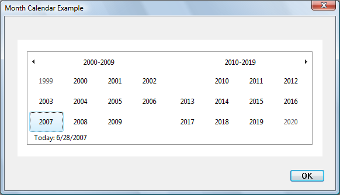

# About Month Calendar Controls

A month calendar control implements a calendar-like user interface. This provides the user with a very intuitive and recognizable method of entering or selecting a date. The control also provides the application with the means to obtain and set the date information in the control using existing data types.

-   [Month Calendar Control Features](#month-calendar-control-features)
    -   [Selecting a day](#selecting-a-day)
    -   [Selecting a nonadjacent month](#selecting-a-nonadjacent-month)
    -   [Selecting a different year](#selecting-a-different-year)
-   [Localization](#localization)
-   [Times in the Month Calendar Control](#times-in-the-month-calendar-control)

## Month Calendar Control Features

The following screen shot shows a month calendar control that has been sized to show two months.

> [!Note]  
> The appearance and behavior of the month calendar control differs slightly under different versions of the run-time library. This topic focuses on the control as it appears in Windows Vista with version 6 of Comctl32.dll.

 

The control in the illustration has the following optional features.

-   The current date is shown on a separate line at the bottom of the control. This is the default style.
-   The "today circle" (actually a rectangle in this version) appears around the current day, and beside the "Today" line as a visual cue. This is the default style.
-   Week numbers are shown at the left of each row of days. This style must be specified.
-   Some dates are shown in bold, according to the day state set by the application. For example, dates that have scheduled meetings might be shown in bold. This style must be specified.

> [!Note]
>
> Windows does not support dates prior to 1601. See [**FILETIME**](/windows/desktop/api/minwinbase/ns-minwinbase-filetime) for details.
>
> The month-calendar control is based on the Gregorian calendar, which was introduced in 1753. It will not calculate dates that are consistent with the Julian calendar that was in use prior to 1753.

 

### Selecting a day

By default, when a user clicks the arrow buttons in the top left or top right of the month calendar control, the control updates its display to show the previous or next month. The user can also perform the same action by clicking the partial months displayed before the first month and after the last month.

The following keyboard commands can also be used to move the selection. The calendar always scrolls as necessary to display the selected day. (The [**virtual key codes**](/windows/desktop/inputdev/virtual-key-codes) are shown in the table.)

|    Command      |    Description                    |
|-------------------------|------------------------------------------------------------------------------------------------------------------------------------------------------------------------------------------------------------------------------------------|
| Left arrow (VK\_LEFT)   | Select the previous day.                                                                                                                                                                                                                 |
| Right arrow (VK\_RIGHT) | Select the next day.                                                                                                                                                                                                                     |
| Up arrow (VK\_UP)       | Select the same day in the previous week.                                                                                                                                                                                                |
| Down arrow (VK\_DOWN)   | Select the same day in the next week.                                                                                                                                                                                                    |
| PAGE UP (VK\_PRIOR)     | Select the same day in the previous month. (If that month does not have the day, the closest day is selected; for example, the selection moves from March 31 to February 28 or 29.)                                                      |
| PAGE DOWN (VK\_NEXT)    | Select the same day in the next month.                                                                                                                                                                                                   |
| HOME (VK\_HOME)         | Select the first day of the current month.                                                                                                                                                                                               |
| END (VK\_END)           | Select the last day of the current month.                                                                                                                                                                                                |
| CTRL + HOME             | Scroll one month backward and select a day in the leftmost column.                                                                                                                                                                       |
| CTRL + END              | Scroll one month forward and select a day in the rightmost column.                                                                                                                                                                       |
| CTRL + PAGE UP          | Select the same day in an earlier month. The number of months by which the selection moves is the number of months displayed in the control. For example, if two months are displayed, the selection would move from June 6 to May 6.    |
| CTRL + PAGE DOWN        | Select the same day in an earlier month. The number of months by which the selection moves is the number of months displayed in the control. For example, if two months are displayed, the selection would move from June 6 to August 6. |

 

If a month calendar control is not using the [**MCS\_NOTODAY**](month-calendar-control-styles.md) style, the user can return to the current day by clicking the "Today" text at the bottom of the control. If the current day is not visible, the control updates its display to show it.

An application can change the number of months by which the control updates its display by using the [**MCM\_SETMONTHDELTA**](mcm-setmonthdelta.md) message or the corresponding macro, [**MonthCal\_SetMonthDelta**](/windows/desktop/api/Commctrl/nf-commctrl-monthcal_setmonthdelta). However, the PAGE UP and PAGE DOWN keys change the selected month by one, regardless of the number of months displayed or the value set by **MCM\_SETMONTHDELTA**.

### Selecting a nonadjacent month

When a user clicks the name of a displayed month, all months in the year are listed (in earlier versions, this is a pop-up menu). The user can select a month on the list. If the user's selection is not visible, the month calendar control scrolls its display to show the chosen month. In the following screen shot, a month calendar control shows the months of two adjacent years.

### Selecting a different year

If the user clicks the year, a group of years is listed, and the user can select a different one, as shown in the following screen shot.

## Localization

The month-calendar control gets its format and all strings from LOCALE\_USER\_DEFAULT.

## Times in the Month Calendar Control

The month calendar control does not display the time. However, the [**SYSTEMTIME**](/windows/desktop/api/minwinbase/ns-minwinbase-systemtime) structure that is used to set and retrieve the selected date or today's date contains time fields. When a date is set programmatically, the control either copies the time fields as they are or validates them first and then, if they are invalid, stores the current default times. Following is a list of the messages that set a date and a description of how the time fields are treated.

|  Message         |  Description            |
|---------------------------------------------|----------------------------------------------------------------------------------------------------------------------------------------------------------------------------------------------------------------------------|
| [**MCM\_SETCURSEL**](mcm-setcursel.md)     | The control copies the time fields as they are, without validation or modification.                                                                                                                                        |
| [**MCM\_SETRANGE**](mcm-setrange.md)       | The time fields of the structures passed in are validated. If they are valid, the time fields are copied without modification. If they are invalid, the control copies the time fields from today's data.                  |
| [**MCM\_SETSELRANGE**](mcm-setselrange.md) | The time fields of the structures passed in are validated. If they are valid, the time fields are copied without modification. If they are invalid, the control retains the time fields from the current selection ranges. |
| [**MCM\_SETTODAY**](mcm-settoday.md)       | The control copies the time fields as they are, without validation or modification.                                                                                                                                        |

 

When a date is retrieved from the control, the time fields will be copied from the stored times without modification. Handling of the time fields by the control is provided as a convenience to the programmer. The control does not examine or modify the time fields as a result of any operation other than those listed above.

 

 