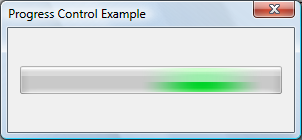

# About Progress Bar Controls

A progress bar is a window that an application can use to indicate the progress of a lengthy operation.

It consists of a rectangle that is animated as an operation progresses.

The following illustration shows a progress bar that does not use visual styles.

The following illustration shows a progress bar using visual styles. The appearance of the control will vary depending on the operating system and the selected theme. For more information, see [Visual Styles](themes-overview.md).

More information is contained under the following headings.

-   [Using Progress Bars](#using-progress-bars)
    -   [Range and Current Position](#range-and-current-position)
    -   [Default Progress Bar Message Processing](#default-progress-bar-message-processing)
    -   [Marquee Style](#marquee-style)

## Using Progress Bars

You can create a progress bar by using the [**CreateWindowEx**](/windows/desktop/api/winuser/nf-winuser-createwindowexa) function, specifying the [**PROGRESS\_CLASS**](common-control-window-classes.md) window class. This window class is registered when the common controls DLL is loaded. For more information, see [About Common Controls](common-controls-intro.md).

The control is also available in the Microsoft Visual Studio Toolbox, where it is called Progress Control.

### Range and Current Position

A progress bar's *range* represents the entire duration of the operation, and the *current position* represents the progress that the application has made toward completing the operation. The window procedure uses the range and the current position to determine the percentage of the progress bar to fill with the highlight color.

If you do not set the range values, the system sets the minimum value to 0 and the maximum value to 100. You can adjust the range to convenient integers by using the [**PBM\_SETRANGE**](pbm-setrange.md) message.

A progress bar provides several messages that you can use to set the current position. The [**PBM\_SETPOS**](pbm-setpos.md) message sets the position to a given value. The [**PBM\_DELTAPOS**](pbm-deltapos.md) message advances the position by adding a specified value to the current position.

The [**PBM\_SETSTEP**](pbm-setstep.md) message allows you to specify a step increment for a progress bar. Subsequently, whenever you send the [**PBM\_STEPIT**](pbm-stepit.md) message to the progress bar, the current position advances by the specified increment. By default, the step increment is set to 10.

### Default Progress Bar Message Processing

This section describes the messages handled by the window procedure for the [**PROGRESS\_CLASS**](common-control-window-classes.md) class.

| Message            | Processing performed                                                                                                                                                               |
|--------------------|------------------------------------------------------------------------------------------------------------------------------------------------------------------------------------|
| **WM\_CREATE**     | Allocates and initializes an initial structure.                                                                                                                                    |
| **WM\_DESTROY**    | Frees all resources associated with the progress bar.                                                                                                                              |
| **WM\_ERASEBKGND** | Draws the background and borders of the progress bar.                                                                                                                              |
| **WM\_GETFONT**    | Returns the handle to the current font. The progress bar does not currently draw text, so sending this message has no effect on the control.                                       |
| **WM\_PAINT**      | Draws the progress bar. If the *wParam* parameter is non-**NULL**, the control assumes that the value is an HDC and paints using that device context.                              |
| **WM\_SETFONT**    | Saves the handle to the new font and returns the handle to the previous font. The progress bar does not currently draw text, so sending this message has no effect on the control. |

 

### Marquee Style

By creating the progress bar control with the [**PBS\_MARQUEE**](progress-bar-control-styles.md) style, you can animate it in a way that shows activity but does not indicate what proportion of the task is complete. The highlighted part of the progress bar moves repeatedly along the length of the bar. You can start and stop the animation, and control its speed, by sending the [**PBM\_SETMARQUEE**](pbm-setmarquee.md) message. Marquee progress bars do not have a range or position.

The following illustration shows a progress bar in marquee mode. The highlighted part moves across the bar.

 

 