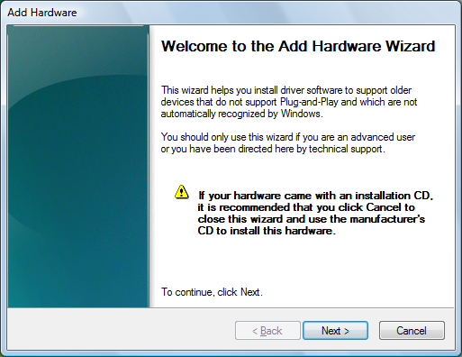

# About Property Sheets

A *property sheet* is a window that allows the user to view and edit the properties of an item. For example, a spreadsheet application can use a property sheet to allow the user to set the font and border properties of a cell or to view and set the properties of a device, such as a disk drive, printer, or mouse.

This section discusses the following topics.

-   [Property Sheet Basics](#property-sheet-basics)
-   [Property Sheet Dialog Boxes](#property-sheet-dialog-boxes)
-   [Pages](#pages)
-   [Property Sheet Creation](#property-sheet-creation)
-   [Adding and Removing Pages](#adding-and-removing-pages)
-   [Property Sheet Title and Page Labels](#property-sheet-title-and-page-labels)
-   [Page Activation](#page-activation)
-   [Help Button](#help-button)
    -   [Removing the Caption Bar Help Button](#removing-the-caption-bar-help-button)
-   [OK, Cancel, and Apply Buttons](#ok-cancel-and-apply-buttons)
-   [Wizards](#wizards)

## Property Sheet Basics

To implement property sheets in your application, include the Prsht.h header file in your project. Prsht.h contains all of the identifiers used with property sheets.

A property sheet contains one or more overlapping child windows called pages, each containing control windows for setting a group of related properties. For example, a page can contain the controls for setting the font properties of an item, including the type style, point size, color, and so on. Each page has a tab that the user can select to bring the page to the foreground of the property sheet. For example, the Date-Time control panel application displays the following property sheet.


A standard property sheet with multiple, tabbed pages allows the user random access to all properties. If it is more appropriate to have properties set in sequence, you can use a [wizard](#wizards).

## Property Sheet Dialog Boxes

A property sheet and the pages it contains are actually dialog boxes. The property sheet is a system-defined dialog box that manages the pages and provides a common container for them. A property sheet dialog box can be modal or modeless. It includes a frame, a title bar, and four buttons: **OK**, **Cancel**, **Apply**, and (optionally) **Help**. The dialog box procedures for the pages receive notification codes in the form of [**WM\_NOTIFY**](wm-notify.md) messages when the user clicks the buttons.

> [!NOTE]  
> Not all the information in this section applies to wizards, which have a somewhat different appearance and behavior. For example, wizards have a different set of buttons and no tabs. For more information, see [Creating Wizards](wizards.md).

Each page in a property sheet is an application-defined modeless dialog box that manages the control windows used to view and edit the properties of an item. You provide the dialog box template used to create each page as well as the dialog box procedure that manages the controls and sets the properties of the corresponding item.

A property sheet sends notification codes to the dialog box procedure for a page when the page is gaining or losing the activation and when the user clicks the **OK**, **Cancel**, **Apply**, or **Help** button. The notifications are sent in the form of [**WM\_NOTIFY**](wm-notify.md) messages. The *lParam* parameter is the address of an [**NMHDR**](/windows/desktop/api/richedit/ns-richedit-nmhdr) structure that includes the window handle to the property sheet dialog box.

Some notification codes require a page to return either **TRUE** or **FALSE** in response to the [**WM\_NOTIFY**](wm-notify.md) message. To do this, the page must use the [**SetWindowLong**](/windows/desktop/api/winuser/nf-winuser-setwindowlonga) function to set the **DWL\_MSGRESULT** value for the page dialog box to either **TRUE** or **FALSE**.

## Pages

A property sheet must contain at least one page, but it cannot contain more than the value of **MAXPROPPAGES** as defined in the Windows header files. Each page has a zero-based index that the property sheet assigns according to the order in which the page is added to the property sheet. The indexes are used in messages that you send to the property sheet.

A property page can contain a nested dialog box. If it does, you must include the [**WS\_EX\_CONTROLPARENT**](/windows/desktop/winmsg/extended-window-styles) style for the top-level dialog box and call the [**IsDialogMessage**](/windows/desktop/api/winuser/nf-winuser-isdialogmessagea) function with the handle to the parent dialog box. This ensures that the user can use mnemonics and the dialog box navigation keys to move the focus to controls in the nested dialog box.

Each page has a corresponding icon and label. The property sheet creates a tab for each page and displays the icon and label in the tab. All property sheet pages are expected to use a nonbold font. To ensure that the font is not bold, specify the **DS\_3DLOOK** style in the dialog box template.

The dialog box procedure for a page must not call the [**EndDialog**](/windows/desktop/api/winuser/nf-winuser-enddialog) function. Doing so will destroy the entire property sheet, not just the page.

The minimum size for a property sheet page is 212 dialog units horizontally and 114 dialog units vertically. If a page dialog is smaller than this, the page will be enlarged until it meets the minimum size. The Prsht.h header file contains three sets of recommended sizes for property sheet pages, as shown in the following table.

|  Size                |   Description                                                   |
|----------------------|-----------------------------------------------------------------|
| **PROP\_SM\_CXDLG**  | Width, in dialog units, of a small property sheet page.         |
| **PROP\_SM\_CYDLG**  | Height, in dialog units, of a small property sheet page.        |
| **PROP\_MED\_CXDLG** | Width, in dialog units, of a medium-sized property sheet page.  |
| **PROP\_MED\_CYDLG** | Height, in dialog units, of a medium-sized property sheet page. |
| **PROP\_LG\_CXDLG**  | Width, in dialog units, of a large property sheet page.         |
| **PROP\_LG\_CYDLG**  | Height, in dialog units, of a large property sheet page.        |

Using these recommended sizes will help ensure visual consistency between your application and other Microsoft Windows applications.

In the Microsoft Visual Studio resource editor, you can create a page of the appropriate size in the **Add Resource** dialog box. Expand the Dialog node and select **IDD\_PROPPAGE\_LARGE**, **IDD\_PROPPAGE\_MEDIUM**, or **IDD\_PROPPAGE\_SMALL**.

The property sheet is automatically sized to accommodate the largest page.

## Property Sheet Creation

Before creating a property sheet, you must define one or more pages. This involves filling a [**PROPSHEETPAGE**](pss-propsheetpage.md) structure with information about the page—its icon, label, dialog box template, dialog box procedure, and so on—and then specifying the address of the structure in a call to the [**CreatePropertySheetPage**](/windows/desktop/api/Prsht/nf-prsht-createpropertysheetpagea) function. The function returns a handle to the HPROPSHEETPAGE type that uniquely identifies the page.

To create a property sheet, you specify the address of a [**PROPSHEETHEADER**](pss-propsheetheader.md) structure in a call to the [**PropertySheet**](/windows/desktop/api/Prsht/nf-prsht-propertysheeta) function. The structure defines the icon and title for the property sheet and also includes the address of an array of HPROPSHEETPAGE handles that you obtain by using [**CreatePropertySheetPage**](/windows/desktop/api/Prsht/nf-prsht-createpropertysheetpagea). When **PropertySheet** creates the property sheet, it includes the pages identified in the array. The pages appear in the property sheet in the same order that they are contained in the array.

Another way to assign pages to a property sheet is to specify an array of [**PROPSHEETPAGE**](pss-propsheetpage.md) structures instead of an array of **HPROPSHEETPAGE** handles. In this case, [**PropertySheet**](/windows/desktop/api/Prsht/nf-prsht-propertysheeta) creates handles for the pages before adding them to the property sheet.

When a page is created, its dialog box procedure receives a [**WM\_INITDIALOG**](/windows/desktop/dlgbox/wm-initdialog) message. The message's *lParam* parameter is a pointer to a copy of the [**PROPSHEETPAGE**](pss-propsheetpage.md) structure that is defined when the page is created. In particular, when a page is created, the structure's **lParam** member can be used to pass application-defined information to the dialog box procedure. With the exception of the **lParam** member, this structure must be treated as read-only. Modifying anything other than **lParam** will have unpredictable consequences.

When the system subsequently passes a copy of the page's [**PROPSHEETPAGE**](pss-propsheetpage.md) structure to your application, it uses the same pointer. Any changes to the structure will be passed along. Because the **lParam** member is ignored by the system, it can be modified to send information to other parts of your application. You can, for instance, use **lParam** to pass information to the page's [*PropSheetPageProc*](/windows/win32/api/prsht/nc-prsht-lpfnpspcallbacka) callback function.

[**PropertySheet**](/windows/desktop/api/Prsht/nf-prsht-propertysheeta) automatically sets the size and initial position of a property sheet. The position is based on the position of the owner window, and the size is based on the largest page specified in the array of pages when the property sheet was created. If you want the pages to match the width of the four buttons at the bottom of the property sheet, set the width of the widest page to 190 dialog units.

The size of a property sheet is computed from the *width* and *height* properties of the dialog template in the resource file. See [**DIALOG Resource**](/windows/desktop/menurc/dialog-resource) or [**DIALOGEX Resource**](/windows/desktop/menurc/dialogex-resource) for further details. Note, however, that for compatibility reasons, the dimensions are computed relative to the MS Shell Dlg font rather than the font used by the page. If you design a page that uses another font, one of the following suggestions can be used.

-   Adjust the dimensions of the dialog template to compensate for the difference in size between the MS Shell Dlg font and the font the page actually uses. For example, if you choose a font that is twice as wide as MS Shell Dlg, then set the dialog template's width property to twice the normal use.
-   Use a [**DIALOGEX**](/windows/desktop/menurc/dialogex-resource) template and set the **DS\_SHELLFONT** dialog style. In that case, the property sheet manager interprets the dialog template dimensions relative to the font used by the dialog template.

## Adding and Removing Pages

After creating a property sheet, an application can add a page to the end of the existing set of pages by sending a [**PSM\_ADDPAGE**](psm-addpage.md) message. To insert a page between existing pages, send a [**PropSheet\_InsertPage**](/windows/desktop/api/Prsht/nf-prsht-propsheet_insertpage) message. Note that the size of the property sheet cannot change after it has been created. Any added or inserted pages must be no larger than the largest page currently in the property sheet. To remove a page, send a [**PSM\_REMOVEPAGE**](psm-removepage.md) message.

When you define a page, you can specify the address of a [*PropSheetPageProc*](/windows/win32/api/prsht/nc-prsht-lpfnpspcallbacka) callback function that the property sheet calls when it is creating or removing the page. Using *PropSheetPageProc* gives you an opportunity to perform initialization and cleanup operations for individual pages.

> [!NOTE]  
> A number of messages and one function call occur while the property sheet is manipulating the list of pages. While this action is taking place, attempting to modify the list of pages will have unpredictable results. Do not add, insert, or remove pages in your implementation of [*PropSheetPageProc*](/windows/win32/api/prsht/nc-prsht-lpfnpspcallbacka), or while handling the following notifications and Windows messages.
>
> -   [PSN\_APPLY](psn-apply.md)
> -   [PSN\_KILLACTIVE](psn-killactive.md)
> -   [PSN\_RESET](psn-reset.md)
> -   [PSN\_SETACTIVE](psn-setactive.md)
> -   [PSN\_WIZBACK](psn-wizback.md)
> -   [PSN\_WIZNEXT](psn-wiznext.md)
> -   [**WM\_INITDIALOG**](/windows/desktop/dlgbox/wm-initdialog)
> -   [**WM\_DESTROY**](/windows/desktop/winmsg/wm-destroy)

If the need arises to modify a property sheet page while you are handling one of these messages or while [*PropSheetPageProc*](/windows/win32/api/prsht/nc-prsht-lpfnpspcallbacka) is in operation, post a private Windows message. Your application will not receive that message until after the property sheet manager has finished its tasks, at which point it will be safe to modify the list of pages.

When a property sheet is destroyed, it automatically destroys all of the pages that have been added to it. The pages are destroyed in reverse order from that specified in the array used to create the pages. To destroy a page that was created by the [**CreatePropertySheetPage**](/windows/desktop/api/Prsht/nf-prsht-createpropertysheetpagea) function but was not added to the property sheet, use the [**DestroyPropertySheetPage**](/windows/desktop/api/Prsht/nf-prsht-destroypropertysheetpage) function.

## Property Sheet Title and Page Labels

You specify the title of a property sheet in the [**PROPSHEETHEADER**](pss-propsheetheader.md) structure used to create the property sheet. If the **dwFlags** member includes the **PSH\_PROPTITLE** value, the property sheet adds the suffix "Properties" or the prefix "Properties for", depending on the version. You can change the title after a property sheet is created by using the [**PSM\_SETTITLE**](psm-settitle.md) message. In an Aero Wizard, this message can be used to change the title of an interior page dynamically.

By default, a property sheet uses the name string specified in the dialog box template as the label for a page. You can override the name string by including the **PSP\_USETITLE** value in the **dwFlags** member of the [**PROPSHEETPAGE**](pss-propsheetpage.md) structure that defines the page. When **PSP\_USETITLE** is specified, the **pszTitle** member must contain the address of the label string for the page.

## Page Activation

A property sheet can have only one active page at a time. The page that has the activation is at the foreground of the overlapping stack of pages. The user activates a page by selecting its tab; an application activates a page by using the [**PSM\_SETCURSEL**](psm-setcursel.md) message.

The property sheet sends the [PSN\_KILLACTIVE](psn-killactive.md) notification code to the page that is about to lose the activation. In response, the page must validate any changes that the user has made to the page. If the page requires additional user input before losing the activation, use the [**SetWindowLong**](/windows/desktop/api/winuser/nf-winuser-setwindowlonga) function to set the **DWL\_MSGRESULT** value of the page to **TRUE**. Also, the page must display a message box that describes the problem and provides the recommended action. Set **DWL\_MSGRESULT** to **FALSE** when it is okay to lose the activation.

Before the page that is gaining the activation is visible, the property sheet sends the [PSN\_SETACTIVE](psn-setactive.md) notification code to the page. The page must respond by initializing its control windows.

## Help Button

Property sheets can display two Help buttons: a property sheet Help button that is displayed at the bottom of the frame, next to the **OK**/**Cancel**/**Apply** buttons, and a standard caption bar button that provides context-sensitive Help.

The property sheet Help button is optional, and can be enabled on a page by page basis. To display the property sheet Help button for one or more pages:

-   Set the **PSH\_HASHELP** flag in the **dwFlags** member of the property sheet's [**PROPSHEETHEADER**](pss-propsheetheader.md) structure.
-   For each page that will display a Help button, set the **PSP\_HASHELP** flag in the **dwFlags** member of the page's [**PROPSHEETPAGE**](pss-propsheetpage.md) structure.

When the user clicks the Help button, the active page receives a [PSN\_HELP](psn-help.md) notification code. The page must respond by displaying Help information, typically by calling the [**WinHelp**](/windows/desktop/api/winuser/nf-winuser-winhelpa) function.

### Removing the Caption Bar Help Button

The caption bar Help button is displayed by default, so that context-sensitive Help is always available for the OK/Cancel/Apply buttons. However, this button can be removed, if necessary. To remove a property sheet's caption bar Help button:

-   For versions of the common controls prior to [version 5.80](common-control-versions.md), you must implement a [**property sheet callback function**](/windows/desktop/api/Prsht/nc-prsht-pfnpropsheetcallback).
-   For [version 5.80](common-control-versions.md) and later of the common controls, you can simply set the PSH\_NOCONTEXTHELP flag in the **dwFlags** member of the property sheet's [**PROPSHEETHEADER**](pss-propsheetheader.md) structure. However, if you need backward compatibility with earlier common control versions, you must implement the callback function.

To implement a property sheet callback function that removes the caption bar Help button:

-   Set the **PSH\_USECALLBACK** flag in the **dwFlags** member of the property sheet's [**PROPSHEETHEADER**](pss-propsheetheader.md) structure.
-   Set the **pfnCallBack** member of the [**PROPSHEETHEADER**](pss-propsheetheader.md) structure to point to the callback function.
-   Implement the callback function. When this function receives the **PSCB\_PRECREATE** message, it will also receive a pointer to the property sheet's dialog box template. Remove the **DS\_CONTEXTHELP** style from this template.

The following sample illustrates how to implement such a callback function:

```cpp
int CALLBACK RemoveContextHelpProc(HWND hwnd, UINT message, LPARAM lParam)
{
    switch (message) 
    {
    case PSCB_PRECREATE:
        // Remove the DS_CONTEXTHELP style from the
        // dialog box template
        if (((LPDLGTEMPLATEEX)lParam)->signature ==    
           0xFFFF)
           {
            ((LPDLGTEMPLATEEX)lParam)->style 
            &= ~DS_CONTEXTHELP;
        }
        else {
            ((LPDLGTEMPLATE)lParam)->style 
            &= ~DS_CONTEXTHELP;
        }
        return TRUE;
    }
    return TRUE;
}
```

If the [**DLGTEMPLATEEX**](/windows/desktop/dlgbox/dlgtemplateex) structure is not defined, include the following declaration:

```cpp
#include <pshpack1.h>

typedef struct DLGTEMPLATEEX
{
    WORD dlgVer;
    WORD signature;
    DWORD helpID;
    DWORD exStyle;
    DWORD style;
    WORD cDlgItems;
    short x;
    short y;
    short cx;
    short cy;
} DLGTEMPLATEEX, *LPDLGTEMPLATEEX;

#include <poppack.h>
```

## OK, Cancel, and Apply Buttons

The **OK** and **Apply** buttons are similar; both direct a property sheet's pages to validate and apply the property changes that the user has made. The only difference is that clicking the **OK** button causes the property sheet to be destroyed after the changes are applied.

When the user clicks the **OK** or **Apply** button, the property sheet sends a [PSN\_KILLACTIVE](psn-killactive.md) notification to the active page, giving it an opportunity to validate the user's changes. If the changes are valid, the page must call the [**SetWindowLong**](/windows/desktop/api/winuser/nf-winuser-setwindowlonga) function with the **DWL\_MSGRESULT** value set to **FALSE**. If the user's changes are not valid, the page must set **DWL\_MSGRESULT** to **TRUE** and display a dialog box informing the user of the problem. The page remains active until it sets **DWL\_MSGRESULT** to **FALSE** in response to a PSN\_KILLACTIVE message.

After a page responds to a [PSN\_KILLACTIVE](psn-killactive.md) notification by setting **DWL\_MSGRESULT** to **FALSE**, the property sheet will send a [PSN\_APPLY](psn-apply.md) notification to each page. When a page receives this notification, it must apply the new properties to the corresponding item. To indicate to the property sheet that the changes are valid for the page, call [**SetWindowLong**](/windows/desktop/api/winuser/nf-winuser-setwindowlonga) with **DWL\_MSGRESULT** set to **PSNRET\_NOERROR**. If the changes are invalid for the page, return an error. Doing so prevents the property sheet from being destroyed and returns focus to either the page that received the PSN\_APPLY notification or the page that had focus when the **Apply** button was pressed. To return an error, and indicate which page will receive focus, set **DWL\_MSGRESULT** to one of the following values.

-   **PSNRET\_INVALID**. The property sheet will not be destroyed, and focus will be returned to this page.
-   **PSNRET\_INVALID\_NOCHANGEPAGE**. The property sheet will not be destroyed, and focus will be returned to the page that had focus when the button was pressed.

An application can use the [**PSM\_APPLY**](psm-apply.md) message to simulate the selection of the **Apply** button.

The **Apply** button is initially disabled when a page becomes active, indicating that there are not yet any property changes to apply. When the page receives input through one of its controls indicating that the user has edited a property, the page must send the [**PSM\_CHANGED**](psm-changed.md) message to the property sheet. The message causes the property sheet to enable the **Apply** button. If the user subsequently clicks the **Apply** or **Cancel** button, the page must reinitialize its controls and then send the [**PSM\_UNCHANGED**](psm-unchanged.md) message to again disable the **Apply** button.

Sometimes the **Apply** button causes a page to make a change to a property sheet, and the change cannot be undone. When this happens, the page must send the [**PSM\_CANCELTOCLOSE**](psm-canceltoclose.md) message to the property sheet. The message causes the property sheet to change the text of the **OK** button to "Close," indicating that the applied changes cannot be canceled.

Sometimes a page makes a change to the system configuration that requires Windows to be restarted or the system rebooted before the change can take effect. After making such a change, a page must send either the [**PSM\_RESTARTWINDOWS**](psm-restartwindows.md) or [**PSM\_REBOOTSYSTEM**](psm-rebootsystem.md) message to the property sheet. These messages cause the [**PropertySheet**](/windows/desktop/api/Prsht/nf-prsht-propertysheeta) function to return the **ID\_PSRESTARTWINDOWS** or **ID\_PSREBOOTSYSTEM** value after the property sheet is destroyed.

When a user clicks the **Cancel** button, the property sheet sends the [PSN\_RESET](psn-reset.md) notification code to all pages, indicating that the property sheet is about to be destroyed. A page must use the notification to perform cleanup operations.

## Wizards

A wizard is a special type of property sheet. Wizards are designed to present pages one at a time in a sequence that is controlled by the application. Instead of selecting from a group of pages by clicking a tab, users navigate forward and backward through the sequence, one page at a time, by clicking buttons. For example, the following screen shot shows the welcome page from the Add Hardware wizard:



The following screen shot shows the first page of an Aero Wizard, the new style introduced in Windows Vista.


See [Creating Wizards](wizards.md) for a complete discussion of wizards.
