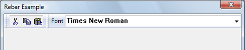

# About Rebar Controls

A *Rebar control* acts as a container for child windows. It can contain one or more *bands*, and each band can have any combination of a gripper bar, a bitmap, a text label, and one child window. An application assigns a child window—typically another control— to a rebar control band. As you dynamically reposition a rebar control band, the rebar control manages the size and position of the child window assigned to that band. Also, an application can specify a background bitmap for a band, and the rebar control will display the band's child window over the bitmap.

The following screen shot shows a rebar control that has two bands. One contains a toolbar, and the other contains a combobox. Both bands have a gripper that allows them to be moved and resized.

> [!Note]  
> The rebar control is implemented in version 4.70 and later of Comctl32.dll.

 

## Rebar Bands and Child Windows

An application defines a rebar band's traits by using the [**RB\_INSERTBAND**](rb-insertband.md) and [**RB\_SETBANDINFO**](rb-setbandinfo.md) messages. These messages accept the address of a [**REBARBANDINFO**](/windows/win32/api/commctrl/ns-commctrl-rebarbandinfoa) structure as the *lParam* parameter. The **REBARBANDINFO** structure members define the traits of a given band. To set a band's traits, set the **cbsize** member to indicate the size of the structure, in bytes. Then set the **fMask** member to indicate which structure members your application is filling.

To assign a child window to a band, include the RBBIM\_CHILD flag in the **fMask** member of the [**REBARBANDINFO**](/windows/win32/api/commctrl/ns-commctrl-rebarbandinfoa) structure, and then set the **hwndChild** member to the child window's handle. Applications can set the minimum allowable width and height of a child window in the **cxMinChild** and **cyMinChild** members.

When a rebar control is destroyed, it destroys any child windows assigned to the bands within it. To prevent the control from destroying child windows assigned to its bands, remove the bands by sending the [**RB\_DELETEBAND**](rb-deleteband.md) message, and then use the [**RB\_SETPARENT**](rb-setparent.md) message to reset the parent to another window before destroying the rebar control.

## The Rebar Control User Interface

All rebar control bands can be resized, except those that use the RBBS\_FIXEDSIZE style. To resize or change the order of bands within the control, click and drag a band's gripper bar. The rebar control automatically resizes and repositions child windows assigned to its bands. Additionally, you can toggle the size of a band by clicking the band text, if there is any.

## The Rebar Control's Image List

If an application is using an image list with a rebar control, it must send the [**RB\_SETBARINFO**](rb-setbarinfo.md) message before adding bands to the control. This message accepts the address of a [**REBARINFO**](/windows/win32/api/commctrl/ns-commctrl-rebarinfo) structure as the *lParam* parameter. Before sending the message, prepare the **REBARINFO** structure by setting the **cbSize** member to the size of the structure, in bytes. Then, if the rebar control is going to display images on the bands, set the **fMask** member to the RBIM\_IMAGELIST flag and assign an image list handle to the **himl** member. If the rebar will not use band images, set **fMask** to zero.

## Rebar Control Message Forwarding

A rebar control forwards all [**WM\_NOTIFY**](wm-notify.md) window messages to its parent window. Additionally, a rebar control forwards any messages sent to it from windows assigned to its bands, like [**WM\_CHARTOITEM**](wm-chartoitem.md), [**WM\_COMMAND**](/windows/desktop/menurc/wm-command), and others.

 

 