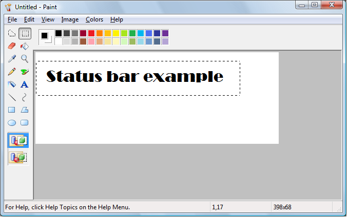

# Status Bars (Windows Controls)

A *status bar* is a horizontal window at the bottom of a parent window in which an application can display various kinds of status information. The status bar can be divided into parts to display more than one type of information. The following screen shot shows the status bar in the Microsoft Windows Paint application. In this case, the status bar contains the text "For Help, click Help Topics on the Help Menu". The status bar is the area at the bottom of the window that contains Help text and coordinate information.

This section includes the following topics.

-   [Types and Styles](#types-and-styles)
-   [Size and Height](#size-and-height)
-   [Multiple-Part Status Bars](#multiple-part-status-bars)
-   [Status Bar Text Operations](#status-bar-text-operations)
-   [Owner-Drawn Status Bars](#owner-drawn-status-bars)
-   [Simple Mode Status Bars](#simple-mode-status-bars)
-   [Default Status Bar Message Processing](#default-status-bar-message-processing)

## Types and Styles

The default position of a status bar is along the bottom of the parent window, but you can specify the [**CCS\_TOP**](common-control-styles.md) style to have it appear at the top of the parent window's client area.

You can specify the [**SBARS\_SIZEGRIP**](status-bar-styles.md) style to include a sizing grip at the right end of the status bar.

> [!Note]  
> Combining the [**CCS\_TOP**](common-control-styles.md) and [**SBARS\_SIZEGRIP**](status-bar-styles.md) styles is not recommended because the resulting sizing grip is not functional.

 

## Size and Height

The window procedure for the status bar automatically sets the initial size and position of the window, ignoring the values specified in the [**CreateWindowEx**](/windows/desktop/api/winuser/nf-winuser-createwindowexa) function. The width is the same as that of the parent window's client area. The height is based on the metrics of the font that is currently selected into the status bar's device context and on the width of the window's borders.

The window procedure automatically adjusts the size of the status bar whenever it receives a [**WM\_SIZE**](/windows/desktop/winmsg/wm-size) message. Typically, when the size of the parent window changes, the parent sends a **WM\_SIZE** message to the status bar.

An application can set the minimum height of a status bar's drawing area by sending the window an [**SB\_SETMINHEIGHT**](sb-setminheight.md) message, specifying the minimum height, in pixels. The drawing area does not include the window's borders. A minimum height is useful for drawing in an owner-drawn status bar. For more information, see [Owner-Drawn Status Bars](#owner-drawn-status-bars) later in this chapter.

You retrieve the widths of the borders of a status bar by sending the window an [**SB\_GETBORDERS**](sb-getborders.md) message. The message includes the address of a three-element array that receives the widths.

## Multiple-Part Status Bars

A status bar can have many different parts, each displaying a different line of text. You divide a status bar into parts by sending the window an [**SB\_SETPARTS**](sb-setparts.md) message, specifying the number of parts to create and the address of an integer array. The array contains one element for each part, and each element specifies the client coordinate of the right edge of a part.

A status bar can have a maximum of 256 parts, although applications typically use far fewer than that. You retrieve a count of the parts in a status bar, as well as the coordinate of the right edge of each part, by sending the window an [**SB\_GETPARTS**](sb-getparts.md) message.

## Status Bar Text Operations

You set the text of any part of a status bar by sending the [**SB\_SETTEXT**](sb-settext.md) message, specifying the zero-based index of a part, an address of the string to draw in the part, and the technique for drawing the string. The drawing technique determines whether the text has a border and, if it does, the style of the border. It also determines whether the parent window is responsible for drawing the text. For more information, see the [Owner-Drawn Status Bars](#owner-drawn-status-bars) section below.

By default, text is left-aligned within the specified part of a status bar. You can embed tab characters (\\ t) in the text to center or right-align it. Text to the right of a single tab character is centered, and text to the right of a second tab character is right-aligned.

To retrieve text from a status bar, use the [**SB\_GETTEXTLENGTH**](sb-gettextlength.md) and [**SB\_GETTEXT**](sb-gettext.md) messages.

If your application uses a status bar that has only one part, you can use the [**WM\_SETTEXT**](/windows/desktop/winmsg/wm-settext), [**WM\_GETTEXT**](/windows/desktop/winmsg/wm-gettext), and [**WM\_GETTEXTLENGTH**](/windows/desktop/winmsg/wm-gettextlength) messages to perform text operations. These messages deal only with the part that has an index of zero, allowing you to treat the status bar much like a static text control.

To display a line of status without creating a status bar, use the [**DrawStatusText**](/windows/desktop/api/Commctrl/nf-commctrl-drawstatustexta) function. The function uses the same techniques to draw the status as the window procedure for the status bar, but it does not automatically set the size and position of the status information. When calling the function, you must specify the size and position of the status information as well as the device context of the window in which to draw it.

## Owner-Drawn Status Bars

You can define individual parts of a status bar to be owner-drawn parts. Using this technique gives you more control than you would otherwise have over the appearance of the window part. For example, you can display a bitmap rather than text or draw text using a different font.

To define a window part as owner-drawn, send the [**SB\_SETTEXT**](sb-settext.md) message to the status bar, specifying the part and the SBT\_OWNERDRAW drawing technique. When SBT\_OWNERDRAW is specified, the *lParam* parameter is a 32-bit application-defined value that the application can use when drawing the part. For example, you can specify a font handle, a bitmap handle, an address of a string, and so on.

When a status bar needs to draw an owner-drawn part, it sends the [**WM\_DRAWITEM**](wm-drawitem.md) message to the parent window. The *wParam* parameter of the message is the child window identifier of the status bar, and the *lParam* parameter is the address of a [**DRAWITEMSTRUCT**](/windows/win32/api/winuser/ns-winuser-drawitemstruct) structure. The parent window uses the information in the structure to draw the part. For an owner-drawn part of a status bar, **DRAWITEMSTRUCT** contains the following information.

| Member         | Description                                                                                                            |
|----------------|------------------------------------------------------------------------------------------------------------------------|
| **CtlType**    | Undefined; do not use.                                                                                                 |
| **CtlID**      | Child window identifier of the status bar.                                                                             |
| **itemID**     | Zero-based index of the part to be drawn.                                                                              |
| **itemAction** | Undefined; do not use.                                                                                                 |
| **itemState**  | Undefined; do not use.                                                                                                 |
| **hwndItem**   | Handle to the status bar.                                                                                              |
| **hDC**        | Handle to the device context of the status bar.                                                                        |
| **rcItem**     | Coordinates of the window part to be drawn. The coordinates are relative to the upper left corner of the status bar.   |
| **itemData**   | Application-defined 32-bit value specified in the *lParam* parameter of the [**SB\_SETTEXT**](sb-settext.md) message. |

 

## Simple Mode Status Bars

You put a status bar in "simple mode" by sending it an [**SB\_SIMPLE**](sb-simple.md) message. A simple mode status bar displays only one part. When the text of the window is set, the window is invalidated, but it is not redrawn until the next [**WM\_PAINT**](/windows/desktop/gdi/wm-paint). Waiting for the message reduces screen flicker by minimizing the number of times the window is redrawn. A simple mode status bar is useful for displaying Help text for menu items while the user is scrolling through the menu.

The string that a status bar displays while in simple mode is maintained separately from the strings that it displays while in nonsimple mode. This means you can put the window in simple mode, set its text, and switch back to nonsimple mode without the nonsimple mode text being changed.

When setting the text of a simple mode status bar, you can specify any drawing technique except SBT\_OWNERDRAW. A simple mode status bar does not support owner drawing.

## Default Status Bar Message Processing

This section describes the messages handled by the window procedure for the predefined [**STATUSCLASSNAME**](common-control-window-classes.md) class.

| Message               | Default processing                                                                                                                                                                                                                                                       |
|-----------------------|--------------------------------------------------------------------------------------------------------------------------------------------------------------------------------------------------------------------------------------------------------------------------|
| **WM\_CREATE**        | Initializes the status bar.                                                                                                                                                                                                                                              |
| **WM\_DESTROY**       | Frees resources allocated for the status bar.                                                                                                                                                                                                                            |
| **WM\_GETFONT**       | Returns the handle to the current font with which the status bar draws its text.                                                                                                                                                                                         |
| **WM\_GETTEXT**       | Copies the text from the first part of a status bar to a buffer. It returns a 32-bit value that specifies the length, in characters, of the text and the technique used to draw the text.                                                                                |
| **WM\_GETTEXTLENGTH** | Returns a 32-bit value that specifies the length, in characters, of the text in the first part of a status bar and the technique used to draw the text.                                                                                                                  |
| **WM\_NCHITTEST**     | Returns the HTBOTTOMRIGHT value if the mouse cursor is in the sizing grip, causing the system to display the sizing cursor. If the mouse cursor is not in the sizing grip, the status bar passes this message to the [**DefWindowProc**](/windows/desktop/api/winuser/nf-winuser-defwindowproca) function. |
| **WM\_PAINT**         | Paints the invalid region of the status bar. If the *wParam* parameter is non-**NULL**, the control assumes that the value is an HDC and paints using that device context.                                                                                               |
| **WM\_SETFONT**       | Selects the font handle into the device context for the status bar.                                                                                                                                                                                                      |
| **WM\_SETTEXT**       | Copies the specified text into the first part of a status bar, using the default drawing operation (specified as zero). It returns **TRUE** if successful, or **FALSE** otherwise.                                                                                       |
| **WM\_SIZE**          | Resizes the status bar based on the current width of the parent window's client area and the height of the current font of the status bar.                                                                                                                               |

 

 

 
