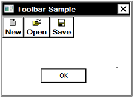
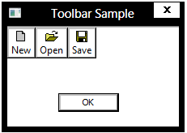

# Supporting High Contrast Themes

This topic compares the support for high contrast themes in Windows 8 to that of previous versions of Windows, and explains how to support high contrast themes in a Windows 8 application.

It includes the following sections.

-   [Overview of Support for High Contrast Themes](#overview-of-support-for-high-contrast-themes)
-   [Supporting High Contrast Themes in Windows 8 and later](#supporting-high-contrast-themes-in-windows-8-and-later)
-   [Adding a Compatibility Section to Your Application Manifest](#adding-a-compatibility-section-to-your-application-manifest)
-   [Detecting High Contrast in Previous Versions of Windows](#detecting-high-contrast-in-previous-versions-of-windows)
-   [Related topics](#related-topics)

## Overview of Support for High Contrast Themes

Windows 7 and earlier support two theming models, including the legacy Windows classic model, and the current visual styles. The Windows classic model has been retained through Windows 7 mainly to support the various high contrast themes. However, the Windows classic model has a number of drawbacks:

-   No support for themes that use visual styles, such as Windows Aero. Users of high contrast themes must use the Windows classic UI.
-   No support for UI features that rely on Desktop Window Manager (DWM) to run, such as thumbnail previews and the full screen magnifier that was introduced in Windows 7.
-   Developers must maintain two separate code paths to support the two different theming models.

In Windows 8 and later, the following changes to the theming model address the previous drawbacks:

-   The Windows classic theming model is no longer supported, enabling developers to maintain just one code path for applications that target only Windows 8.
-   Because visual styles and DWM are on in Windows 8, high contrast users have access to features such as thumbnail previews and the full-screen magnifier.
-   Visual styles support setting the colors of various UI elements, enabling high contrast users to customize the UI to accommodate individual needs and preferences.
-   Windows 8 includes compatibility support for existing applications that are designed to use high contrast themes based on the Windows classic theming model.

## Supporting High Contrast Themes in Windows 8 and later

In Windows 8, because visual styles are on in high contrast mode, supporting high contrast themes is straightforward as long as you heed the following guidelines.

-   Font and control sizes. To ensure that your UI is accessible to users with disabilities, set font sizes according to the current theme settings. Set the size of controls to be at least the default size.
-   Colors. Avoid using hard-coded colors. Instead, use the system colors because they are based on the current theme. Using custom colors can interfere with and override the colors in the high contrast themes.
-   Application manifest. Applications designed to work with the new high contrast themes should have an application compatibility section defined in their manifest that contains the Windows 8 compatibility GUIDs. Otherwise, Windows assumes that the application is designed for an older version of Windows and renders the application UI by simulating the Windows classic theming model.

## Adding a Compatibility Section to Your Application Manifest

An application manifest is an XML file that describes the requirements for an application. The compatibility section of the manifest identifies the versions of Windows supported by the application. The following GUIDs are used in the compatibility section to identify the various versions of Windows.

| Version       | GUID                                   |
|---------------|----------------------------------------|
| Windows Vista | {e2011457-1546-43c5-a5fe-008deee3d3f0} |
| Windows 7     | {35138b9a-5d96-4fbd-8e2d-a2440225f93a} |
| Windows 8     | {4a2f28e3-53b9-4441-ba9c-d69d4a4a6e38} |


 

The compatibility section can specify multiple versions of Windows, but each must be contained within its own `<supportedOS/>` tag. The following example shows an application manifest that specifies Windows 7 and Windows 8 in the compatibility section:


```C++
<?xml version="1.0" encoding="UTF-8" standalone="yes"?>
<assembly xmlns="urn:schemas-microsoft-com:asm.v1" manifestVersion="1.0">
    <compatibility xmlns="urn:schemas-microsoft-com:compatibility.v1">
        <application>
            <!--The ID below indicates application support for Windows 8 -->
            <supportedOS Id="{4a2f28e3-53b9-4441-ba9c-d69d4a4a6e38}"/>

            <!--The ID below indicates application support for Windows 7 -->
            <supportedOS Id="{35138b9a-5d96-4fbd-8e2d-a2440225f93a}"/>
        </application>
    </compatibility>
</assembly>
```


If an application does not have a compatibility manifest, it is assumed to be a Windows Vista application and does not use themed controls in the client area when a high contrast theme is active. Also, the behavior of some visual styles functions are affected. For example, [**IsThemeActive**](/windows/desktop/api/Uxtheme/nf-uxtheme-isthemeactive), [**IsCompositionActive**](/windows/desktop/api/Uxtheme/nf-uxtheme-iscompositionactive), and [**IsAppThemed**](/windows/desktop/api/Uxtheme/nf-uxtheme-isappthemed) return FALSE, while [**OpenThemeData**](/windows/desktop/api/Uxtheme/nf-uxtheme-openthemedata) and [**OpenThemeDataEx**](/windows/desktop/api/Uxtheme/nf-uxtheme-openthemedataex) return a NULL handle. This is for compatibility support, so that applications built before Windows 8 can still render their UI in the same look as the high contrast mode of previous versions of Windows where visual styles are not available.

On Windows 8, the application still receives the benefits of desktop composition. This means, for example, that usability applications such as the full screen magnifier don't depend on the status of an individual application's manifest. The usability application continues to work in high contrast mode with an application that does not identify itself as Windows 8 compatible in its manifest.

The following images show a simple dialog box in high contrast on Windows 7.



This image shows the same dialog box in high contrast on Windows 8, but with Windows 7 compatibility specified in the application manifest:



This image shows the same dialog box in high contrast on Windows 8, with Windows 8 specified in the application manifest:


## Detecting High Contrast in Previous Versions of Windows

Applications running on previous versions of Windows do not have access to the new high contrast themes. If your application needs to run on previous versions of , you should include support for rendering your UI in high contraWindowsst in the Windows classic theming model. Your application can determine whether a high contrast theme is active by calling the [**SystemParametersInfo**](/windows/desktop/api/winuser/nf-winuser-systemparametersinfoa) function with the **SPI\_GETHIGHCONTRAST** flag.

## Related topics

<dl> <dt>

[Enabling Visual Styles](cookbook-overview.md)
</dt> <dt>

[Visual Styles](themes-overview.md)
</dt> </dl>

 

 