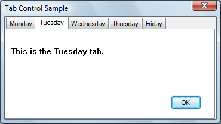

# About Tab Controls

A tab control is analogous to the dividers in a notebook or the labels in a file cabinet. By using a tab control, an application can define multiple pages for the same area of a window or dialog box. Each page consists of a certain type of information or a group of controls that the application displays when the user selects the corresponding tab.

The following screen shot shows a simple tab control that contains tabs for days of the week. The Tuesday tab has been selected.

This topic includes the following sections.

-   [Creating Tab Controls](#creating-tab-controls)
-   [Tab Control Styles](#tab-control-styles)
-   [Tabs and Tab Attributes](#tabs-and-tab-attributes)
-   [Display Area](#display-area)
-   [Tab Selection](#tab-selection)
-   [Tab Control Image Lists](#tab-control-image-lists)
-   [Tab Size and Position](#tab-size-and-position)
-   [Owner-Drawn Tabs](#owner-drawn-tabs)
-   [Tab Control Tooltips](#tab-control-tooltips)
-   [Default Tab Control Message Processing](#default-tab-control-message-processing)

## Creating Tab Controls

You can create a tab control by calling the [**CreateWindowEx**](/windows/desktop/api/winuser/nf-winuser-createwindowexa) function, specifying the [**WC\_TABCONTROL**](common-control-window-classes.md) window class. This window class is registered when the common controls DLL is loaded. To ensure that the DLL is loaded, use the [**InitCommonControlsEx**](/windows/desktop/api/Commctrl/nf-commctrl-initcommoncontrolsex) function.

In Microsoft Visual Studio, you can create a tab control by using the Toolbox.

You send messages to a tab control to add tabs and otherwise affect the control's appearance and behavior. Each message has a corresponding macro that you can use instead of sending the message explicitly. You cannot disable an individual tab in a tab control. However, you can disable a tab control in a property sheet by disabling the corresponding page.

## Tab Control Styles

You can apply certain characteristics to tab controls by specifying tab control styles when the control is created. For example, you can specify the alignment and general appearance of the tabs in a tab control.

You can cause the tabs to look like buttons by specifying the [**TCS\_BUTTONS**](tab-control-styles.md) style. Tabs in this type of tab control should serve the same function as button controls; that is, clicking a tab should carry out a command instead of displaying a page. Because the display area in a button tab control is typically not used, no border is drawn around it.

You can cause a tab to receive the input focus when clicked by specifying the [**TCS\_FOCUSONBUTTONDOWN**](tab-control-styles.md) style. This style is typically used only with the [**TCS\_BUTTONS**](tab-control-styles.md) style. You can specify that a tab does not receive input focus when clicked by using the [**TCS\_FOCUSNEVER**](tab-control-styles.md) style.

By default, a tab control displays only one row of tabs. If not all tabs can be shown at once, the tab control displays an up-down control so that the user can scroll additional tabs into view. You can cause a tab control to display multiple rows of tabs, if necessary, by specifying the [**TCS\_MULTILINE**](tab-control-styles.md) style. With this style, all tabs can be displayed at once. The tabs are left-aligned within each row unless you specify the [**TCS\_RIGHTJUSTIFY**](tab-control-styles.md) style. In this case, the width of each tab is increased so that each row of tabs fills the entire width of the tab control.

A tab control automatically sizes each tab to fit its icon, if any, and its label. To give all tabs the same width, you can specify the [**TCS\_FIXEDWIDTH**](tab-control-styles.md) style. The control sizes all the tabs to fit the widest label, or you can assign a specific width and height by using the [**TCM\_SETITEMSIZE**](tcm-setitemsize.md) message. Within each tab, the control centers the icon and label, placing the icon to the left of the label. You can force the icon to the left, leaving the label centered, by specifying the [**TCS\_FORCEICONLEFT**](tab-control-styles.md) style. You can left-align both the icon and label by using the [**TCS\_FORCELABELLEFT**](tab-control-styles.md) style. You cannot use the **TCS\_FIXEDWIDTH** style with the [**TCS\_RIGHTJUSTIFY**](tab-control-styles.md) style.

You can specify that the parent window draws the tabs in the control by using the [**TCS\_OWNERDRAWFIXED**](tab-control-styles.md) style. For more information, see [Owner-Drawn Tabs](#owner-drawn-tabs).

You can specify that a tab control will create a tooltip control by using the [**TCS\_TOOLTIPS**](tab-control-styles.md) style. For more information about this, see [Tab Control Tooltips](#tab-control-tooltips).

## Tabs and Tab Attributes

Each tab in a tab control consists of an icon, a label, and application-defined data. This information is specified by a [**TCITEM**](/windows/win32/api/commctrl/ns-commctrl-tcitema) structure. You can add tabs to a tab control, retrieve the number of tabs, retrieve and set the contents of a tab, and delete tabs. Tabs are identified by their zero-based index.

To add tabs to a tab control, use the [**TCM\_INSERTITEM**](tcm-insertitem.md) message, specifying the position of the item and the address of a [**TCITEM**](/windows/win32/api/commctrl/ns-commctrl-tcitema) structure. You can retrieve and set the contents of an existing tab by using the [**TCM\_GETITEM**](tcm-getitem.md) and [**TCM\_SETITEM**](tcm-setitem.md) messages. For each tab, you can specify an icon, a label, or both. You can also specify application-defined data to associate with the tab.

You can retrieve the current number of tabs by using the [**TCM\_GETITEMCOUNT**](tcm-getitemcount.md) message, delete a tab by using the [**TCM\_DELETEITEM**](tcm-deleteitem.md) message, and delete all tabs in a tab control by using the [**TCM\_DELETEALLITEMS**](tcm-deleteallitems.md) message.

You can associate application-defined data with each tab. For example, you might save information about each page with its corresponding tab. By default, a tab control allocates four extra bytes per tab for application-defined data. You can change the number of extra bytes per tab by using the [**TCM\_SETITEMEXTRA**](tcm-setitemextra.md) message. You can only use this message when the tab control is empty.

The application-defined data is specified by the **lParam** member of the [**TCITEM**](/windows/win32/api/commctrl/ns-commctrl-tcitema) structure. If you use more than 4 bytes of application-defined data, you need to define your own structure and use it instead of **TCITEM**. You can retrieve and set application-defined data the same way you retrieve and set other information about a tab—by using the [**TCM\_GETITEM**](tcm-getitem.md) and [**TCM\_SETITEM**](tcm-setitem.md) messages.

The first member of your structure must be a [**TCITEMHEADER**](/windows/win32/api/commctrl/ns-commctrl-tcitemheadera) structure, and the remaining members must specify application-defined data. **TCITEMHEADER** is identical to [**TCITEM**](/windows/win32/api/commctrl/ns-commctrl-tcitema), except it does not have the **lParam** member. The difference between the size of your structure and the size of **TCITEMHEADER** should equal the number of extra bytes per tab.

## Display Area

The display area of a tab control is the area in which an application displays the current page. Typically, an application creates a child window or dialog box, setting the window size and position to fit the display area. Given the window rectangle for a tab control, you can calculate the bounding rectangle of the display area by using the [**TCM\_ADJUSTRECT**](tcm-adjustrect.md) message.

Sometimes the display area must be a particular size—for example, the size of a modeless child dialog box. Given the bounding rectangle for the display area, you can use [**TCM\_ADJUSTRECT**](tcm-adjustrect.md) to calculate the corresponding window rectangle for the tab control.

## Tab Selection

When the user selects a tab, a tab control sends its parent window notification codes in the form of [**WM\_NOTIFY**](wm-notify.md) messages. The [TCN\_SELCHANGING](tcn-selchanging.md) notification code is sent before the selection changes, and the [TCN\_SELCHANGE](tcn-selchange.md) notification code is sent after the selection changes.

You can process [TCN\_SELCHANGING](tcn-selchanging.md) to save the state of the outgoing page. You can return **TRUE** to prevent the selection from changing. For example, you might not want to switch away from a child dialog box in which a control has an invalid setting.

You must process [TCN\_SELCHANGE](tcn-selchange.md) to display the incoming page in the display area. This might simply entail changing the information displayed in a child window. More often, each page consists of a child window or dialog box. In this case, an application might process this notification by destroying or hiding the outgoing child window or dialog box and by creating or showing the incoming child window or dialog box.

You can retrieve and set the current selection by using the [**TCM\_GETCURSEL**](tcm-getcursel.md) and [**TCM\_SETCURSEL**](tcm-setcursel.md) messages.

## Tab Control Image Lists

Each tab can have an icon associated with it, which is specified by an index in the image list for the tab control. When a tab control is created, it has no image list associated with it. An application can create an image list by using the [**ImageList\_Create**](/windows/desktop/api/Commctrl/nf-commctrl-imagelist_create) function and then assign it to a tab control by using the [**TCM\_SETIMAGELIST**](tcm-setimagelist.md) message.

You can add images to a tab control's image list just as you would to any other image list. However, an application should remove images by using the [**TCM\_REMOVEIMAGE**](tcm-removeimage.md) message instead of the [**ImageList\_Remove**](/windows/desktop/api/Commctrl/nf-commctrl-imagelist_remove) function. This message ensures that each tab remains associated with the same image as before.

Destroying a tab control does not destroy an image list that is associated with it. You must destroy the image list separately. This is useful if you want to assign the same image list to multiple tab controls.

To retrieve the handle to the image list currently associated with a tab control, you can use the [**TCM\_GETIMAGELIST**](tcm-getimagelist.md) message.

## Tab Size and Position

Each tab in a tab control has a size and position. You can set the size of tabs, retrieve the bounding rectangle of a tab, or determine which tab is at a specified position.

For fixed-width and owner-drawn tab controls, you can set the exact width and height of tabs by using the [**TCM\_SETITEMSIZE**](tcm-setitemsize.md) message. In other tab controls, each tab's size is calculated based on the icon and label for the tab. The tab control includes space for a border and an additional margin. You can set the thickness of the margin by using the [**TCM\_SETPADDING**](tcm-setpadding.md) message.

You can determine the current bounding rectangle for a tab by using the [**TCM\_GETITEMRECT**](tcm-getitemrect.md) message. You can determine which tab, if any, is at a specified location by using the [**TCM\_HITTEST**](tcm-hittest.md) message.

In a tab control with the [**TCS\_MULTILINE**](tab-control-styles.md) style, you can determine the current number of rows of tabs by using the [**TCM\_GETROWCOUNT**](tcm-getrowcount.md) message.

## Owner-Drawn Tabs

If a tab control has the [**TCS\_OWNERDRAWFIXED**](tab-control-styles.md) style, the parent window must paint tabs by processing the [**WM\_DRAWITEM**](wm-drawitem.md) message. The tab control sends this message whenever a tab needs to be painted. The *lParam* parameter specifies the address of a [**DRAWITEMSTRUCT**](/windows/win32/api/winuser/ns-winuser-drawitemstruct) structure, which contains the index of the tab, its bounding rectangle, and the device context (DC) in which to draw.

By default, the **itemData** member of [**DRAWITEMSTRUCT**](/windows/win32/api/winuser/ns-winuser-drawitemstruct) contains the value of the **lParam** member of the [**TCITEM**](/windows/win32/api/commctrl/ns-commctrl-tcitema) structure. However, if you change the amount of application-defined data per tab, **itemData** contains the address of the data instead. You can change the amount of application-defined data per tab by using the [**TCM\_SETITEMEXTRA**](tcm-setitemextra.md) message.

To specify the size of items in a tab control, the parent window must process the [**WM\_MEASUREITEM**](wm-measureitem.md) message. Because all tabs in an owner-drawn tab control are the same size, this message is sent only once. There is no tab control style for owner-drawn tabs of varying size. You can also set the width and height of tabs by using the [**TCM\_SETITEMSIZE**](tcm-setitemsize.md) message.

## Tab Control Tooltips

You can use a tooltip control to provide a brief description of each tab in a tab control. A tab control that has the [**TCS\_TOOLTIPS**](tab-control-styles.md) style creates a tooltip control when it is created and destroys the tooltip control when it is destroyed. You can also create a tooltip control and assign it to a tab control.

If you use a tooltip control with a tab control, the parent window must process the [TTN\_GETDISPINFO](ttn-getdispinfo.md) notification code to provide a description of each tab on request.

To use the same tooltip control with more than one tab control, create the tooltip control yourself and assign it to the tab control by using the [**TCM\_SETTOOLTIPS**](tcm-settooltips.md) message. You can retrieve the handle to a tab control's current tooltip control by using the [**TCM\_GETTOOLTIPS**](tcm-gettooltips.md) message. If you create your own tooltip control, you should not use the [**TCS\_TOOLTIPS**](tab-control-styles.md) style.

## Default Tab Control Message Processing

This section describes the message processing performed by a tab control. Messages specific to tab controls are discussed in other sections of this documentation.

| Message                                                  | Processing performed                                                                                                                                                                                                                                                                                                                                                                                                                                                               |
|----------------------------------------------------------|------------------------------------------------------------------------------------------------------------------------------------------------------------------------------------------------------------------------------------------------------------------------------------------------------------------------------------------------------------------------------------------------------------------------------------------------------------------------------------|
| [**WM\_CAPTURECHANGED**](/windows/desktop/inputdev/wm-capturechanged) | Does nothing if the tab control released the mouse capture itself. If another window captured the mouse and a button is held down, the command releases the button.                                                                                                                                                                                                                                                                                                                |
| [**WM\_CREATE**](/windows/desktop/winmsg/wm-create)                 | Allocates and initializes an internal data structure. The control creates a tooltip control if the [**TCS\_TOOLTIPS**](tab-control-styles.md) style is specified.                                                                                                                                                                                                                                                                                                    |
| [**WM\_DESTROY**](/windows/desktop/winmsg/wm-destroy)               | Frees resources allocated during [**WM\_CREATE**](/windows/desktop/winmsg/wm-create) processing.                                                                                                                                                                                                                                                                                                                                                                                                    |
| [**WM\_GETDLGCODE**](/windows/desktop/dlgbox/wm-getdlgcode)         | Returns a combination of the DLGC\_WANTARROWS and DLGC\_WANTCHARS values.                                                                                                                                                                                                                                                                                                                                                                                                          |
| [**WM\_GETFONT**](/windows/desktop/winmsg/wm-getfont)               | Returns the handle to the font used for labels.                                                                                                                                                                                                                                                                                                                                                                                                                                    |
| [**WM\_KEYDOWN**](/windows/desktop/inputdev/wm-keydown)               | Processes direction keys and changes the selection, if appropriate.                                                                                                                                                                                                                                                                                                                                                                                                                |
| [**WM\_KILLFOCUS**](/windows/desktop/inputdev/wm-killfocus)           | Invalidates the tab that has the focus so it will be repainted to reflect an unfocused state.                                                                                                                                                                                                                                                                                                                                                                                      |
| [**WM\_LBUTTONDOWN**](/windows/desktop/inputdev/wm-lbuttondown)       | Forwards the message to the tooltip control, if any, and changes the selection if the user is clicking a tab. If the user is clicking a button, the control redraws the button to give a sunken appearance and captures the mouse. If the user is clicking either a tab or button and the [**TCS\_FOCUSONBUTTONDOWN**](tab-control-styles.md) style is specified, the control sets the focus to itself.                                                     |
| [**WM\_LBUTTONUP**](/windows/desktop/inputdev/wm-lbuttonup)           | Releases the mouse if a button was pressed. If the cursor is over the button and is being held down, the control changes the selection accordingly and redraws the button.                                                                                                                                                                                                                                                                                                         |
| [**WM\_MOUSEMOVE**](/windows/desktop/inputdev/wm-mousemove)           | Forwards the message to the tooltip control, if any. If the [**TCS\_BUTTONS**](tab-control-styles.md) style is specified and the mouse button is being held down after clicking, the control may also redraw the affected button to give it a raised or sunken appearance.                                                                                                                                                                                            |
| [**WM\_NOTIFY**](wm-notify.md)                          | Forwards notification codes sent by the tooltip control.                                                                                                                                                                                                                                                                                                                                                                                                                           |
| [**WM\_PAINT**](/windows/desktop/gdi/wm-paint)                            | Draws a border around the display area (unless the [**TCS\_BUTTONS**](tab-control-styles.md) style is specified) and paints any tabs that intersect the invalid rectangle. For each tab, it draws the body of the tab (or sends a [**WM\_DRAWITEM**](wm-drawitem.md) message to the parent window) and then draws a border around the tab. If the *wParam* parameter is non-NULL, the control assumes that the value is an HDC and paints using that device context. |
| [**WM\_RBUTTONDOWN**](/windows/desktop/inputdev/wm-rbuttondown)       | Sends an [NM\_RCLICK](nm-rclick-tab.md) notification code to the parent window.                                                                                                                                                                                                                                                                                                                                                                                                   |
| [**WM\_SETFOCUS**](/windows/desktop/inputdev/wm-setfocus)             | Invalidates the tab that has the focus so that it will be repainted to reflect a focused state.                                                                                                                                                                                                                                                                                                                                                                                    |
| [**WM\_SETFONT**](/windows/desktop/winmsg/wm-setfont)               | Sets the font used for labels.                                                                                                                                                                                                                                                                                                                                                                                                                                                     |
| [**WM\_SETREDRAW**](/windows/desktop/gdi/wm-setredraw)                    | Sets the state of an internal flag that determines whether the control is repainted when items are inserted and deleted, when the font is changed, and so on.                                                                                                                                                                                                                                                                                                                      |
| [**WM\_SIZE**](/windows/desktop/winmsg/wm-size)                     | Recalculates the positions of tabs and may invalidate part of the tab control to force repainting of some or all tabs.                                                                                                                                                                                                                                                                                                                                                             |

 

 

 