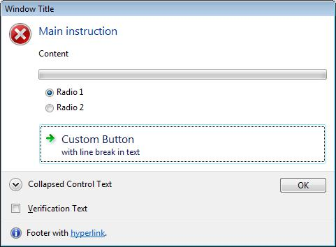
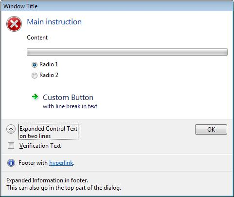

# About Task Dialogs

A task dialog is a dialog box that can be used to display information and receive simple input from the user. Like a message box, it is formatted by the operating system according to parameters you set. However, a task dialog has many more features than a message box.

> [!Note]  
> Task dialogs require the single-threaded apartment (STA) model.

 

## Parts of a Task Dialog

A task dialog consists of several elements, most of which are optional. The following illustration shows the various parts of a task dialog.

In the following illustration, the user has clicked the button beside the collapsed control text, causing alternative text to be displayed there and in the footer.

The illustrations show the following parts:

| Part                   | Description                                                                                                                                                                                                                                                                                                                                                                          | TASKDIALOGCONFIG member                                    |
|------------------------|--------------------------------------------------------------------------------------------------------------------------------------------------------------------------------------------------------------------------------------------------------------------------------------------------------------------------------------------------------------------------------------|------------------------------------------------------------|
| Window title           | Caption of the window.                                                                                                                                                                                                                                                                                                                                                               | **pszWindowTitle**                                         |
| Main icon              | A large icon that signifies the purpose of the task dialog.                                                                                                                                                                                                                                                                                                                          | **hMainIcon** or **pszMainIcon**                           |
| Main instruction       | Principal text.                                                                                                                                                                                                                                                                                                                                                                      | **pszMainInstruction**                                     |
| Content                | Extra text.                                                                                                                                                                                                                                                                                                                                                                          | **pszContent**                                             |
| Progress bar           | An animated bar that shows the progress of some task.                                                                                                                                                                                                                                                                                                                                | **dwFlags**                                                |
| Radio buttons          | Application-defined options for the user.                                                                                                                                                                                                                                                                                                                                            | **pRadioButtons**                                          |
| Custom button          | A button that is not one of the common buttons. This can be either a normal button or, as shown in the illustration, a command link with up to two lines of text.                                                                                                                                                                                                                    | **pButtons**                                               |
| Expand/collapse button | A button that can be used to toggle between the application-defined collapsed control text (such as "See more details") and the expanded control text, which can be on two or more lines. When the control text is expanded, the additional text in **pszExpandedInformation** is also shown, either after the content text, or (as shown in the second illustration) in the footer. | **pszCollapsedControlText** and **pszExpandedControlText** |
| Verification check box | A checkbox, accompanied by application-defined text, for simple choices such as "Do not show this dialog again."                                                                                                                                                                                                                                                                     | **pszVerificationText**                                    |
| Footer icon            | A small icon that signifies the purpose of the footer text.                                                                                                                                                                                                                                                                                                                          | **hFooterIcon** or **pszFooterIcon**                       |
| Footer text            | Additional text. In the illustrations, the text contains a hyperlink.                                                                                                                                                                                                                                                                                                                | **pszFooter**                                              |
| Common button          | A standard button; in the illustrations, the OK button.                                                                                                                                                                                                                                                                                                                              | **dwCommonButtons**                                        |

 

 

 

