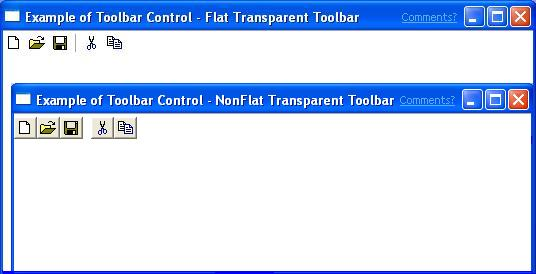
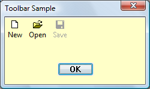
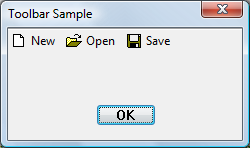

# About Toolbar Controls

A toolbar is a control that contains one or more buttons. Each button, when clicked by a user, sends a command message to the parent window. Typically, the buttons in a toolbar correspond to items in the application's menu, providing an additional and more direct way for the user to access an application's commands.

The following screen shot shows a window that contains a simple toolbar for file operations. The application has enabled visual styles. The Save button is "hot" because the cursor was hovering over it when the screen shot was taken. The actual appearance of the control varies depending on the operating system and the user-selected theme.


The following screen shot shows the same control in an application that was compiled without visual styles enabled.


The following topics discuss features to consider when planning a toolbar. For specific information on implementation, and example code, see [Using Toolbar Controls](using-toolbar-controls.md).

-   [Specifying Toolbar Size and Position](#specifying-toolbar-size-and-position)
-   [Transparent Toolbars](#transparent-toolbars)
-   [List-style Toolbars](#list-style-toolbars)
-   [Defining Button Images](#defining-button-images)
    -   [Defining Button Images by Using Bitmaps](#defining-button-images-by-using-bitmaps)
    -   [Defining Button Images by Using Image Lists](#defining-button-images-by-using-image-lists)
-   [Defining Text for Buttons](#defining-text-for-buttons)
-   [Adding Toolbar Buttons](#adding-toolbar-buttons)
    -   [Toolbar Button Styles](#toolbar-button-styles)
    -   [Toolbar Button States](#toolbar-button-states)
    -   [Command Identifier](#command-identifier)
    -   [Button Size and Position](#button-size-and-position)
-   [Enabling Customization](#enabling-customization)
-   [Enabling Hot-tracking](#enabling-hot-tracking)

## Specifying Toolbar Size and Position

If you create a toolbar using [**CreateToolbarEx**](/windows/desktop/api/Commctrl/nf-commctrl-createtoolbarex), the function enables you to specify in pixels the height and width of the toolbar.

> [!Note]  
> Using [**CreateToolbarEx**](/windows/desktop/api/Commctrl/nf-commctrl-createtoolbarex) is not recommended, as it does not support new features of toolbars, including image lists. For more information about creating toolbars, see [Using Toolbar Controls](using-toolbar-controls.md).

 

The [**CreateWindowEx**](/windows/desktop/api/winuser/nf-winuser-createwindowexa) function does not have parameters for specifying toolbar size. The toolbar window procedure automatically sets the size and position of the toolbar window. The height is based on the height of the buttons in the toolbar. The width is the same as the width of the parent window's client area. To change the automatic size settings, send a [**TB\_SETBUTTONSIZE**](tb-setbuttonsize.md) message. The [**CCS\_TOP**](common-control-styles.md) and [**CCS\_BOTTOM**](common-control-styles.md) common control styles determine whether the toolbar is positioned along the top or bottom of the client area. By default, a toolbar has the **CCS\_TOP** style.

Also, the toolbar window procedure automatically adjusts the size of the toolbar whenever it receives a [**WM\_SIZE**](/windows/desktop/winmsg/wm-size) or [**TB\_AUTOSIZE**](tb-autosize.md) message. An application should send either of these messages whenever the size of the parent window changes or after sending a message that requires adjusting the size of the toolbar—for example, a [**TB\_SETBUTTONSIZE**](tb-setbuttonsize.md) message.

The toolbar default sizing and positioning behaviors can be turned off by setting the [**CCS\_NORESIZE**](common-control-styles.md) and [**CCS\_NOPARENTALIGN**](common-control-styles.md) common control styles. Toolbar controls that are hosted by rebar controls must set these styles because the rebar control sizes and positions the toolbar.

## Transparent Toolbars

Toolbar controls support a transparent look that allows the client area under the toolbar to show through. There are two kinds of transparent toolbars, ones with flat buttons and ones with three-dimensional buttons. If you want your application to match the Windows interface, use the flat transparent style toolbar.

The following screen shot shows the two kinds of transparent toolbars, not using visual styles.



The following screen shot shows a transparent toolbar as it might appear in Windows Vista, with visual styles enabled. The background color of the dialog box has been changed to make the transparency more obvious.



To create a transparent toolbar, all you need to do is add [**TBSTYLE\_FLAT**](toolbar-control-and-button-styles.md) or [**TBSTYLE\_TRANSPARENT**](toolbar-control-and-button-styles.md) to the window style parameter of [**CreateWindowEx**](/windows/desktop/api/winuser/nf-winuser-createwindowexa). If you do not want a line to appear to indicate the bottom of the toolbar, do not use the [**WS\_BORDER**](/windows/desktop/winmsg/window-styles) window style.

> [!Note]  
> When using visual styles, toolbars may be flat by default.

 

## List-style Toolbars

Toolbar buttons enable you to display both text and bitmaps. The buttons on a toolbar created with the [**TBSTYLE\_LIST**](toolbar-control-and-button-styles.md) style place text to the right of the bitmap instead of under it.

The following screen shot shows a toolbar with the list style.



You can use the [**TBSTYLE\_LIST**](toolbar-control-and-button-styles.md) toolbar style in combination with the [**TBSTYLE\_FLAT**](toolbar-control-and-button-styles.md) style to create a toolbar with flat buttons.

## Defining Button Images

There are two ways to specify the images for buttons—by bitmaps or by image lists. An application must choose which method to use. It cannot use both methods with the same toolbar control. Note that the [**CreateToolbarEx**](/windows/desktop/api/Commctrl/nf-commctrl-createtoolbarex) function uses the bitmap method. Applications that want to use the image list method must use the [**CreateWindowEx**](/windows/desktop/api/winuser/nf-winuser-createwindowexa) function to create the toolbar control.

### Defining Button Images by Using Bitmaps

Each button in a toolbar can include a bitmapped image. A toolbar uses an internal list to store the information that it needs to draw the images. When you call the [**CreateToolbarEx**](/windows/desktop/api/Commctrl/nf-commctrl-createtoolbarex) function, you specify a monochrome or color bitmap that contains the initial images, and the toolbar adds the information to the internal list of images. You can add additional images later by using the [**TB\_ADDBITMAP**](tb-addbitmap.md) message.

Each image has a zero-based index. The first image added to the internal list has an index of 0, the second image has an index of 1, and so on. [**TB\_ADDBITMAP**](tb-addbitmap.md) adds images to the end of the list and returns the index of the first new image that it added. To associate the image with a button, you must send a [**TB\_ADDBUTTONS**](tb-addbuttons.md) message and specify the image's index after you add bitmaps to the internal image list.

Windows assumes that all of a toolbar's bitmapped images are the same size. You specify the size when you create the toolbar by using [**CreateToolbarEx**](/windows/desktop/api/Commctrl/nf-commctrl-createtoolbarex). If you use the [**CreateWindowEx**](/windows/desktop/api/winuser/nf-winuser-createwindowexa) function to create a toolbar, the size of the images is set to the default dimensions of 16 by 15 pixels. You can use the [**TB\_SETBITMAPSIZE**](tb-setbitmapsize.md) message to change the dimensions of the bitmapped images, but you must do so before adding any images to the internal list.

### Defining Button Images by Using Image Lists

You can also store button images in a set of [Image Lists](image-lists.md). An image list is a collection of images of the same size, each of which can be referred to by its index. Image lists are used to manage large sets of icons or bitmaps. You can use up to three different image lists to display buttons in various states, as shown in the following table.


|  State        |  Description                                                                                                                                                                                            |
|----------|----------------------------------------------------------------------------------------------------------------------------------------------------------------------------------------------|
| Normal   | Buttons in their default state.                                                                                                                                                              |
| Hot      | Buttons that are under the pointer or pressed. Hot items are supported only in toolbar controls that have the [**TBSTYLE\_FLAT**](toolbar-control-and-button-styles.md) style. |
| Disabled | Buttons that are disabled.                                                                                                                                                                   |


 

After the toolbar is destroyed, applications must free any image lists they have created.

## Defining Text for Buttons

Each button can display a string in addition to, or instead of, an image. A toolbar maintains an internal list that contains all the strings available to toolbar buttons. You add strings to the internal list by using the [**TB\_ADDSTRING**](tb-addstring.md) message, specifying the address of the buffer containing the strings to add. Each string must be null-terminated, and the last string must be terminated with two null characters.

Each string has a zero-based index. The first string added to the internal list of strings has an index of 0, the second string has an index of 1, and so on. [**TB\_ADDSTRING**](tb-addstring.md) adds strings to the end of the list and returns the index of the first new string. You use a string's index to associate the string with a button.

Using [**TB\_ADDSTRING**](tb-addstring.md) is not the only way to add strings to a toolbar. You can display a string in a button by passing a string pointer in the **iString** member of the [**TBBUTTON**](/windows/desktop/api/Commctrl/ns-commctrl-tbbutton) structure that is passed to [**TB\_ADDBUTTONS**](tb-addbuttons.md). Additionally, you can use [**TB\_SETBUTTONINFO**](tb-setbuttoninfo.md) to assign text to a toolbar button.

## Adding Toolbar Buttons

If you use the [**CreateToolbarEx**](/windows/desktop/api/Commctrl/nf-commctrl-createtoolbarex) function to create a toolbar, you can add buttons to the toolbar by filling an array of [**TBBUTTON**](/windows/desktop/api/Commctrl/ns-commctrl-tbbutton) structures and specifying the address of the array in the function call. However, the [**CreateWindowEx**](/windows/desktop/api/winuser/nf-winuser-createwindowexa) function does not have a parameter for passing a **TBBUTTON** structure. **CreateWindowEx** creates an empty toolbar that you fill by sending a [**TB\_ADDBUTTONS**](tb-addbuttons.md) message, specifying the address of a **TBBUTTON** structure.

After a toolbar is created, you can add buttons by sending a [**TB\_INSERTBUTTON**](tb-insertbutton.md) or [**TB\_ADDBUTTONS**](tb-addbuttons.md) message. Each button is described by a [**TBBUTTON**](/windows/desktop/api/Commctrl/ns-commctrl-tbbutton) structure, which defines the attributes of the button, including the indexes of its string and bitmap as well as its style, state, command identifier, and application-defined 32-bit value.

> [!Note]  
> If you use the [**CreateWindowEx**](/windows/desktop/api/winuser/nf-winuser-createwindowexa) function to create a toolbar, you must send the [**TB\_BUTTONSTRUCTSIZE**](tb-buttonstructsize.md) message before adding any buttons. The message passes the size of the [**TBBUTTON**](/windows/desktop/api/Commctrl/ns-commctrl-tbbutton) structure to the toolbar.

 

### Toolbar Button Styles

A button's style determines how the button appears and how it responds to user input. For instance, the [**BTNS\_BUTTON**](toolbar-control-and-button-styles.md) style creates a toolbar button that behaves like a standard push button. A button that has the [**BTNS\_CHECK**](toolbar-control-and-button-styles.md) style is similar to a standard push button, except it toggles between the pressed and nonpressed states each time the user clicks it.

You can create groups of toolbar buttons that act like radio buttons by using the [**BTNS\_GROUP**](toolbar-control-and-button-styles.md) or [**BTNS\_CHECKGROUP**](toolbar-control-and-button-styles.md) style. This causes a button to stay pressed until the user chooses another button in the group. A group is defined as a contiguous collection of buttons, all with the **BTNS\_GROUP** or **BTNS\_CHECKGROUP** style.

The [**BTNS\_SEP**](toolbar-control-and-button-styles.md) style creates a small gap between buttons or draws an etch between buttons on flat toolbars. A button with the **BTNS\_SEP** style does not receive user input.

Version 5.80 of the common controls introduced some new toolbar button styles and renamed some of the older styles. All button style flags now begin with BTNS\_XXX instead of TBSTYLE\_XXX. For a listing and discussion of the button styles, see [Toolbar Control and Button Styles](toolbar-control-and-button-styles.md).

### Toolbar Button States

Each button in a toolbar has a state. The toolbar updates a button's state to reflect user actions, such as clicking the button. The state indicates whether the button is currently pressed or not pressed, enabled or disabled, hidden or visible. Although an application sets a button's initial state when adding the button to the toolbar, it can change and retrieve the state by sending [**TB\_GETSTATE**](tb-getstate.md) and [**TB\_SETSTATE**](tb-setstate.md) messages to the toolbar. For a list of toolbar button states, see [Toolbar States](toolbar-button-states.md).

### Command Identifier

Each button has an application-defined command identifier associated with it. Button identifiers are usually defined in an application header file. For example, a Paste button can be defined as:


```
#define ID_PASTE 100
```


When the user selects a button, the toolbar sends the parent window a [**WM\_COMMAND**](/windows/desktop/menurc/wm-command) or [**WM\_NOTIFY**](wm-notify.md) message that includes the command identifier of the button. The parent window examines the command identifier and carries out the command associated with the button. For information about when controls send **WM\_COMMAND** messages and when they send **WM\_NOTIFY**, see the Remarks section of the [**WM\_NOTIFY**](wm-notify.md) documentation.

### Button Size and Position

A toolbar keeps track of its buttons by assigning each button a position index. The index is zero-based; that is, the leftmost button has an index of 0, the next button to the right has an index of 1, and so on. An application must specify the index of a button when sending messages to retrieve information about the button or to set the button's attributes.

A toolbar updates the position indexes as buttons are inserted and removed. An application can retrieve the current position index of a button by using the [**TB\_COMMANDTOINDEX**](tb-commandtoindex.md) message. The message specifies the command identifier of a button, and the toolbar window uses the identifier to locate the button and return its position index.

All buttons in a toolbar are the same size. The [**CreateToolbarEx**](/windows/desktop/api/Commctrl/nf-commctrl-createtoolbarex) function requires you to set the initial size of the buttons when you create the toolbar. When you use the [**CreateWindowEx**](/windows/desktop/api/winuser/nf-winuser-createwindowexa) function, the initial size is set to the default dimensions of 24 by 22 pixels. You can use the [**TB\_SETBUTTONSIZE**](tb-setbuttonsize.md) message to change the button size, but you must do so before adding any buttons to the toolbar. The [**TB\_GETITEMRECT**](tb-getitemrect.md) message retrieves the current dimensions of the buttons.

When you add a string that is longer than any string currently in the toolbar, the toolbar automatically resets the width of its buttons. The width is set to accommodate the longest string in the toolbar.

## Enabling Customization

A toolbar has built-in customization features that you can make available to the user by giving the toolbar the [**CCS\_ADJUSTABLE**](common-control-styles.md) common control style. The customization features allow the user to drag a button to a new position or to remove a button by dragging it off the toolbar. In addition, the user can double-click the toolbar to display the Customize Toolbar dialog box, which allows the user to add, delete, and rearrange toolbar buttons. To display the dialog box, use the [**TB\_CUSTOMIZE**](tb-customize.md) message. An application determines whether the customization features are available to the user and controls the extent to which the user can customize the toolbar.

As part of the customization process, applications often need to save and restore a toolbar's state. For instance, many applications store the toolbar state before the user begins customizing the toolbar in case the user later wants to restore the toolbar to its original state. The toolbar control does not automatically keep a record of its precustomization state. Your application must save the toolbar state in order to restore it. For more information, see [Using Toolbar Controls](using-toolbar-controls.md).

## Enabling Hot-tracking

Hot-tracking means that when the pointer moves over an item, the button's appearance changes. When visual styles are enabled, toolbars support hot-tracking by default. Otherwise, only toolbar controls created with the [**TBSTYLE\_FLAT**](toolbar-control-and-button-styles.md) style support hot-tracking. You can use other window styles in combination with **TBSTYLE\_FLAT** to produce toolbars that enable hot-tracking but have a different appearance from a flat toolbar. For more information, see [Using Toolbar Controls](using-toolbar-controls.md).

 

 