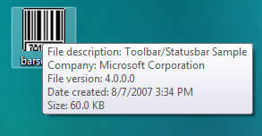
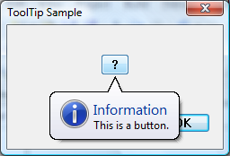
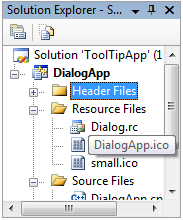

# About Tooltip Controls

Tooltips appear automatically, or pop up, when the user pauses the mouse pointer over a tool or some other UI element. The tooltip appears near the pointer and disappears when the user clicks a mouse button, moves the pointer away from the tool, or simply waits for a few seconds.

The tooltip control in the following illustration displays information about a file on the Windows desktop. As you move the mouse over the illustration, you should also see a live tooltip that contains descriptive text.



This section describes how tooltip controls work and how you create them.

-   [Tooltip Behavior and Appearance](#tooltip-behavior-and-appearance)
-   [Creating Tooltip Controls](#creating-tooltip-controls)
-   [Activating Tooltip Controls](#activating-tooltip-controls)
-   [Supporting Tools](#supporting-tools)
-   [Displaying Text](#displaying-text)
-   [Messaging and Notification](#messaging-and-notification)
-   [Hit Testing](#hit-testing)
-   [Default Message Processing](#default-message-processing)

## Tooltip Behavior and Appearance

Tooltip controls can display a single line of text or multiple lines. Their corners can be rounded or square. They might or might not have a stem that points to the tools like a cartoon speech balloon. Tooltip text can be stationary or can move with the mouse pointer, called tracking. Stationary text can be displayed adjacent to a tool or it can be displayed over a tool, which is referred to as in-place. Standard tooltips are stationary, display a single line of text, have square corners, and have no stem pointing to the tool.

Tracking tooltips, which are supported by [version 4.70](common-control-versions.md) of the common controls, change position on the screen dynamically. By rapidly updating the position, these tooltip controls appear to move smoothly, or "track." These are useful when you want tooltip text to follow the position of the mouse pointer as it moves. For more information about tracking tooltips and an example with code that shows how you create them, see [Tracking Tooltips](using-tooltip-contro.md).

Multiline tooltips, which are also supported by version 4.70 of the common controls, display text on more than one line. These are useful for displaying lengthy messages. For more information and an example that shows how to create multiline tooltips, see [Multiline Tooltips](using-tooltip-contro.md).

Balloon tooltips are displayed in a box with rounded corners and a stem pointing to the tool. They can be either single-line or multiline. The following illustration shows a balloon tooltip with the stem and rectangle in their default positions. For more information about balloon tooltips and an example that shows how to create them, see [Using Tooltip Controls](using-tooltip-contro.md).


A tooltip can also have title text and an icon, as shown in the following illustration. Note that the tooltip must have text; if it has only title text, the tooltip does not display. Also the icon does not appear unless there is a title.



Sometimes text strings are clipped because they are too long to be displayed completely in a small window. In-place tooltips are used to display text strings for objects that have been clipped, such as the file name in the following illustration. For an example that shows how to create in-place tooltips, see [In-Place Tooltips](using-tooltip-contro.md).



The cursor must hover over a tool for a period of time before the tooltip is displayed. The default duration of this timeout is controlled by the user's double click time and is typically about one-half second. To specify a non-default timeout value, send the tooltip control a [**TTM\_SETDELAYTIME**](ttm-setdelaytime.md) message.

## Creating Tooltip Controls

To create a tooltip control, call [**CreateWindowEx**](/windows/desktop/api/winuser/nf-winuser-createwindowexa) and specify the [**TOOLTIPS\_CLASS**](common-control-window-classes.md) window class. This class is registered when the common control DLL is loaded. To ensure that this DLL is loaded, include the [**InitCommonControlsEx**](/windows/desktop/api/Commctrl/nf-commctrl-initcommoncontrolsex) function in your application. You must explicitly define a tooltip control as topmost. Otherwise, it might be covered by the parent window. The following code fragment shows how to create a tooltip control.


```
HWND hwndTip = CreateWindowEx(NULL, TOOLTIPS_CLASS, NULL,
                            WS_POPUP | TTS_NOPREFIX | TTS_ALWAYSTIP,
                            CW_USEDEFAULT, CW_USEDEFAULT,
                            CW_USEDEFAULT, CW_USEDEFAULT,
                            hwndParent, NULL, hinstMyDll,
                            NULL);

SetWindowPos(hwndTip, HWND_TOPMOST,0, 0, 0, 0,
             SWP_NOMOVE | SWP_NOSIZE | SWP_NOACTIVATE);
```


The window procedure for the tooltip control automatically sets the size, position, and visibility of the control. The height of the tooltip window is based on the height of the font currently selected into the device context for the tooltip control. The width varies based on the length of the string currently in the tooltip window.

## Activating Tooltip Controls

A tooltip control can be either active or inactive. When it is active, the tooltip text appears when the mouse pointer is on a tool. When it is inactive, the tooltip text does not appear, even if the pointer is on a tool. The [**TTM\_ACTIVATE**](ttm-activate.md) message activates and deactivates a tooltip control.

## Supporting Tools

A tooltip control can support any number of tools. To support a particular tool, you must register the tool with the tooltip control by sending the control the [**TTM\_ADDTOOL**](ttm-addtool.md) message. The message includes the address of a [**TOOLINFO**](/windows/win32/api/commctrl/ns-commctrl-tttoolinfoa) structure, which provides information the tooltip control needs to display text for the tool. The **uID** member of the **TOOLINFO** structure is defined by the application. Each time you add a tool, your application provides a unique identifier. The **cbSize** member of the **TOOLINFO** structure is required, and must specify the size of the structure.

A tooltip control supports tools implemented as windows (such as child windows or control windows) and as rectangular areas within a window's client area. When you add a tool implemented as a rectangular area, the **hwnd** member of the [**TOOLINFO**](/windows/win32/api/commctrl/ns-commctrl-tttoolinfoa) structure must specify the handle to the window that contains the area, and the **rect** member must specify the client coordinates of the area's bounding rectangle. In addition, the **uID** member must specify the application-defined identifier for the tool.

When you add a tool implemented as a window, the **uID** member of the [**TOOLINFO**](/windows/win32/api/commctrl/ns-commctrl-tttoolinfoa) structure must contain the window handle to the tool. Also, the **uFlags** member must specify the **TTF\_IDISHWND** value, which tells the tooltip control to interpret the **uID** member as a window handle.

## Displaying Text

When you add a tool to a tooltip control, the **lpszText** member of the [**TOOLINFO**](/windows/win32/api/commctrl/ns-commctrl-tttoolinfoa) structure must specify the address of the string to display for the tool. After you add a tool, you can change the text using the [**TTM\_UPDATETIPTEXT**](ttm-updatetiptext.md) message.

If the high-order word of **lpszText** is zero, the low-order word must be the identifier of a string resource. When the tooltip control needs the text, the system loads the specified string resource from the application instance identified by the **hinst** member of the [**TOOLINFO**](/windows/win32/api/commctrl/ns-commctrl-tttoolinfoa) structure.

If you specify the LPSTR\_TEXTCALLBACK value in the **lpszText** member, the tooltip control notifies the window specified in the **hwnd** member of the [**TOOLINFO**](/windows/win32/api/commctrl/ns-commctrl-tttoolinfoa)structure whenever the tooltip control needs to display text for the tool. The tooltip control sends the [TTN\_GETDISPINFO](ttn-getdispinfo.md) notification code to the window. The message includes the address of a [**NMTTDISPINFO**](/windows/win32/api/commctrl/ns-commctrl-nmttdispinfoa) structure, which contains the window handle as well as the application-defined identifier for the tool. The window examines the structure to determine the tool for which text is needed, and it fills the appropriate structure members with information that the tooltip control needs in order to display the string.

> [!Note]  
> The maximum length for standard tooltip text is 80 characters. For more information, see the [**NMTTDISPINFO**](/windows/win32/api/commctrl/ns-commctrl-nmttdispinfoa) structure. Multiline tooltip text can be longer.

 

Many applications create toolbars containing tools that correspond to menu commands. For such tools, it is convenient for the tooltip control to display the same text as the corresponding menu item. The system automatically strips the ampersand (&) accelerator characters from all strings passed to a tooltip control, and terminates the string at the first tab character (\\t), unless the control has the [**TTS\_NOPREFIX**](tooltip-styles.md) style.

To retrieve the text for a tool, use the [**TTM\_GETTEXT**](ttm-gettext.md) message.

## Messaging and Notification

Tooltip text is normally displayed when the mouse pointer hovers over an area, typically the rectangle defined by a tool such as a button control. However, Microsoft Windows only sends mouse-related messages to the window that contains the pointer, not the tooltip control itself. Mouse-related information must be relayed to the tooltip control in order for it to display the tooltip text at the appropriate time and place.

You can have messages relayed automatically if:

-   The tool is a control or is defined as a rectangle in the tool's [**TOOLINFO**](/windows/win32/api/commctrl/ns-commctrl-tttoolinfoa) structure.
-   The window associated with the tool is in the same thread as the tooltip control.

If these two conditions are met, set the **TTF\_SUBCLASS** flag in the **uFlags** member of the tool's [**TOOLINFO**](/windows/win32/api/commctrl/ns-commctrl-tttoolinfoa) structure when you add the tool to the tooltip control with [**TTM\_ADDTOOL**](ttm-addtool.md). The necessary mouse messages then will be relayed automatically to the tooltip control.

Setting **TTF\_SUBCLASS** to have mouse messages relayed to the control is sufficient for most purposes. However, it will not work in cases where there is no direct connection between the tooltip control and the tool's window. For example, if a tool is implemented as a rectangular area in an application-defined window, the window procedure receives the mouse messages. Setting **TTF\_SUBCLASS** is sufficient to ensure that they are passed to the control. However, if a tool is implemented as a system-defined window, mouse messages are sent to that window and are not directly available to the application. In this case, you must either subclass the window or use a message hook to access the mouse messages. You must then explicitly relay mouse messages to the tooltip control with [**TTM\_RELAYEVENT**](ttm-relayevent.md). For an example of how to use **TTM\_RELAYEVENT**, see [Tracking Tooltips](using-tooltip-contro.md).

When a tooltip control receives a [**WM\_MOUSEMOVE**](/windows/desktop/inputdev/wm-mousemove) message, it determines whether the mouse pointer is in the bounding rectangle of a tool. If it is, the tooltip control sets a timer. At the end of the time-out interval, the tooltip control checks the position of the pointer to see if it has moved. If it hasn't, the tooltip control retrieves the text for the tool and displays the tooltip. The tooltip control continues to show the window until it receives a relayed button-up or button-down message or until a **WM\_MOUSEMOVE** message indicates that the pointer has moved outside the bounding rectangle of the tool.

A tooltip control actually has three time-out durations associated with it. The initial duration is the time that the mouse pointer must remain stationary within the bounding rectangle of a tool before the tooltip window is displayed. The reshow duration is the length of the delay before subsequent tooltip windows are displayed when the pointer moves from one tool to another. The pop-up duration is the time that the tooltip window remains displayed before it is hidden. That is, if the pointer remains stationary within the bounding rectangle after the tooltip window is displayed, the tooltip window is automatically hidden at the end of the pop-up duration. You can adjust all of the time-out durations by using the [**TTM\_SETDELAYTIME**](ttm-setdelaytime.md) message.

If an application includes a tool implemented as a rectangular area and the size or position of the control changes, the application can use the [**TTM\_NEWTOOLRECT**](ttm-newtoolrect.md) message to report the change to the tooltip control. An application does not need to report size and position changes for a tool implemented as a window because the tooltip control uses the tool's window handle to determine if the mouse pointer is on the tool, not the tool's bounding rectangle.

When a tooltip is about to be displayed, the tooltip control sends the owner window a [TTN\_SHOW](ttn-show.md) notification code. The owner window receives a [TTN\_POP](ttn-pop.md) notification code when a tooltip is about to be hidden. Each notification code is sent in the context of a [**WM\_NOTIFY**](wm-notify.md) message.

## Hit Testing

The [**TTM\_HITTEST**](ttm-hittest.md) message allows you to retrieve information that a tooltip control maintains about the tool occupying a particular point. The message includes a [**TTHITTESTINFO**](/windows/win32/api/commctrl/ns-commctrl-tthittestinfoa) structure that contains a window handle, the coordinates of a point, and the address of a [**TOOLINFO**](/windows/win32/api/commctrl/ns-commctrl-tttoolinfoa) structure. The tooltip control determines whether a tool occupies the point and, if it does, fills **TOOLINFO** with information about the tool.

## Default Message Processing

The following table describes the messages handled by the window procedure for the tooltip control.


| Message                                        | Description                                                                                                                                                                                                                                                       |
|------------------------------------------------|-------------------------------------------------------------------------------------------------------------------------------------------------------------------------------------------------------------------------------------------------------------------|
| [**WM\_CREATE**](/windows/desktop/winmsg/wm-create)             | Ensures that the tooltip control has the [**WS\_EX\_TOOLWINDOW**](/windows/desktop/winmsg/window-styles) and [**WS\_POPUP**](/windows/desktop/winmsg/window-styles) window styles. It also allocates memory and initializes internal variables. |
| [**WM\_DESTROY**](/windows/desktop/winmsg/wm-destroy)           | Frees resources allocated for the tooltip control.                                                                                                                                                                                                                |
| [**WM\_GETFONT**](/windows/desktop/winmsg/wm-getfont)           | Returns the handle of the font that the tooltip control will use to draw text.                                                                                                                                                                                    |
| [**WM\_MOUSEMOVE**](/windows/desktop/inputdev/wm-mousemove)     | Hides the tooltip window.                                                                                                                                                                                                                                         |
| [**WM\_PAINT**](/windows/desktop/gdi/wm-paint)                  | Draws the tooltip window.                                                                                                                                                                                                                                         |
| [**WM\_SETFONT**](/windows/desktop/winmsg/wm-setfont)           | Sets the handle of the font that the tooltip control will use to draw text.                                                                                                                                                                                       |
| [**WM\_TIMER**](/windows/desktop/winmsg/wm-timer)               | Hides the tooltip window if the tool has changed position or if the mouse pointer has moved outside the tool. Otherwise, it shows the tooltip window.                                                                                                             |
| [**WM\_WININICHANGE**](/windows/desktop/winmsg/wm-wininichange) | Resets internal variables that are based on system metrics.                                                                                                                                                                                                       |


 

 

 