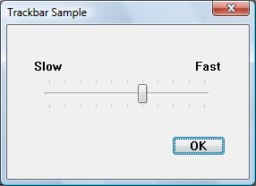
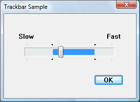

# About Trackbar Controls

A trackbar is a window that contains a slider (sometimes called a thumb) in a channel, and optional tick marks. When the user moves the slider, using either the mouse or the direction keys, the trackbar sends notification messages to indicate the change.

-   [Selection Range](#selection-range)
-   [Trackbar Messages](#trackbar-messages)
-   [Trackbar Notification Messages](#trackbar-notification-messages)
-   [Default Trackbar Message Processing](#default-trackbar-message-processing)
-   [Trackbar Tooltips](#trackbar-tooltips)

Trackbars are useful when you want the user to select a discrete unsigned integer value or a set of consecutive unsigned integer values in a range. For example, you might use a trackbar to allow the user to set the repeat rate of the keyboard by moving the slider to a given tick mark. The following illustration shows a typical trackbar.

The slider in a trackbar moves in increments that you specify when you create it. The values in this range are referred to as logical units. For example, if you specify that the trackbar should have logical units that range from 0 to 5, the slider can occupy only six positions: a position at the left side of the trackbar and one position for each increment in the range. Typically, each of these positions is identified by a tick mark; however, the number of tick marks is arbitrary and can be fewer than the number of logical positions.

You create a trackbar by using the [**CreateWindowEx**](/windows/desktop/api/winuser/nf-winuser-createwindowexa) function, specifying the [**TRACKBAR\_CLASS**](common-control-window-classes.md) window class. After you have created a trackbar, you can use trackbar messages to set and retrieve many of its properties. Changes that you can make include setting the minimum and maximum positions for the slider, drawing tick marks, setting a selection range, and repositioning the slider.

## Selection Range

If you create a trackbar with the [**TBS\_ENABLESELRANGE**](trackbar-control-styles.md) style, you can specify a selection range. The trackbar highlights the selection range and displays triangular tick marks at the start and end, as shown in the following illustration.

The trackbar's selection range does not affect its functionality in any way. It is up to the application to implement the range. You might do this in one of the following ways:

-   Use a selection range to enable the user to set maximum and minimum values for some parameter. For example, the user could move the slider to a position and then click a button labeled "Max". The application then sets the selection range to show the values chosen by the user.
-   Limit the movement of the slider to a predetermined subrange within the control, by handling the [**WM\_HSCROLL**](wm-hscroll.md) or [**WM\_VSCROLL**](wm-vscroll.md) notification and disallowing any movement outside the selection range. You might do this, for example, if the range of values available to the user can change because of other choices the user has made, or according to available resources.

## Trackbar Messages

The logical units of a trackbar are the set of contiguous values that the trackbar can represent. They are usually defined by specifying the range of possible values with a [**TBM\_SETRANGE**](tbm-setrange.md) message as soon as the trackbar has been created. Applications can dynamically alter the range by using **TBM\_SETRANGE**, [**TBM\_SETRANGEMAX**](tbm-setrangemax.md), or [**TBM\_SETRANGEMIN**](tbm-setrangemin.md).

To retrieve the position of the slider (that is, the value the user has chosen), use the [**TBM\_GETPOS**](tbm-getpos.md) message. To set the position of the slider, use the [**TBM\_SETPOS**](tbm-setpos.md) message.

A trackbar automatically displays tick marks at its beginning and end, unless you specify the [**TBS\_NOTICKS**](trackbar-control-styles.md) style. (In the Microsoft Visual Studio resource editor, this means setting the Tick Marks property to False.) You can use the [**TBS\_AUTOTICKS**](trackbar-control-styles.md) style to automatically display additional tick marks at regular intervals along the trackbar. By default, a **TBS\_AUTOTICKS** trackbar displays a tick mark at each increment of the trackbar's range. To specify a different interval for the automatic tick marks, send the [**TBM\_SETTICFREQ**](tbm-setticfreq.md) message to the trackbar. For example, you could use this message to display only 10 tick marks in a range of 1 through 100.

To set the position of a single tick mark, send the [**TBM\_SETTIC**](tbm-settic.md) message. A trackbar maintains an array of DWORD values that stores the position of each tick mark. The array does not include the first and last tick marks, which the trackbar creates automatically. You can specify an index in this array when you send the [**TBM\_GETTIC**](tbm-gettic.md) message to retrieve the position of the corresponding tick mark. Alternatively, you can send the [**TBM\_GETPTICS**](tbm-getptics.md) message to retrieve a pointer to the array. The number of elements in the array is equal to two less than the tick count returned by the [**TBM\_GETNUMTICS**](tbm-getnumtics.md) message. This is because the count returned by **TBM\_GETNUMTICS** includes the first and last tick marks, which are not included in the array. To retrieve the physical position of a tick mark, in client coordinates of the trackbar's window, send the [**TBM\_GETTICPOS**](tbm-getticpos.md) message. The [**TBM\_CLEARTICS**](tbm-cleartics.md) message removes all but the first and last of a trackbar's tick marks.

A trackbar's line size determines how far the slider moves in response to keyboard input from the arrow keys, such as the RIGHT ARROW or DOWN ARROW key. To retrieve or set the line size, send the [**TBM\_GETLINESIZE**](tbm-getlinesize.md) and [**TBM\_SETLINESIZE**](tbm-setlinesize.md) messages. The trackbar also sends the TB\_LINEUP and TB\_LINEDOWN notification codes to its parent window when the user presses the arrow keys.

A trackbar's page size determines how far the slider moves in response to keyboard input, such as the PAGE UP or PAGE DOWN key, or mouse input, such as clicks in the trackbar channel. To retrieve or set the page size, send the [**TBM\_GETPAGESIZE**](tbm-getpagesize.md) and [**TBM\_SETPAGESIZE**](tbm-setpagesize.md) messages. The trackbar also sends the TB\_PAGEUP and TB\_PAGEDOWN notification codes to its parent window when it receives keyboard or mouse input that scrolls the page. For more information, see [Trackbar Notification Messages](#trackbar-notification-messages).

An application can send messages to retrieve the dimensions of a trackbar. The [**TBM\_GETTHUMBRECT**](tbm-getthumbrect.md) message retrieves the bounding rectangle for the slider. The [**TBM\_GETTHUMBLENGTH**](tbm-getthumblength.md) message retrieves the length of the slider. The [**TBM\_GETCHANNELRECT**](tbm-getchannelrect.md) message retrieves the bounding rectangle for the trackbar's channel, which is the area over which the slider moves. It contains the highlight when a range is selected. If a trackbar has the [**TBS\_FIXEDLENGTH**](trackbar-control-styles.md) style, you can send the [**TBM\_SETTHUMBLENGTH**](tbm-setthumblength.md) message to change the length of the slider.

You retrieve or set the selection range by sending messages to the trackbar. Use the [**TBM\_SETSEL**](tbm-setsel.md) message to set the starting and ending positions of a selection. To set just the starting position or just the ending position of a selection, send a [**TBM\_SETSELSTART**](tbm-setselstart.md) or [**TBM\_SETSELEND**](tbm-setselend.md) message. To retrieve the starting or ending positions of a selection range, send a [**TBM\_GETSELSTART**](tbm-getselstart.md) or [**TBM\_GETSELEND**](tbm-getselend.md) message. To clear a selection range and restore the trackbar to its original range, send the [**TBM\_CLEARSEL**](tbm-clearsel.md) message.

> [!Note]  
> It is the application's responsibility to ensure that the user cannot select values outside the selection range. The control itself does not prevent the user from moving the slider outside the range.

 

## Trackbar Notification Messages

A trackbar notifies its parent window of user actions by sending the parent a [**WM\_HSCROLL**](wm-hscroll.md) or [**WM\_VSCROLL**](wm-vscroll.md) message. A trackbar with the [**TBS\_HORZ**](trackbar-control-styles.md) style sends **WM\_HSCROLL** messages. A trackbar with the [**TBS\_VERT**](trackbar-control-styles.md) style sends **WM\_VSCROLL** messages. The low-order word of the *wParam* parameter of **WM\_HSCROLL** or **WM\_VSCROLL** contains the notification code. For the TB\_THUMBPOSITION and TB\_THUMBTRACK notification codes, the high-order word of the *wParam* parameter specifies the position of the slider. For all other notification codes, the high-order word is zero; send the [**TBM\_GETPOS**](tbm-getpos.md) message to determine the slider position. The *lParam* parameter is the handle to the trackbar.

The system sends the TB\_BOTTOM, TB\_LINEDOWN, TB\_LINEUP, and TB\_TOP notification codes only when the user interacts with a trackbar by using the keyboard. The TB\_THUMBPOSITION and TB\_THUMBTRACK notification codes are only sent when the user is using the mouse. The TB\_ENDTRACK, TB\_PAGEDOWN, and TB\_PAGEUP notification codes are sent in both cases. The following table lists the trackbar notification codes and the events (virtual key codes or mouse events) that cause the [**Virtual-Key Codes**](/windows/desktop/inputdev/virtual-key-codes)notifications to be sent.

| Notification code | Reason sent                                                                                                                     |
|-------------------|---------------------------------------------------------------------------------------------------------------------------------|
| TB\_BOTTOM        | [**VK\_END**](/windows/desktop/inputdev/virtual-key-codes)                                                                         |
| TB\_ENDTRACK      | [**WM\_KEYUP**](/windows/desktop/inputdev/wm-keyup) (the user released a key that sent a relevant virtual key code)                              |
| TB\_LINEDOWN      | [**VK\_RIGHT**](/windows/desktop/inputdev/virtual-key-codes) or [**VK\_DOWN**](/windows/desktop/inputdev/virtual-key-codes)     |
| TB\_LINEUP        | [**VK\_LEFT**](/windows/desktop/inputdev/virtual-key-codes) or [**VK\_UP**](/windows/desktop/inputdev/virtual-key-codes)              |
| TB\_PAGEDOWN      | [**VK\_NEXT**](/windows/desktop/inputdev/virtual-key-codes) (the user clicked the channel below or to the right of the slider)   |
| TB\_PAGEUP        | [**VK\_PRIOR**](/windows/desktop/inputdev/virtual-key-codes) (the user clicked the channel above or to the left of the slider) |
| TB\_THUMBPOSITION | [**WM\_LBUTTONUP**](/windows/desktop/inputdev/wm-lbuttonup) following a TB\_THUMBTRACK notification code                                         |
| TB\_THUMBTRACK    | Slider movement (the user dragged the slider)                                                                                   |
| TB\_TOP           | [**VK\_HOME**](/windows/desktop/inputdev/virtual-key-codes)                                                                      |

 

## Default Trackbar Message Processing

This section describes the window message processing performed by a trackbar.

| Message                                              | Processing performed                                                                                                                                                                                                                                     |
|------------------------------------------------------|----------------------------------------------------------------------------------------------------------------------------------------------------------------------------------------------------------------------------------------------------------|
| [**WM\_CAPTURECHANGED**](/windows/desktop/inputdev/wm-capturechanged) | Kills the timer if one was set during [**WM\_LBUTTONDOWN**](/windows/desktop/inputdev/wm-lbuttondown) processing and sends the TB\_THUMBPOSITION notification code, if necessary. It always sends the TB\_ENDTRACK notification code.                                     |
| [**WM\_CREATE**](/windows/desktop/winmsg/wm-create)                   | Performs additional initialization, such as setting the line size, page size, and tick mark frequency to default values.                                                                                                                                 |
| [**WM\_DESTROY**](/windows/desktop/winmsg/wm-destroy)                 | Frees resources.                                                                                                                                                                                                                                         |
| [**WM\_ENABLE**](/windows/desktop/winmsg/wm-enable)                   | Repaints the trackbar window.                                                                                                                                                                                                                            |
| [**WM\_ERASEBKGND**](/windows/desktop/winmsg/wm-erasebkgnd)           | Erases the window background, using the current background color for the trackbar.                                                                                                                                                                       |
| [**WM\_GETDLGCODE**](/windows/desktop/dlgbox/wm-getdlgcode)           | Returns the DLGC\_WANTARROWS value.                                                                                                                                                                                                                      |
| [**WM\_KEYDOWN**](/windows/desktop/inputdev/wm-keydown)               | Processes the direction keys and sends the TB\_TOP, TB\_BOTTOM, TB\_PAGEUP, TB\_PAGEDOWN, TB\_LINEUP, and TB\_LINEDOWN notification codes, as appropriate.                                                                                               |
| [**WM\_KEYUP**](/windows/desktop/inputdev/wm-keyup)                   | Sends the TB\_ENDTRACK notification code if the key was one of the direction keys.                                                                                                                                                                       |
| [**WM\_KILLFOCUS**](/windows/desktop/inputdev/wm-killfocus)           | Repaints the trackbar window.                                                                                                                                                                                                                            |
| [**WM\_LBUTTONDOWN**](/windows/desktop/inputdev/wm-lbuttondown)       | Sets the focus and the mouse capture to the trackbar. When necessary, it sets a timer that determines how quickly the slider moves toward the mouse cursor when the user holds down the mouse button in the window.                                      |
| [**WM\_LBUTTONUP**](/windows/desktop/inputdev/wm-lbuttonup)           | Releases the mouse capture and terminates the timer if one was set during [**WM\_LBUTTONDOWN**](/windows/desktop/inputdev/wm-lbuttondown) processing. It sends the TB\_THUMBPOSITION notification code, if necessary. It always sends the TB\_ENDTRACK notification code. |
| [**WM\_MOUSEMOVE**](/windows/desktop/inputdev/wm-mousemove)           | Moves the slider and sends the TB\_THUMBTRACK notification code when tracking the mouse (see [**WM\_TIMER**](/windows/desktop/winmsg/wm-timer)).                                                                                                                          |
| [**WM\_PAINT**](/windows/desktop/gdi/wm-paint)                        | Paints the trackbar. If the wParam parameter is non-NULL, the control assumes that the value is an HDC and paints using that device context.                                                                                                             |
| [**WM\_SETFOCUS**](/windows/desktop/inputdev/wm-setfocus)             | Repaints the trackbar window.                                                                                                                                                                                                                            |
| [**WM\_SIZE**](/windows/desktop/winmsg/wm-size)                       | Sets the dimensions of the trackbar, removing the slider if there is not enough room to display it.                                                                                                                                                      |
| [**WM\_TIMER**](/windows/desktop/winmsg/wm-timer)                     | Retrieves the mouse position and updates the position of the slider. (It is received only when the user is dragging the slider.)                                                                                                                         |
| [**WM\_WININICHANGE**](/windows/desktop/winmsg/wm-wininichange)       | Initializes slider dimensions.                                                                                                                                                                                                                           |

 

## Trackbar Tooltips

A trackbar that is created with the [**TBS\_TOOLTIPS**](trackbar-control-styles.md) style has a default tooltip control. The tooltip remains visible and displays the current value as the user drags the slider using the mouse.

You can assign a new tooltip control to a trackbar by sending the [**TBM\_SETTOOLTIPS**](tbm-settooltips.md) message. To retrieve the handle to an assigned tooltip control, use the [**TBM\_GETTOOLTIPS**](tbm-gettooltips.md) message.

 

 